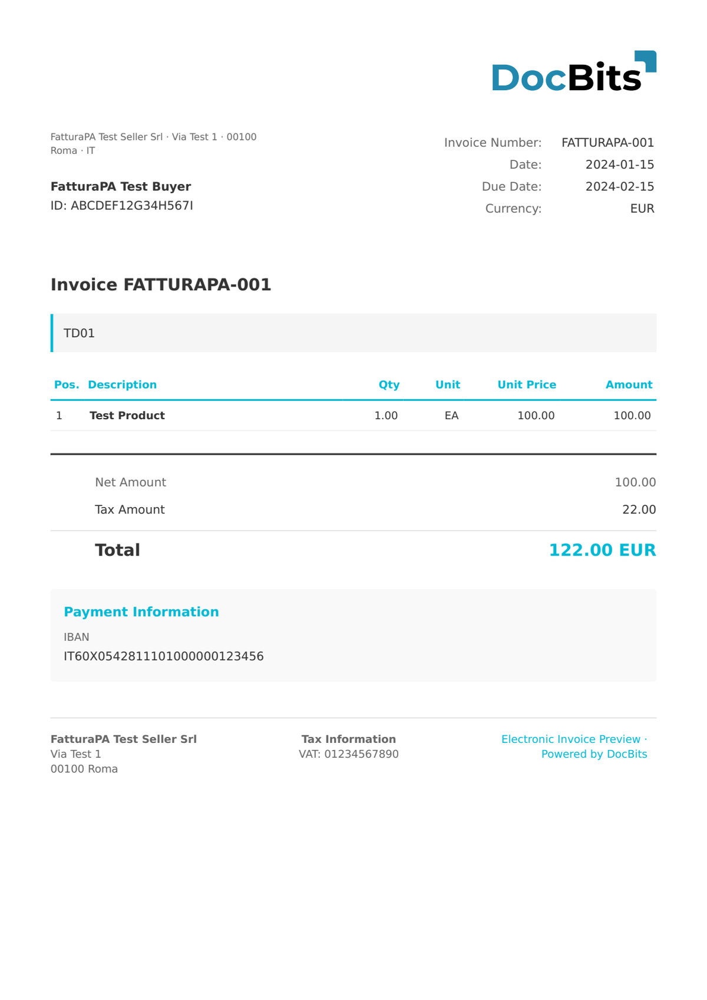

# 🇮🇹 FATTURAPA

| Property             | Value                                    |
| -------------------- | ---------------------------------------- |
| **Country / Region** | Italy                                    |
| **Document Types**   | Invoice, Credit Note, Simplified Invoice |
| **Format**           | XML (FatturaPA 1.2.x)                    |
| **Standard**         | FatturaPA (SDI)                          |

FatturaPA is the Italian electronic invoicing standard mandated by the Agenzia delle Entrate. Since January 2019, all invoices between Italian businesses must be transmitted through the Sistema di Interscambio (SDI). DocBits processes FatturaPA XML documents and extracts all header and line-item fields.

## Support Status

| Component        | Status      |
| ---------------- | ----------- |
| Preview          | ✅ Supported |
| Field Extraction | ✅ Supported |
| Transformation   | ✅ Supported |

## Default Preview

<figure><figcaption>
Default DocBits preview for an Italy FatturaPA invoice
</figcaption></figure>

## Related

* [Supported Electronic Documents](./)
