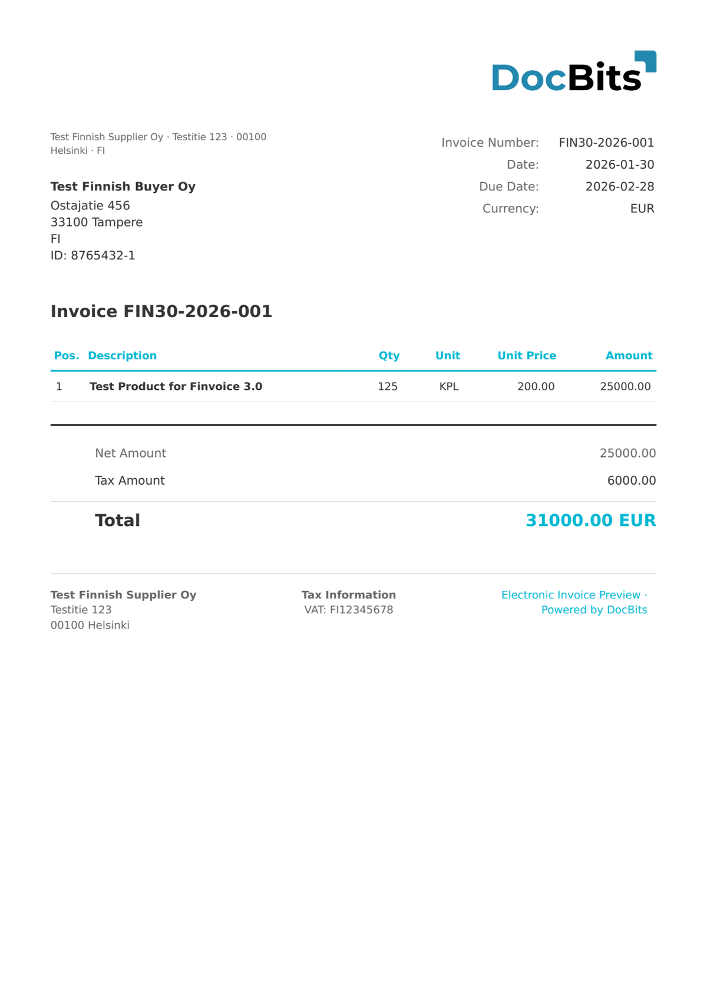

# 🇫🇮 FINVOICE 2.01

| Property             | Value                |
| -------------------- | -------------------- |
| **Country / Region** | Finland              |
| **Document Types**   | Invoice, Credit Note |
| **Format**           | XML (SOAP envelope)  |
| **Standard**         | Finvoice 2.01        |

Finvoice 2.01 is a maintenance release that corrected schema issues in version 2.0 and added support for additional invoice attachment references and buyer-initiated invoicing scenarios.

## Support Status

| Component        | Status      |
| ---------------- | ----------- |
| Preview          | ✅ Supported |
| Field Extraction | ✅ Supported |
| Transformation   | ✅ Supported |

## Default Preview

<figure><figcaption>
Default DocBits preview for a Finland Finvoice 2.01 invoice
</figcaption></figure>

## Related

* [Supported Electronic Documents](./)
