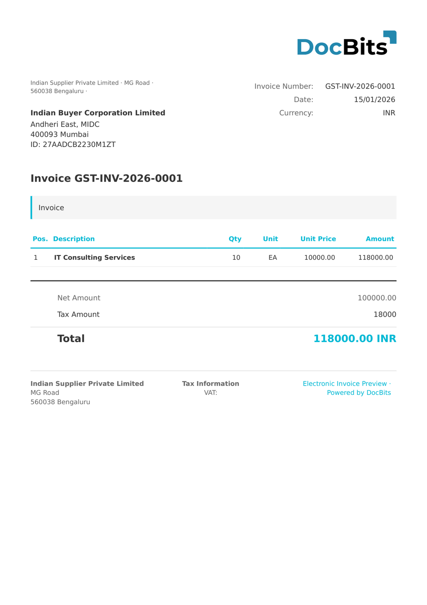

# 🇮🇳 India GST E-Invoice

| Eigenschap | Waarde |
|----------|-------|
| **Land / Regio** | India |
| **Documenttypen** | Factuur (INV), Creditnota (CRN), Debetnota (DBN) |
| **Formaat** | XML (`<SignedInvoice>`) |
| **Standaard** | GST E-Invoice (GSTN Invoice Registration Portal) |
| **Locale** | `en_IN` |

De Indiase GST e-factuur is de verplichte standaard voor elektronische facturatie onder het Indiase GST-stelsel (Goods and Services Tax), beheerd door het GSTN (GST Network). Bedrijven boven de voorgeschreven omzetdrempel moeten e-facturen genereren via het IRP (Invoice Registration Portal), dat de factuur ondertekent en een **IRN** (Invoice Reference Number — een 64-karakter SHA-256 hash) en een QR-code retourneert.

DocBits detecteert GST E-Invoice-documenten door de aanwezigheid van `<SignedInvoice>` als rootelement. Het formaat omvat drie GST-belastingcomponenten:

| Belastingcomponent | Beschrijving |
|--------------|-------------|
| IGST | Geïntegreerde GST — toegepast op transacties tussen staten |
| CGST | Centrale GST — toegepast op transacties binnen de staat (centrale component) |
| SGST | Staats-GST — toegepast op transacties binnen de staat (staatscomponent) |

De belastingplichtige identificator is het **GSTIN** (Goods and Services Tax Identification Number), een alfanumerieke code van 15 tekens in het formaat `29AABCU9603R1ZM` (2-cijferige staatscode + 10-cijferig PAN + entiteitsnummer + controlecijfer). Datums gebruiken het formaat `DD/MM/JJJJ`.

## Ondersteuningsstatus

| Component | Status |
|-----------|--------|
| Voorbeeld | ✅ Ondersteund |
| Veldextractie | ✅ Ondersteund |
| Transformatie | ✅ Ondersteund |

## Standaard voorbeeld

<figure><figcaption>
Standaard DocBits voorbeeld voor een Indiase GST e-factuur
</figcaption></figure>

## Veldtoewijzing

### Kopvelden

| DocBits-veld | Bron-XML-element | Opmerkingen |
|---|---|---|
| `invoice_id` | `Invoice/DocDtls/No` | Factuurnummer |
| `invoice_date` | `Invoice/DocDtls/Dt` | Uitgiftedatum (`DD/MM/JJJJ`) |
| `invoice_type` | `Invoice/DocDtls/Typ` | INV=Factuur, CRN=Creditnota, DBN=Debetnota |
| `currency` | Vast: `INR` | Altijd Indiase roepie |
| `net_amount` | `Invoice/ValDtls/AssVal` | Belastbare / aanslagwaarde |
| `tax_amount` | `Invoice/ValDtls/IgstVal` + `CgstVal` + `SgstVal` | Totaal GST-bedrag |
| `total_amount` | `Invoice/ValDtls/TotInvVal` | Totale factuurwaarde incl. GST |
| `igst_amount` | `Invoice/ValDtls/IgstVal` | Geïntegreerd GST-bedrag |
| `cgst_amount` | `Invoice/ValDtls/CgstVal` | Centraal GST-bedrag |
| `sgst_amount` | `Invoice/ValDtls/SgstVal` | Staats-GST-bedrag |
| `cess_amount` | `Invoice/ValDtls/CesVal` | Cess-bedrag (indien van toepassing) |
| `supplier_name` | `Invoice/SellerDtls/LglNm` | Wettelijke naam leverancier |
| `supplier_id` | `Invoice/SellerDtls/Gstin` | GSTIN leverancier (15 tekens, bijv. `29AABCU9603R1ZM`) |
| `supplier_trade_name` | `Invoice/SellerDtls/TrdNm` | Handelsnaam leverancier |
| `supplier_address` | `Invoice/SellerDtls/Addr1` | Adres leverancier regel 1 |
| `supplier_city` | `Invoice/SellerDtls/Loc` | Stad / locatie leverancier |
| `supplier_postal_code` | `Invoice/SellerDtls/Pin` | PIN-code leverancier |
| `supplier_state_code` | `Invoice/SellerDtls/Stcd` | Staatscode leverancier (2 cijfers) |
| `buyer_name` | `Invoice/BuyerDtls/LglNm` | Wettelijke naam koper |
| `buyer_id` | `Invoice/BuyerDtls/Gstin` | GSTIN koper |
| `buyer_trade_name` | `Invoice/BuyerDtls/TrdNm` | Handelsnaam koper |
| `buyer_address` | `Invoice/BuyerDtls/Addr1` | Adres koper regel 1 |
| `buyer_city` | `Invoice/BuyerDtls/Loc` | Stad / locatie koper |
| `buyer_postal_code` | `Invoice/BuyerDtls/Pin` | PIN-code koper |
| `buyer_state_code` | `Invoice/BuyerDtls/Stcd` | Staatscode koper |
| `irn` | `Irn` | Factuurreferentienummer (64-karakter SHA-256 hash) |
| `ack_number` | `AckNo` | IRP-bevestigingsnummer |
| `ack_date` | `AckDt` | IRP-bevestigingsdatum |

### Regeltabel (`INVOICE_TABLE`)

Rijpad: `Invoice/ItemList/Item`

| Kolom | Bron-XML-element | Opmerkingen |
|---|---|---|
| `POSITION` | `SlNo` | Regelvolgordnummer |
| `DESCRIPTION` | `PrdDesc` | Product-/servicebeschrijving |
| `QUANTITY` | `Qty` | Gefactureerde hoeveelheid |
| `UNIT` | `Unit` | Maateenheid (bijv. `OTH`, `NOS`, `KGS`) |
| `UNIT_PRICE` | `UnitPrice` | Eenheidsprijs |
| `VAT_RATE` | `GstRt` | GST-tarief in % (bijv. 18%) |
| `VAT` | `IgstAmt` (of `CgstAmt` + `SgstAmt`) | GST-bedrag per regel |
| `NET_AMOUNT` | `AssAmt` | Belastbaar bedrag per regel |

## Classificatieregel

DocBits detecteert India GST E-Invoice-documenten door het rootelement te vergelijken:

| Elektronisch documenttype | Patroon |
|--------------------------|---------|
| INDIA GST E-INVOICE | Rootelement bevat `<SignedInvoice` |

## Gerelateerd

- [Momenteel ondersteunde e-factuurstandaarden](../../currently-supported-e-invoice-standards/)
- [Ondersteunde elektronische documenten](./)
