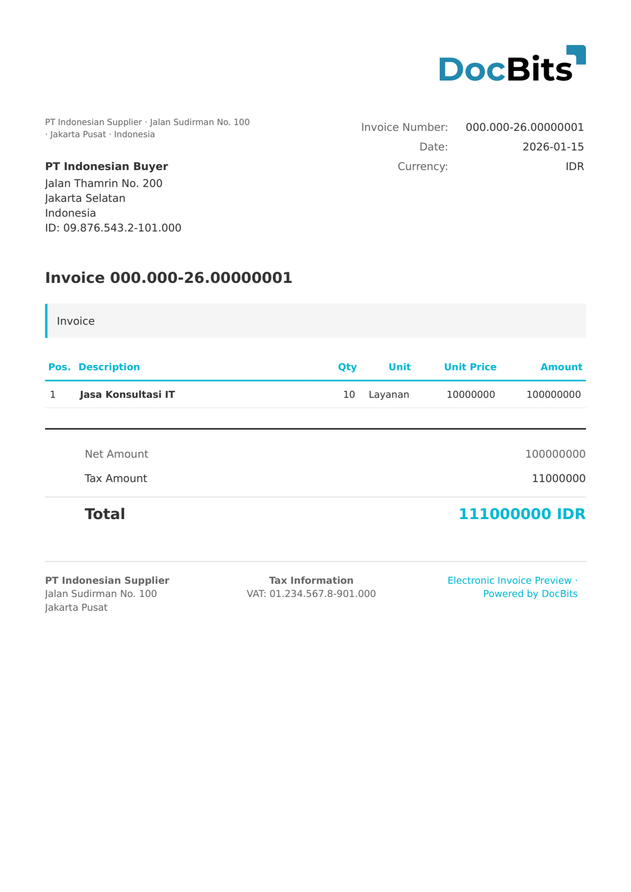

# 🇮🇩 INDONESIA E-FAKTUR

| Property | Value |
|----------|-------|
| **Country / Region** | Indonesia |
| **Document Types** | Tax Invoice (Faktur Pajak) |
| **Format** | XML/CSV |
| **Standard** | e-Faktur (DJP - Direktorat Jenderal Pajak) |

e-Faktur is the Indonesian electronic tax invoice system operated by the Directorate General of Taxes (DJP). It is mandatory for all PKP (Pengusaha Kena Pajak) taxpayers and includes the NSFP (Nomor Seri Faktur Pajak) serial number, NPWP tax identifiers, and PPN (VAT) calculations.

## Support Status

| Component | Status |
|-----------|--------|
| Preview | ✅ Supported |
| Field Extraction | ✅ Supported |
| Transformation | ✅ Supported |

## Default Preview

<figure><figcaption>
Default DocBits preview for an Indonesia E-Faktur invoice
</figcaption></figure>

## Related

- [Supported Electronic Documents](./)
