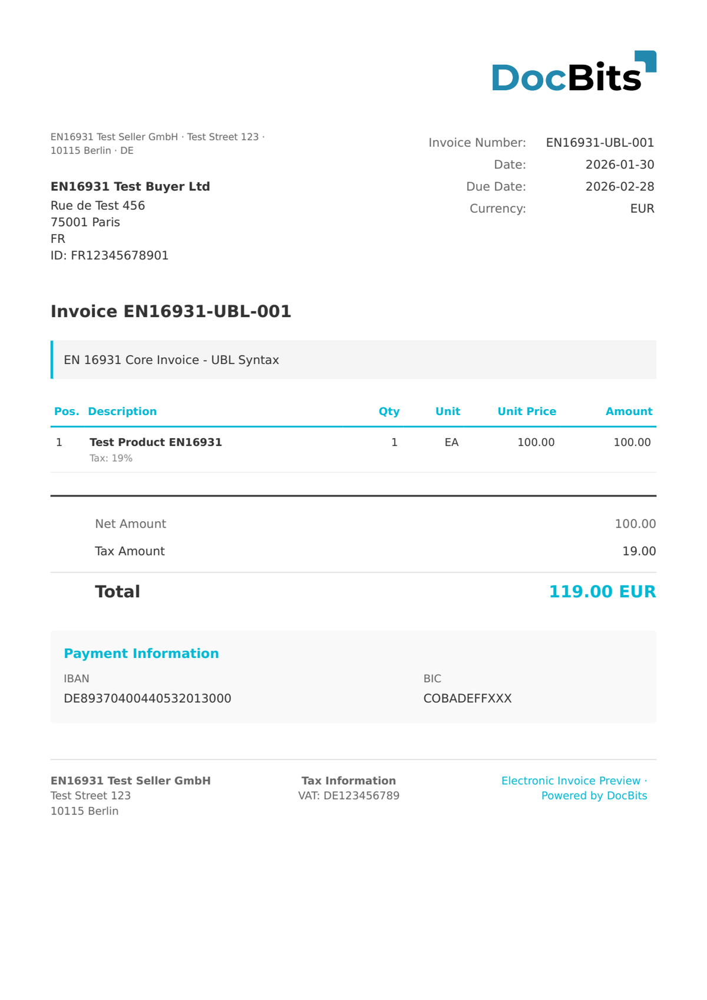

# INVOIC02

| Property             | Value                   |
| -------------------- | ----------------------- |
| **Country / Region** | International           |
| **Document Types**   | Invoice                 |
| **Format**           | EDIFACT                 |
| **Standard**         | UN/EDIFACT INVOIC D.02B |

INVOIC02 is a UN/EDIFACT invoice message based on the D.02B directory version. EDIFACT (Electronic Data Interchange for Administration, Commerce and Transport) is a widely used EDI standard in logistics, retail, and manufacturing. DocBits parses the EDIFACT segment structure and extracts header, line item, and summary fields.

## Support Status

| Component        | Status      |
| ---------------- | ----------- |
| Preview          | ✅ Supported |
| Field Extraction | ✅ Supported |
| Transformation   | ✅ Supported |

## Default Preview

<figure><figcaption>
Default DocBits preview for an INVOIC02 invoice
</figcaption></figure>

## Related

* [Supported Electronic Documents](./)
