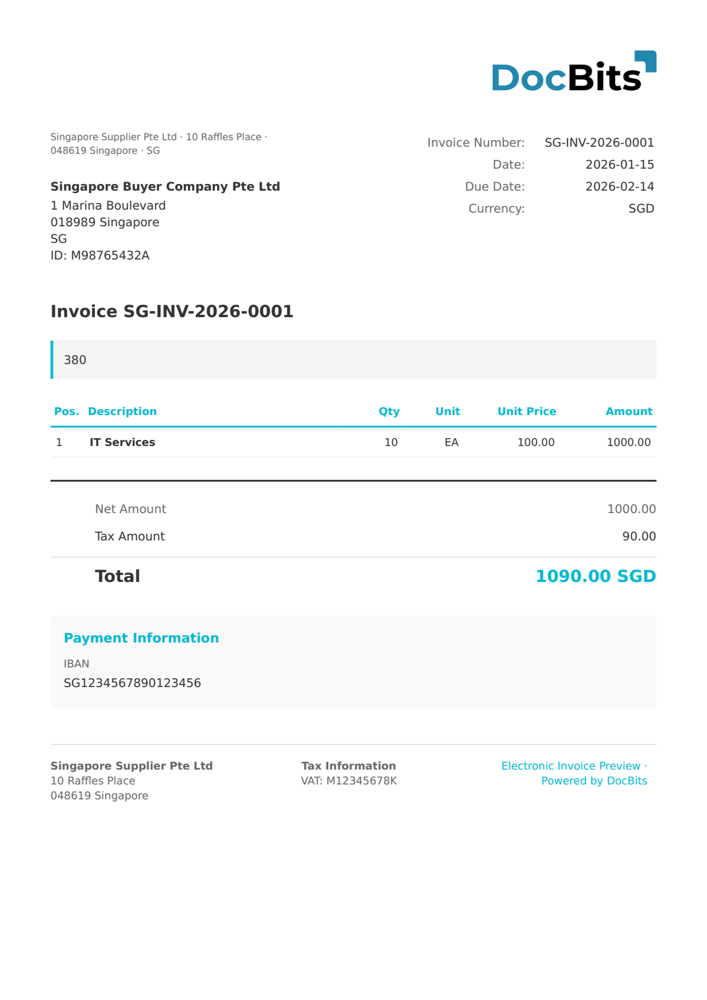

# 🇸🇬 INVOICENOW SG

| Property | Value |
|----------|-------|
| **Country / Region** | Singapore |
| **Document Types** | Invoice, Credit Note |
| **Format** | UBL 2.1 XML (Peppol) |
| **Standard** | InvoiceNow SG (Singapore-specific Peppol BIS) |

InvoiceNow SG is the Singapore-specific localization of the Peppol BIS Billing standard. It extends the base Peppol model with Singapore-specific business rules, GST handling, and UEN (Unique Entity Number) identification requirements.

## Support Status

| Component | Status |
|-----------|--------|
| Preview | ✅ Supported |
| Field Extraction | ✅ Supported |
| Transformation | ✅ Supported |

## Default Preview

<figure><figcaption>
Default DocBits preview for a Singapore InvoiceNow SG invoice
</figcaption></figure>

## Related

- [Supported Electronic Documents](./)
- [InvoiceNow](invoicenow.md)
