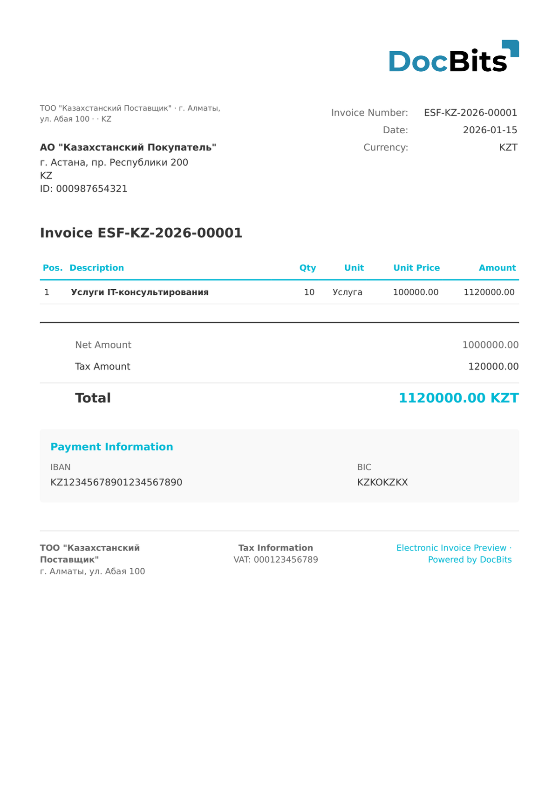

# 🇰🇿 KAZAKHSTAN ESF

| Property | Value |
|----------|-------|
| **Country / Region** | Kazakhstan |
| **Document Types** | Invoice |
| **Format** | XML |
| **Standard** | ESF (Электронные счета-фактуры / Electronic Invoice) |

Kazakhstan ESF (Электронные счета-фактуры) is the electronic invoice system operated by the Committee of State Revenues. All VAT-registered businesses must issue electronic invoices through the ESF information system. Documents include the BIN/IIN tax identification, VAT calculations, and are digitally signed.

## Support Status

| Component | Status |
|-----------|--------|
| Preview | ✅ Supported |
| Field Extraction | ✅ Supported |
| Transformation | ✅ Supported |

## Default Preview

<figure><figcaption>
Default DocBits preview for a Kazakhstan ESF invoice
</figcaption></figure>

## Related

- [Supported Electronic Documents](./)
