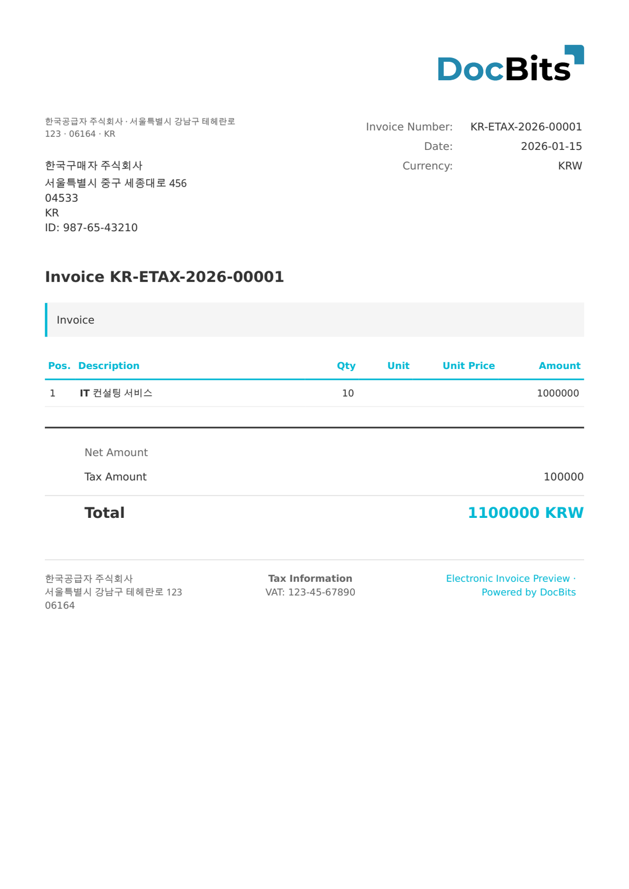

# 🇰🇷 KOREA NTS

| Property             | Value                      |
| -------------------- | -------------------------- |
| **Country / Region** | South Korea                |
| **Document Types**   | Tax Invoice, Cash Receipt  |
| **Format**           | XML                        |
| **Standard**         | NTS (National Tax Service) |

Korea NTS refers to the broader National Tax Service electronic document system that encompasses tax invoices, cash receipts, and other tax-related documents. DocBits processes NTS documents and extracts all standard fields including business registration numbers, supply values, and tax amounts.

## Support Status

| Component        | Status      |
| ---------------- | ----------- |
| Preview          | ✅ Supported |
| Field Extraction | ✅ Supported |
| Transformation   | ✅ Supported |

## Default Preview

<figure><figcaption>
Default DocBits preview for a Korea NTS invoice
</figcaption></figure>

## Related

* [Supported Electronic Documents](./)
* [Korea E-Tax Invoice](korea-e-tax-invoice.md)
