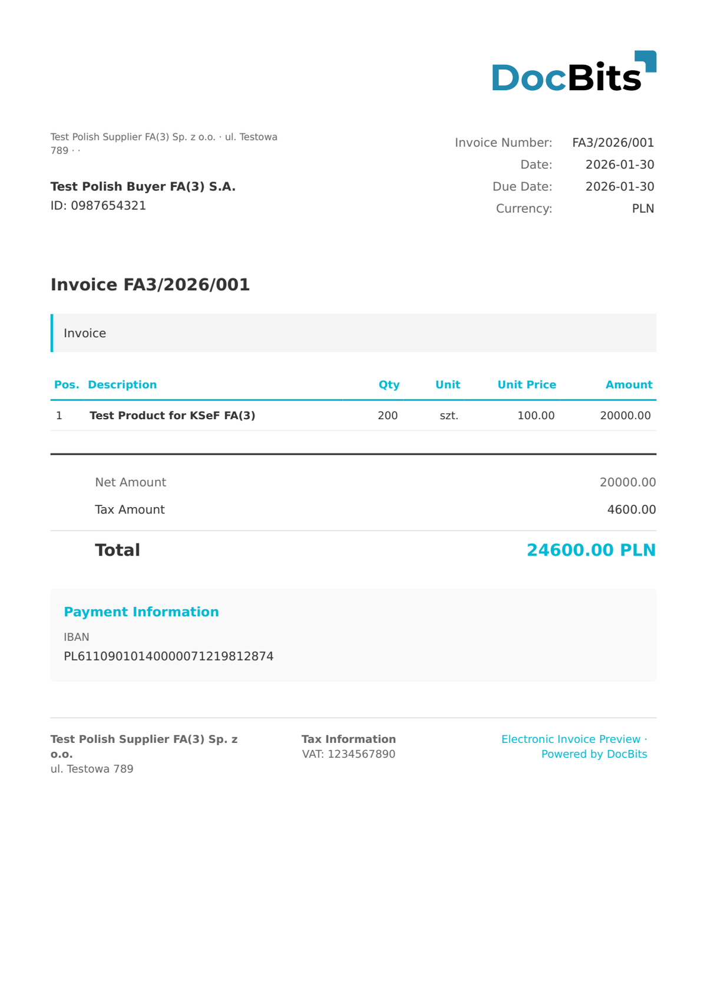

# 🇵🇱 KSEF

| Property             | Value                                    |
| -------------------- | ---------------------------------------- |
| **Country / Region** | Poland                                   |
| **Document Types**   | Invoice, Credit Note, Corrective Invoice |
| **Format**           | XML                                      |
| **Standard**         | KSeF (Krajowy System e-Faktur)           |

KSeF is the Polish National e-Invoice System operated by the Ministry of Finance. It will become mandatory for all Polish VAT-registered businesses. DocBits supports the KSeF FA2 and FA3 schema versions for invoice processing.

## Support Status

| Component        | Status      |
| ---------------- | ----------- |
| Preview          | ✅ Supported |
| Field Extraction | ✅ Supported |
| Transformation   | ✅ Supported |

## Default Preview

<figure><figcaption>
Default DocBits preview for a Poland KSeF invoice
</figcaption></figure>

## Related

* [Supported Electronic Documents](./)
* [KSeF FA2](ksef-fa2.md)
* [KSeF FA3](ksef-fa3.md)
