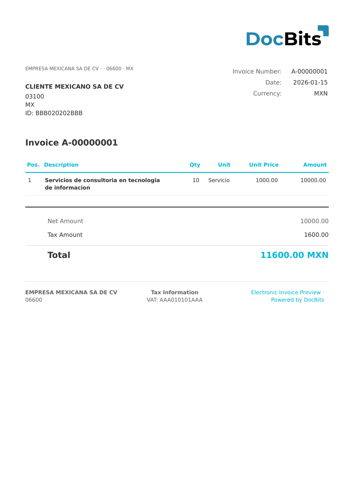

# 🇲🇽 MEXICO CFDI 4.0

| Property             | Value                                              |
| -------------------- | -------------------------------------------------- |
| **Country / Region** | Mexico                                             |
| **Document Types**   | Invoice, Credit Note, Payment Receipt              |
| **Format**           | XML                                                |
| **Standard**         | CFDI 4.0 (Comprobante Fiscal Digital por Internet) |

CFDI 4.0 is the current version of the Mexican digital tax receipt standard, mandatory since January 2023. It requires the receiver's name and tax regime (régimen fiscal), adds the export field, and includes the updated digital seal and SAT certificate chain.

## Support Status

| Component        | Status      |
| ---------------- | ----------- |
| Preview          | ✅ Supported |
| Field Extraction | ✅ Supported |
| Transformation   | ✅ Supported |

## Default Preview

<figure><figcaption>
Default DocBits preview for a Mexico CFDI 4.0 invoice
</figcaption></figure>

## Related

* [Supported Electronic Documents](./)
