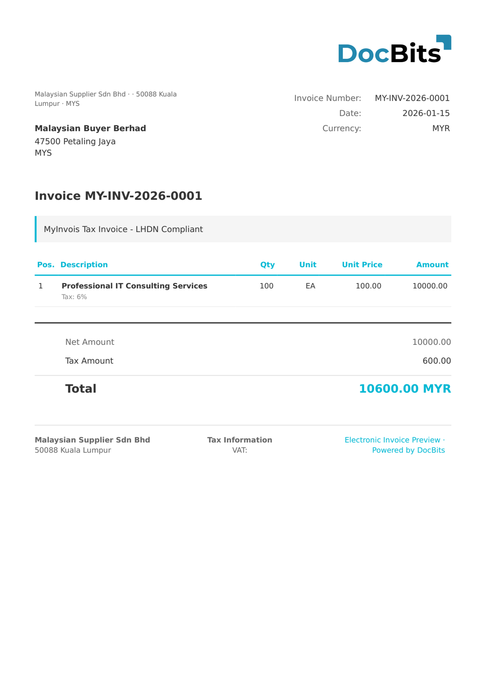

# 🇲🇾 MYINVOIS

| Property | Value |
|----------|-------|
| **Country / Region** | Malaysia |
| **Document Types** | Invoice, Credit Note, Debit Note, Self-Billed Invoice |
| **Format** | UBL 2.1 XML / JSON |
| **Standard** | MyInvois (LHDN - Lembaga Hasil Dalam Negeri) |

MyInvois is Malaysia's e-invoicing system operated by the Inland Revenue Board (LHDN). Effective August 2024 for large enterprises, it requires all invoices to be submitted to the MyInvois portal for validation and receive a unique identifier. The system uses UBL 2.1 and supports both XML and JSON submission formats.

## Support Status

| Component | Status |
|-----------|--------|
| Preview | ✅ Supported |
| Field Extraction | ✅ Supported |
| Transformation | ✅ Supported |

## Default Preview

<figure><figcaption>
Default DocBits preview for a Malaysia MyInvois invoice
</figcaption></figure>

## Related

- [Supported Electronic Documents](./)
