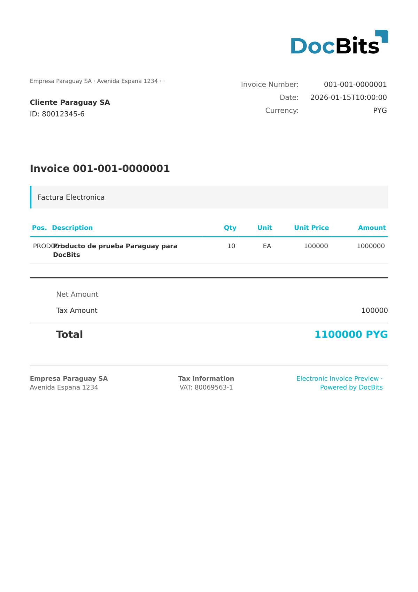

# 🇵🇾 PARAGUAY DTE

| Property | Value |
|----------|-------|
| **Country / Region** | Paraguay |
| **Document Types** | Invoice, Credit Note |
| **Format** | XML |
| **Standard** | DTE (Documento Tributario Electrónico) |

Paraguay DTE is the Paraguayan electronic tax document standard regulated by the Subsecretaría de Estado de Tributación (SET). It covers electronic invoices and credit notes with Paraguayan-specific tax identification (RUC) and tax category requirements.

## Support Status

| Component | Status |
|-----------|--------|
| Preview | ✅ Supported |
| Field Extraction | ✅ Supported |
| Transformation | ✅ Supported |

## Default Preview

<figure><figcaption>
Default DocBits preview for a Paraguay DTE invoice
</figcaption></figure>

## Related

- [Supported Electronic Documents](./)
