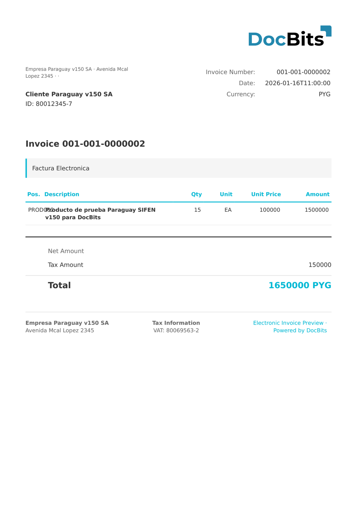

# 🇵🇾 PARAGUAY SIFEN

| Property | Value |
|----------|-------|
| **Country / Region** | Paraguay |
| **Document Types** | Invoice, Credit Note, Debit Note, Withholding |
| **Format** | XML |
| **Standard** | SIFEN (Sistema Integrado de Facturación Electrónica Nacional) |

SIFEN is Paraguay's national integrated electronic invoicing system operated by SET. All electronic documents must be submitted to SIFEN for validation and receive a CDC (Código de Control Digital) unique identifier.

## Support Status

| Component | Status |
|-----------|--------|
| Preview | ✅ Supported |
| Field Extraction | ✅ Supported |
| Transformation | ✅ Supported |

## Default Preview

<figure><figcaption>
Default DocBits preview for a Paraguay SIFEN invoice
</figcaption></figure>

## Related

- [Supported Electronic Documents](./)
- [Paraguay SIFEN 150](paraguay-sifen-150.md)
