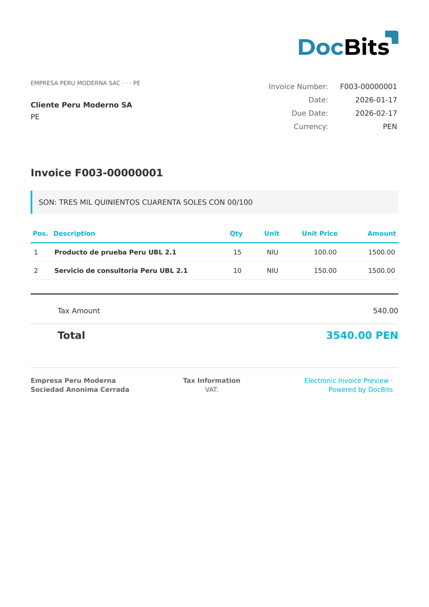

# 🇵🇪 PERU CPE

| Property | Value |
|----------|-------|
| **Country / Region** | Peru |
| **Document Types** | Invoice, Credit Note, Debit Note |
| **Format** | UBL XML |
| **Standard** | CPE (Comprobante de Pago Electrónico) |

CPE (Comprobante de Pago Electrónico) is the Peruvian electronic payment voucher standard regulated by SUNAT. DocBits supports both UBL 2.0 and 2.1 versions used for electronic invoicing in Peru.

## Support Status

| Component | Status |
|-----------|--------|
| Preview | ✅ Supported |
| Field Extraction | ✅ Supported |
| Transformation | ✅ Supported |

## Default Preview

<figure><figcaption>
Default DocBits preview for a Peru CPE invoice
</figcaption></figure>

## Related

- [Supported Electronic Documents](./)
- [Peru CPE UBL 2.0](peru-cpe-ubl-2-0.md)
- [Peru CPE UBL 2.1](peru-cpe-ubl-2-1.md)
