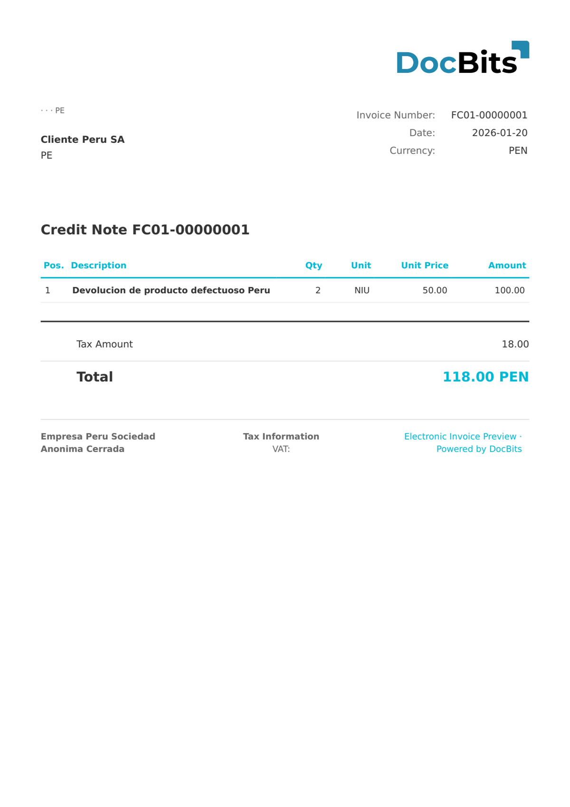

# 🇵🇪 PERU FACTURA ELECTRONICA

| Property | Value |
|----------|-------|
| **Country / Region** | Peru |
| **Document Types** | Invoice |
| **Format** | UBL XML |
| **Standard** | Factura Electrónica (SUNAT) |

Peru Factura Electrónica is the electronic invoice document type within the SUNAT CPE system. It corresponds to document type code 01 (Factura) and includes all mandatory fields required by SUNAT including series, correlative number, and electronic signature.

## Support Status

| Component | Status |
|-----------|--------|
| Preview | ✅ Supported |
| Field Extraction | ✅ Supported |
| Transformation | ✅ Supported |

## Default Preview

<figure><figcaption>
Default DocBits preview for a Peru Factura Electronica
</figcaption></figure>

## Related

- [Supported Electronic Documents](./)
