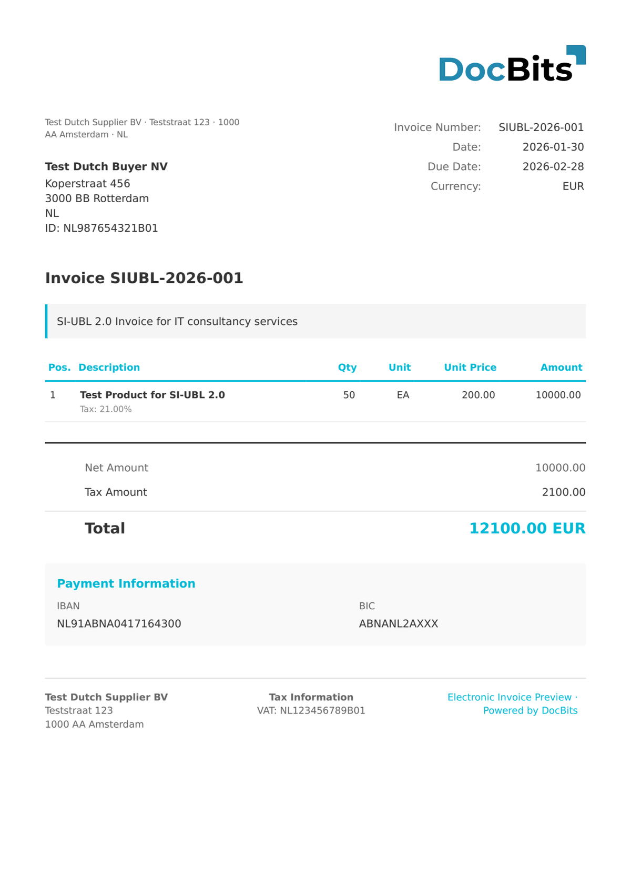

# 🇳🇱 SI-UBL 2.0

| Property | Value |
|----------|-------|
| **Country / Region** | Netherlands |
| **Document Types** | Invoice, Credit Note |
| **Format** | UBL 2.1 XML |
| **Standard** | SI-UBL 2.0 (Standaard Invoice - UBL) |

SI-UBL 2.0 is the Dutch e-invoicing standard based on OASIS UBL 2.1. It is maintained by NLCIUS (Netherlands Core Invoice Usage Specification) and aligns with EN 16931. SI-UBL is widely used in Dutch B2G and B2B transactions, particularly through the Peppol network.

## Support Status

| Component | Status |
|-----------|--------|
| Preview | ✅ Supported |
| Field Extraction | ✅ Supported |
| Transformation | ✅ Supported |

## Default Preview

<figure><figcaption>
Default DocBits preview for a Netherlands SI-UBL 2.0 invoice
</figcaption></figure>

## Related

- [Supported Electronic Documents](./)
