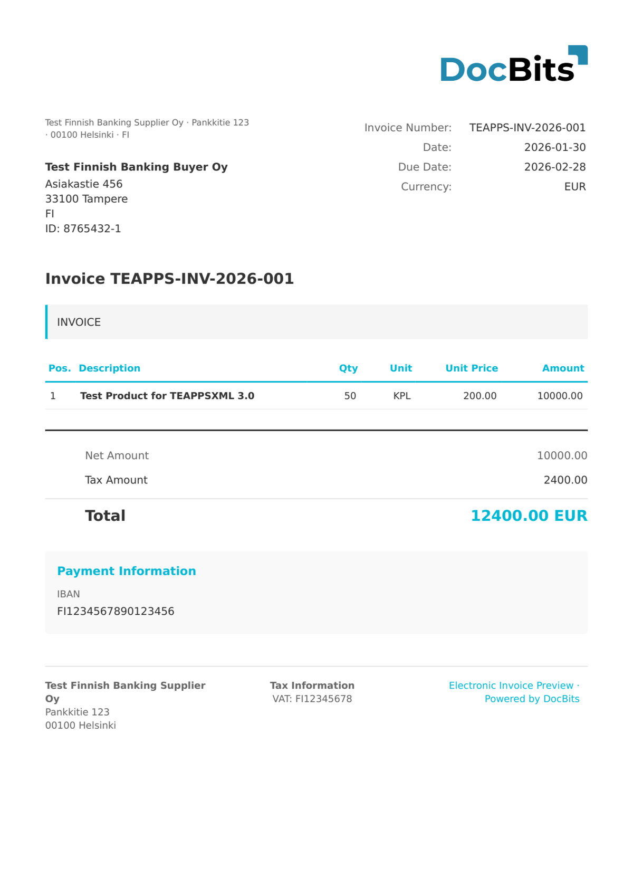

# 🇫🇮 TEAPPSXML

| Property             | Value                |
| -------------------- | -------------------- |
| **Country / Region** | Finland              |
| **Document Types**   | Invoice, Credit Note |
| **Format**           | XML                  |
| **Standard**         | TEAPPSXML 3.0        |

TEAPPSXML is a Finnish e-invoicing format used by Tieto (now TietoEVRY) for invoice exchange. It is commonly used alongside Finvoice in the Finnish market, particularly by organizations using Tieto-based ERP and financial systems.

## Support Status

| Component        | Status      |
| ---------------- | ----------- |
| Preview          | ✅ Supported |
| Field Extraction | ✅ Supported |
| Transformation   | ✅ Supported |

## Default Preview

<figure><figcaption>
Default DocBits preview for a Finland TEAPPSXML invoice
</figcaption></figure>

## Related

* [Supported Electronic Documents](./)
