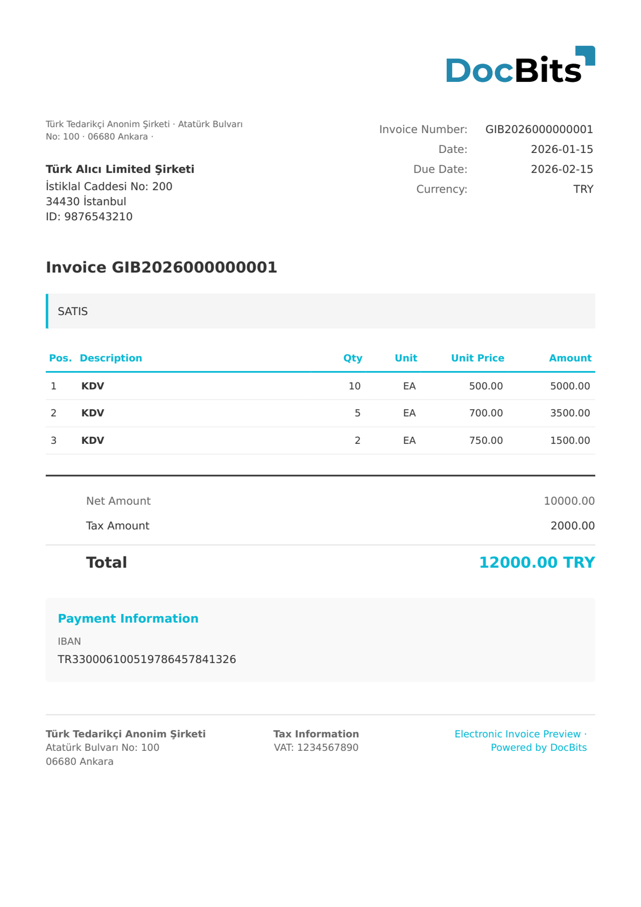

# 🇹🇷 TURKEY E-FATURA

| Property | Value |
|----------|-------|
| **Country / Region** | Turkey |
| **Document Types** | Invoice, Credit Note |
| **Format** | UBL-TR 1.2 XML |
| **Standard** | e-Fatura (GİB - Revenue Administration) |

Turkey e-Fatura is the primary electronic invoice standard mandated by the GİB (Revenue Administration) for B2B transactions between registered taxpayers. Invoices are exchanged through registered integrators and the GİB platform. The format uses UBL-TR, Turkey's localized version of UBL, with Turkish-specific fields for TCKN/VKN tax identification.

## Support Status

| Component | Status |
|-----------|--------|
| Preview | ✅ Supported |
| Field Extraction | ✅ Supported |
| Transformation | ✅ Supported |

## Default Preview

<figure><figcaption>
Default DocBits preview for a Turkey E-Fatura invoice
</figcaption></figure>

## Related

- [Supported Electronic Documents](./)
- [TURKEY E-ARSIV](turkey-e-arsiv.md)
