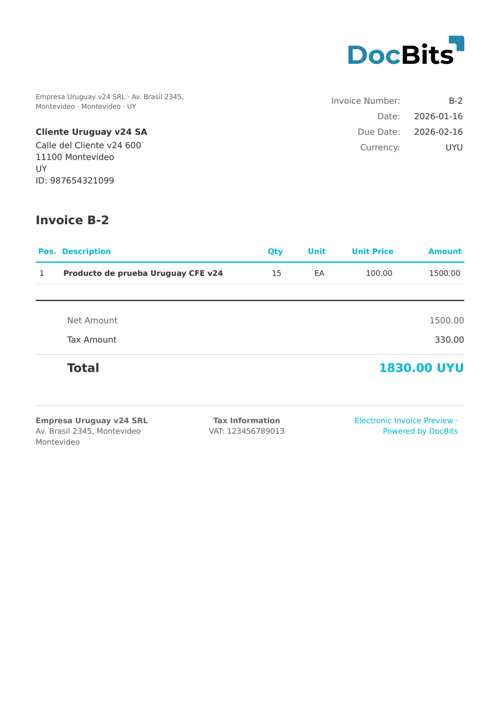

# 🇺🇾 URUGUAY CFE 24

| Property | Value |
|----------|-------|
| **Country / Region** | Uruguay |
| **Document Types** | e-Invoice, Credit Note |
| **Format** | XML |
| **Standard** | CFE Schema Version 24 |

Uruguay CFE 24 refers to schema version 24 of the Uruguayan CFE system. This version is used by many existing electronic documents and includes all required fields for DGI compliance including CAE (Código de Autorización Electrónico).

## Support Status

| Component | Status |
|-----------|--------|
| Preview | ✅ Supported |
| Field Extraction | ✅ Supported |
| Transformation | ✅ Supported |

## Default Preview

<figure><figcaption>
Default DocBits preview for a Uruguay CFE v24 invoice
</figcaption></figure>

## Related

- [Supported Electronic Documents](./)
