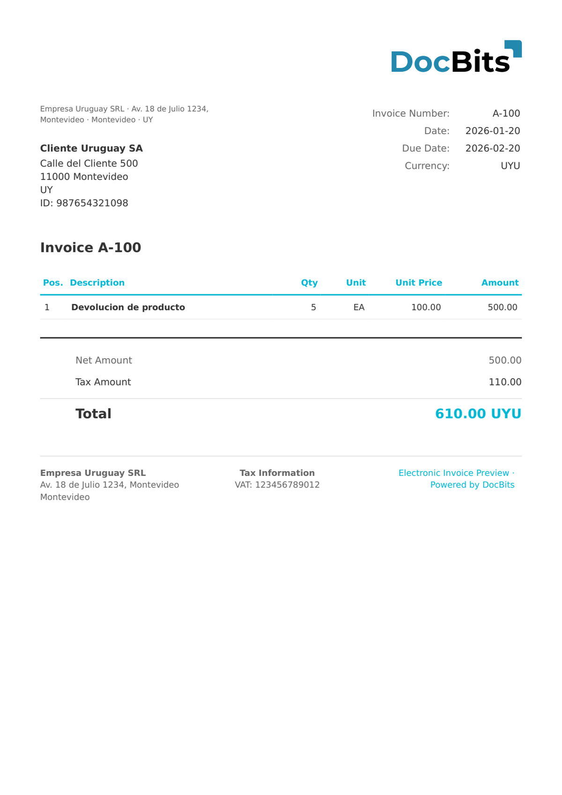

# 🇺🇾 URUGUAY E-NOTA CREDITO

| Property | Value |
|----------|-------|
| **Country / Region** | Uruguay |
| **Document Types** | Credit Note (e-Nota de Crédito) |
| **Format** | XML |
| **Standard** | e-Nota de Crédito (CFE Type 112) |

Uruguay e-Nota de Crédito is the electronic credit note document type within the CFE system, identified by type code 112. It is used to adjust or cancel previously issued e-Facturas and must reference the original document.

## Support Status

| Component | Status |
|-----------|--------|
| Preview | ✅ Supported |
| Field Extraction | ✅ Supported |
| Transformation | ✅ Supported |

## Default Preview

<figure><figcaption>
Default DocBits preview for a Uruguay E-Nota Credito invoice
</figcaption></figure>

## Related

- [Supported Electronic Documents](./)
