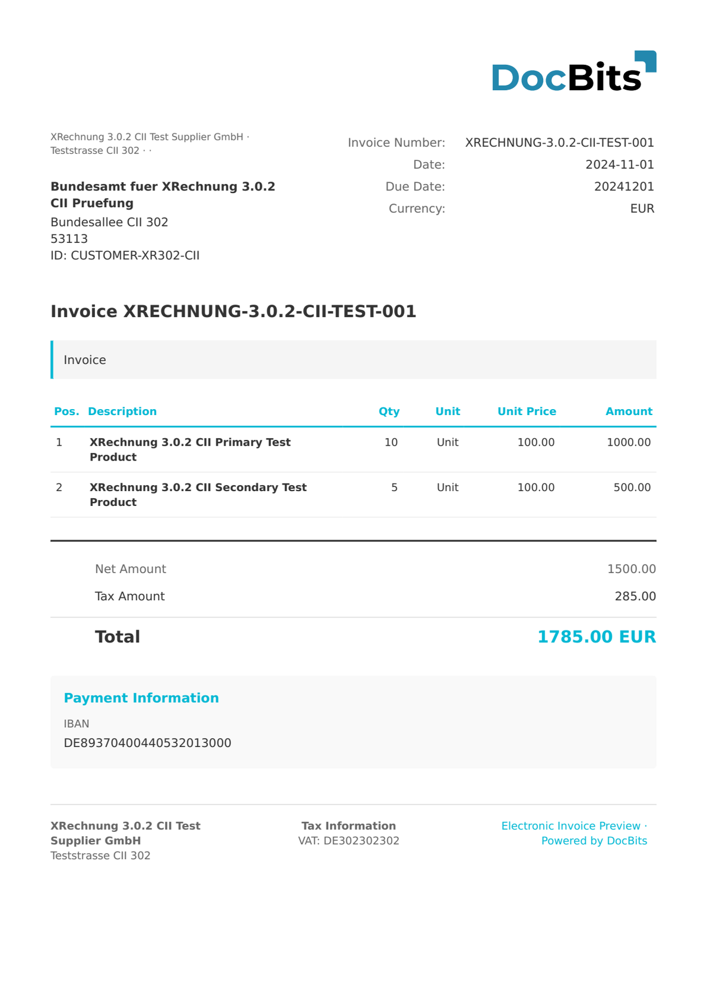

# 🇩🇪 XRECHNUNG 1.2.1 CII

| Property | Value |
|----------|-------|
| **Country / Region** | Germany |
| **Document Types** | Invoice, Credit Note |
| **Format** | CII |
| **Standard** | XRechnung 1.2.1 |
| **Based On** | EN 16931 (UN/CEFACT Cross Industry Invoice) |

Early version of the XRechnung standard. Superseded by newer versions but still supported for processing legacy documents.

## Support Status

| Component | Status |
|-----------|--------|
| Preview | ✅ Supported |
| Field Extraction | ✅ Supported |
| Transformation | ✅ Supported |

## Default Preview

<figure><figcaption>
Default DocBits preview for a Germany XRechnung 1.2.1 CII invoice
</figcaption></figure>

## Related

- [XRechnung Configuration](../xrechnung/)
- [XRechnung Field Mapping](../xrechnung/mapping-xrechnung-in-docbits/)
- [Supported Electronic Documents](./)
