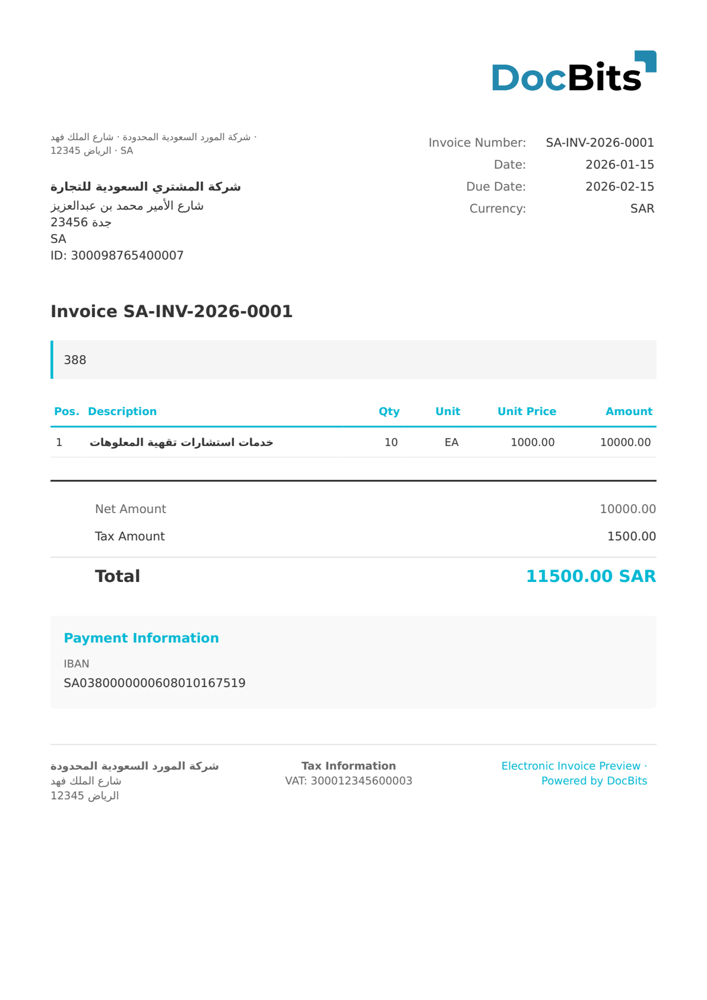

# 🇸🇦 ZATCA FATOORAH

| Property             | Value                                                     |
| -------------------- | --------------------------------------------------------- |
| **Country / Region** | Saudi Arabia                                              |
| **Document Types**   | Invoice (Fatoorah)                                        |
| **Format**           | UBL 2.1 XML                                               |
| **Standard**         | ZATCA FATOORAH (ZATCA - Zakat, Tax and Customs Authority) |

ZATCA Fatoorah is the Saudi Arabian electronic invoicing standard operated by the Zakat, Tax and Customs Authority. Phase 1 (Generation) became mandatory in December 2022, and Phase 2 (Integration) requires real-time reporting to the ZATCA platform. Fatoorah is the standard tax invoice format used for B2B transactions exceeding SAR 1,000.

## Support Status

| Component        | Status      |
| ---------------- | ----------- |
| Preview          | ✅ Supported |
| Field Extraction | ✅ Supported |
| Transformation   | ✅ Supported |

## Default Preview

<figure><figcaption>
Default DocBits preview for a ZATCA Fatoorah invoice
</figcaption></figure>

## Related

* [Supported Electronic Documents](./)
* [ZATCA REPORTING](zatca-reporting.md)
* [ZATCA SIMPLIFIED](zatca-simplified.md)
* [ZATCA TAX INVOICE](zatca-tax-invoice.md)
