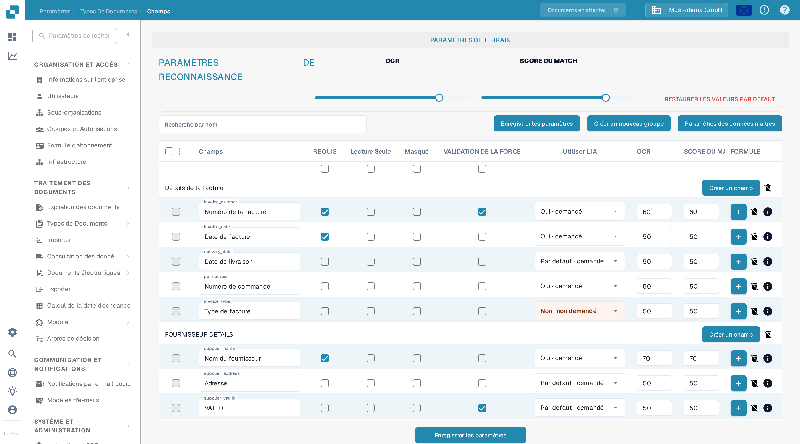
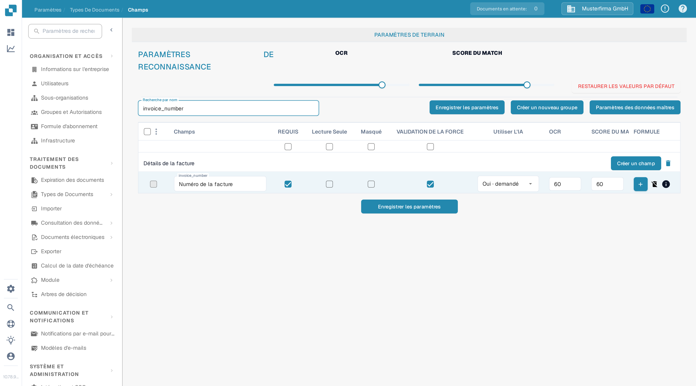

# Configuration des propriétés de champ

Utilisez **Paramètres → Types de Documents → Champs** pour contrôler le comportement des champs d'un type de document. Sélectionnez d'abord le type de document ; l'exemple ci-dessous montre **Facture** dans l'interface française.

<figure><figcaption>Paramètres des champs de la facture dans une organisation DocBits de bac à sable.</figcaption></figure>

## Trouver un champ et modifier ses propriétés

1. Dans **Recherche par nom**, saisissez le nom technique ou le libellé du champ. Cela filtre la liste ; cela ne modifie pas le champ.
2. Repérez la ligne du champ. Par exemple, le champ **Numéro de facture** porte le nom technique `invoice_number`.
3. Réglez les contrôles de cette ligne, puis sélectionnez **Enregistrer les paramètres**. Le même bouton d'enregistrement est disponible au-dessus et en dessous du tableau.

<figure><figcaption>La ligne du champ Numéro de facture après une recherche sur `invoice_number`.</figcaption></figure>

| Contrôle | À quoi il sert |
| --- | --- |
| **REQUIS** | Marque les informations qui doivent être présentes pour la validation. Après avoir modifié ce réglage, vérifiez le résultat de validation d'un document. |
| **Lecture Seule** | Affiche un champ sans permettre aux utilisateurs de modifier sa valeur. |
| **Masqué** | Retire le champ de la vue normale du document. |
| **VALIDATION DE LA FORCE** | Exige que le champ passe la validation. Configurez les règles détaillées séparément ; cette case à cocher n'est pas un éditeur de règles. |
| **Utiliser L'IA** | Demande ou arrête l'extraction par IA pour ce champ. La ligne indique si l'extraction est demandée. |
| **OCR** | Saisissez le seuil de confiance OCR du champ. Il s'agit d'un nombre, pas d'un interrupteur marche/arrêt ni d'un réglage de langue. |
| **SCORE DU MATCH** | Saisissez le seuil de correspondance du champ. Il s'agit d'un nombre, pas d'un interrupteur marche/arrêt. |

Les curseurs **OCR** et **SCORE DU MATCH** sous **PARAMÈTRES DE RECONNAISSANCE** appliquent des valeurs à toute la liste des champs. Les cases à cocher directement sous les titres de colonnes appliquent **REQUIS**, **Lecture Seule**, **Masqué** ou **VALIDATION DE LA FORCE** à toute la liste. Vérifiez les lignes concernées avant de sélectionner **Enregistrer les paramètres**. **RESTAURER LES VALEURS PAR DÉFAUT** réinitialise la configuration des champs ; utilisez-le uniquement si vous voulez remplacer vos modifications.

## Autres contrôles dans cette vue

- **Créer un nouveau groupe** et **Créer un champ** ajoutent un groupe ou un champ. Voir [Ajout et Édition de Champs](adding-and-editing-fields.md).
- **Paramètres des données maîtres** ouvre la [configuration des données de base](master-data-settings.md).
- Les cases à cocher situées le plus à gauche sélectionnent des champs. Le menu adjacent propose **Réaffecter le groupe de champ** pour les champs sélectionnés.
- Le bouton plus **FORMULE** ouvre l'éditeur de formule de ce champ. L'icône **info** affiche les informations du champ. L'icône de suppression n'est pas disponible pour les champs standard.

Pour en savoir plus sur la validation et la correspondance, voir [Setting Validation and Match Score](setting-validation-and-match-score.md).
