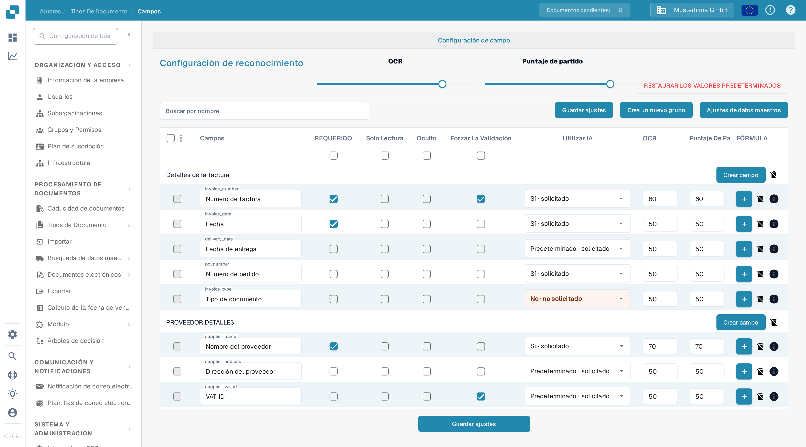
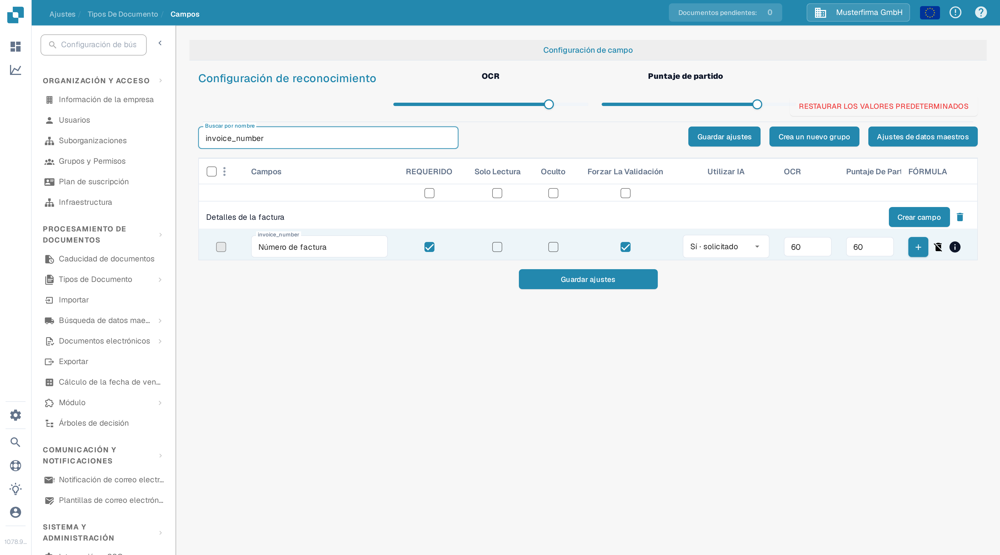

# Configuración de las propiedades de los campos

Utilice **Ajustes → Tipos de documento → Campos** para controlar cómo se comportan los campos de un tipo de documento. Seleccione primero el tipo de documento; el ejemplo siguiente muestra **Invoice** en la interfaz en español.

<figure><figcaption>
Configuración de campos de Invoice en una organización de sandbox de DocBits.
</figcaption></figure>

## Buscar un campo y cambiar sus propiedades

1. En **Buscar por nombre**, escriba el nombre o la etiqueta del campo. Esto filtra la lista; no modifica el campo.
2. Encuentre la fila del campo. Por ejemplo, **Número de factura** tiene el nombre técnico `invoice_number`.
3. Ajuste los controles de esa fila y seleccione **Guardar ajustes**. El mismo botón de guardado está disponible encima y debajo de la tabla.

<figure><figcaption>
La fila de Número de factura tras buscar `invoice_number`.
</figcaption></figure>

| Control | Para qué utilizarlo |
| --- | --- |
| **Requerido** | Marque la información que debe estar presente para la validación. Compruebe el resultado de validación del documento después de cambiar este ajuste. |
| **Solo lectura** | Muestre un campo sin permitir que los usuarios editen su valor. |
| **Oculto** | Mantenga el campo fuera de la vista normal del documento. |
| **Forzar la validación** | Exija que el campo supere la validación. Configure las reglas detalladas por separado; esta casilla no es un editor de reglas. |
| **Utilizar IA** | Solicite o detenga la extracción por IA para este campo. La fila muestra si la extracción está solicitada. |
| **OCR** | Introduzca el umbral de confianza OCR del campo. Es un número, no un interruptor de activación/desactivación ni un ajuste de idioma. |
| **Puntaje de partido** | Introduzca el umbral de coincidencia del campo. Es un número, no un interruptor de activación/desactivación. |

Los controles deslizantes de **OCR** y **Puntaje de partido** bajo **Configuración de reconocimiento** aplican sus valores a toda la lista de campos. Las casillas situadas justo debajo de los títulos de columna aplican **Requerido**, **Solo lectura**, **Oculto** o **Forzar la validación** a toda la lista. Revise las filas afectadas antes de seleccionar **Guardar ajustes**. **Restaurar los valores predeterminados** restablece la configuración de campos; utilícelo solo cuando quiera sustituir sus cambios.

## Otros controles de esta vista

- **Crea un nuevo grupo** y **Crear campo** añaden un grupo o un campo. Consulte [Agregar y editar campos](adding-and-editing-fields.md).
- **Ajustes de datos maestros** abre la [configuración de datos maestros](master-data-settings.md).
- Las casillas de la extrema izquierda seleccionan campos. El menú adyacente ofrece **Reasignar el grupo de campo** para los campos seleccionados.
- El botón **más** de **Fórmula** abre el editor de fórmulas de ese campo. El icono de **información** muestra la información del campo. El icono de eliminar no está disponible para los campos estándar.

Para más información sobre la validación y la coincidencia, consulte [Establecer la validación y el puntaje de coincidencia](setting-validation-and-match-score.md).
