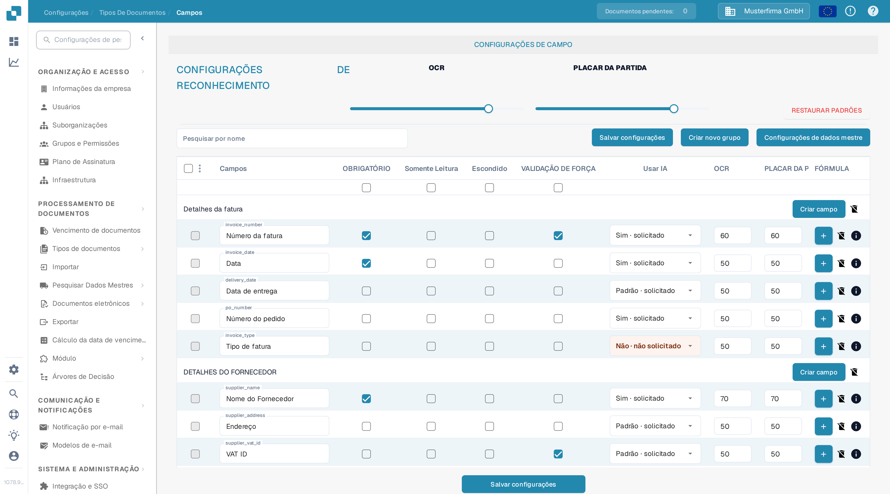
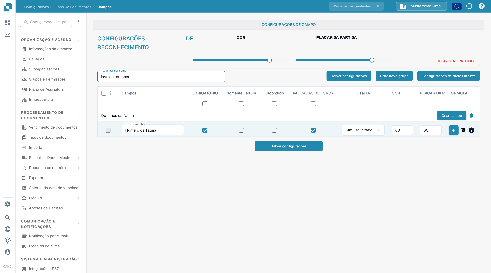

# Configurando Propriedades do Campo

Use **Configurações → Tipos de Documentos → Campos** para controlar o comportamento dos campos de um tipo de documento. Selecione primeiro o tipo de documento; o exemplo abaixo mostra **Fatura** na interface em português.

<figure><figcaption>Configurações de campos da fatura em uma organização do DocBits Sandbox.</figcaption></figure>

## Encontrar um campo e alterar suas propriedades

1. Em **Pesquisar por nome**, insira o nome ou o rótulo do campo. Isso filtra a lista; não altera o campo.
2. Encontre a linha do campo. Por exemplo, **Número da fatura** tem o nome técnico `invoice_number`.
3. Ajuste os controles nessa linha e selecione **Salvar configurações**. O mesmo botão de salvar está disponível acima e abaixo da tabela.

<figure><figcaption>A linha do campo número da fatura após pesquisar por `invoice_number`.</figcaption></figure>

| Controle | Para que serve |
| --- | --- |
| **OBRIGATÓRIO** | Marque informações que precisam estar presentes para a validação. Verifique o resultado da validação do documento após alterar esta configuração. |
| **Somente Leitura** | Exiba um campo sem permitir que os usuários editem seu valor. |
| **Escondido** | Mantenha o campo fora da visualização normal do documento. |
| **VALIDAÇÃO DE FORÇA** | Exija que o campo passe na validação. Configure as regras detalhadas separadamente; esta caixa de seleção não é um editor de regras. |
| **Usar IA** | Solicite ou interrompa a extração por IA para este campo. A linha mostra se a extração foi solicitada. |
| **OCR** | Insira o limite de confiança de OCR do campo. É um número, não um interruptor liga/desliga nem uma configuração de idioma. |
| **PLACAR DA PARTIDA** | Insira o limite de correspondência do campo. É um número, não um interruptor liga/desliga. |

Os controles deslizantes **OCR** e **PLACAR DA PARTIDA** em **CONFIGURAÇÕES DE RECONHECIMENTO** aplicam valores a toda a lista de campos. As caixas de seleção logo abaixo dos títulos das colunas aplicam **OBRIGATÓRIO**, **Somente Leitura**, **Escondido** ou **VALIDAÇÃO DE FORÇA** a toda a lista. Revise as linhas afetadas antes de selecionar **Salvar configurações**. **RESTAURAR PADRÕES** redefine a configuração dos campos; use-o somente quando quiser realmente substituir suas alterações.

## Outros controles nesta visualização

- **Criar novo grupo** e **Criar campo** adicionam um grupo ou um campo. Consulte [Adicionar e Editar Campos](adding-and-editing-fields.md).
- **Configurações de dados mestre** abre a [configuração de dados mestre](master-data-settings.md).
- As caixas de seleção mais à esquerda selecionam campos. O menu ao lado oferece **Reatribuir Grupo de Campo** para os campos selecionados.
- O botão **FÓRMULA** abre o editor de fórmulas desse campo. O ícone **info** mostra informações do campo. O ícone de exclusão não está disponível para campos padrão.

Para mais informações sobre validação e correspondência, consulte [Definir Validação e Pontuação de Correspondência](setting-validation-and-match-score.md).
