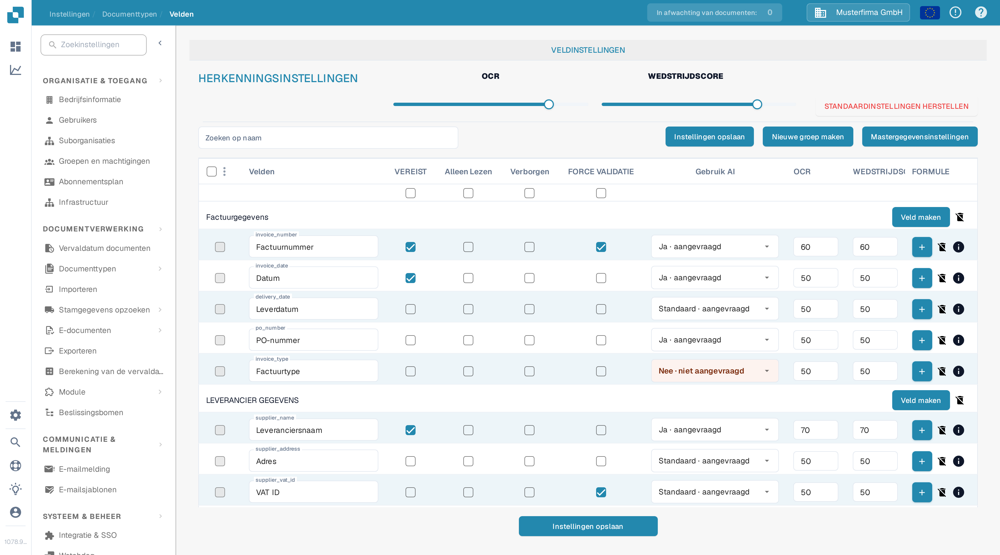
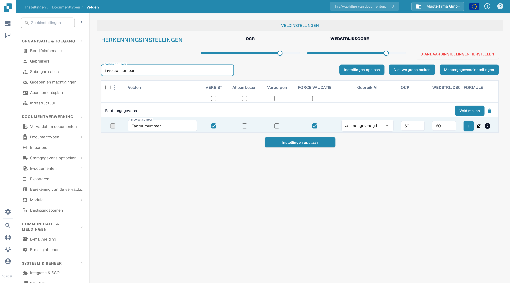

# Velden Eigenschappen Configureren

Gebruik **Instellingen → Documenttypen → Velden** om te bepalen hoe velden zich gedragen voor een documenttype. Selecteer eerst het documenttype; het voorbeeld hieronder toont **Factuur** in de Nederlandse interface.

<figure><figcaption>Veldinstellingen van de factuur in een DocBits-sandboxorganisatie.</figcaption></figure>

## Een veld zoeken en de eigenschappen wijzigen

1. Voer in **Zoeken op naam** de veldnaam of het label in. Dit filtert de lijst; het wijzigt het veld niet.
2. Zoek de veldrij. **invoice_number** heeft bijvoorbeeld de technische naam `invoice_number`.
3. Pas de besturingselementen in die rij aan en kies daarna **Instellingen opslaan**. Dezelfde knop om op te slaan is boven en onder de tabel beschikbaar.

<figure><figcaption>De rij invoice_number na het zoeken op `invoice_number`.</figcaption></figure>

| Besturingselement | Waarvoor je het gebruikt |
| --- | --- |
| **VEREIST** | Markeer informatie die aanwezig moet zijn voor de validatie. Controleer de validatieresultaat van het document nadat je deze instelling hebt gewijzigd. |
| **Alleen Lezen** | Toon een veld zonder dat gebruikers de waarde kunnen bewerken. |
| **Verborgen** | Houd het veld buiten de normale documentweergave. |
| **FORCE VALIDATIE** | Vereist dat het veld de validatie doorstaat. Gedetailleerde regels stel je apart in; dit selectievakje is geen regeleditor. |
| **Gebruik AI** | Vraag AI-extractie voor dit veld aan of stop deze. De rij toont of extractie is aangevraagd. |
| **OCR** | Voer de OCR-betrouwbaarheidsdrempel van het veld in. Dit is een getal, geen aan/uit-schakelaar en geen taalinstelling. |
| **WEDSTRIJDSCORE** | Voer de afstemmingsdrempel van het veld in. Dit is een getal, geen aan/uit-schakelaar. |

De schuifregelaars **OCR** en **WEDSTRIJDSCORE** onder **HERKENNINGSINSTELLINGEN** passen de waarden toe op de hele veldlijst. De selectievakjes direct onder de kolomtitels passen **VEREIST**, **Alleen Lezen**, **Verborgen** of **FORCE VALIDATIE** toe op de hele lijst. Controleer de betrokken rijen voordat je **Instellingen opslaan** kiest. **STANDAARDINSTELLINGEN HERSTELLEN** zet de veldconfiguratie terug; gebruik het alleen als je je wijzigingen echt wilt vervangen.

## Andere besturingselementen in deze weergave

- **Nieuwe groep maken** en **Veld maken** voegen een groep of een veld toe. Zie [Velden Toevoegen en Bewerken](adding-and-editing-fields.md).
- **Mastergegevensinstellingen** opent de [mastergegevensconfiguratie](master-data-settings.md).
- De selectievakjes links selecteren velden. Het menu ernaast biedt **Veldgroep opnieuw toewijzen** aan voor geselecteerde velden.
- De plusknop **FORMULE** opent de formule-editor voor dat veld. Het **info**-pictogram toont veldinformatie. Het verwijderpictogram is niet beschikbaar voor standaardvelden.

Zie voor meer informatie over validatie en afstemmen [Setting Validation and Match Score](setting-validation-and-match-score.md).
