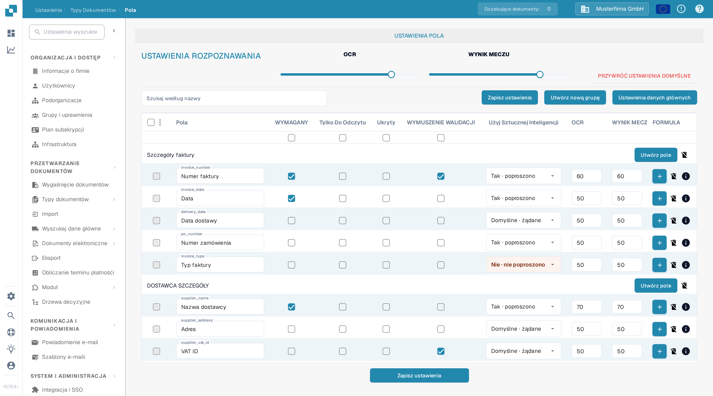
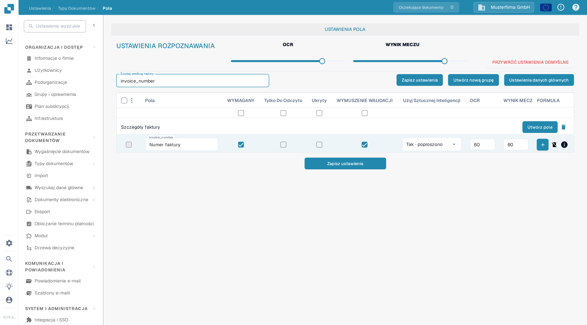

# Konfigurowanie Właściwości Pola

Użyj **Ustawienia → Typy Dokumentów → Pola**, aby sterować zachowaniem pól dla danego typu dokumentu. Najpierw wybierz typ dokumentu; poniższy przykład pokazuje **Fakturę** w polskim interfejsie.

<figure><figcaption>Ustawienia pól faktury w organizacji DocBits Sandbox.</figcaption></figure>

## Znajdź pole i zmień jego właściwości

1. W polu **Szukaj według nazwy** wpisz nazwę lub etykietę pola. To filtrowanie listy; nie zmienia pola.
2. Znajdź wiersz pola. Na przykład **Numer faktury** ma nazwę techniczną `invoice_number`.
3. Dostosuj kontrolki w tym wierszu, a następnie wybierz **Zapisz ustawienia**. Ten sam przycisk zapisu jest dostępny nad tabelą i pod nią.

<figure><figcaption>Wiersz pola numer faktury po wyszukaniu `invoice_number`.</figcaption></figure>

| Kontrolka | Do czego jej użyć |
| --- | --- |
| **WYMAGANY** | Oznacz informacje, które muszą być obecne do walidacji. Po zmianie tego ustawienia sprawdź wynik walidacji dokumentu. |
| **Tylko Do Odczytu** | Pokaż pole, nie pozwalając użytkownikom na zmianę jego wartości. |
| **Ukryty** | Wyklucz pole z normalnego widoku dokumentu. |
| **WYMUSZENIE WALIDACJI** | Wymagaj, aby pole przeszło walidację. Szczegółowe reguły konfiguruje się osobno; ten pole wyboru nie jest edytorem reguł. |
| **Użyj Sztucznej Inteligencji** | Żądaj lub zatrzymaj ekstrakcję AI dla tego pola. Wiersz pokazuje, czy ekstrakcja jest żądana. |
| **OCR** | Wpisz próg pewności OCR dla pola. To liczba, nie przełącznik włącz/wyłącz ani ustawienie języka. |
| **WYNIK MECZU** | Wpisz próg dopasowania dla pola. To liczba, nie przełącznik włącz/wyłącz. |

Suwaki **OCR** i **WYNIK MECZU** w sekcji **USTAWIENIA ROZPOZNAWANIA** stosują wartości do całej listy pól. Pole wyboru bezpośrednio pod tytułami kolumn stosują **WYMAGANY**, **Tylko Do Odczytu**, **Ukryty** lub **WYMUSZENIE WALIDACJI** do całej listy. Sprawdź dotyczące wiersze, zanim wybierzesz **Zapisz ustawienia**. **PRZYWRÓĆ USTAWIENIA DOMYŚLNE** resetuje konfigurację pól; użyj tego tylko wtedy, gdy naprawdę chcesz zastąpić swoje zmiany.

## Inne kontrolki w tym widoku

- **Utwórz nową grupę** i **Utwórz pole** dodają grupę lub pole. Zobacz [Dodawanie i Edytowanie Pól](adding-and-editing-fields.md).
- **Ustawienia danych głównych** otwiera [konfigurację danych głównych](master-data-settings.md).
- Pole wyboru po lewej stronie zaznaczają pola. Menu obok oferuje **Przypisz ponownie grupę pól** dla zaznaczonych pól.
- Przycisk **FORMUŁA** otwiera edytor formuł dla tego pola. Ikona **info** pokazuje informacje o polu. Ikona usunięcia nie jest dostępna dla pól standardowych.

Aby uzyskać więcej informacji o walidacji i dopasowywaniu, zobacz [Ustawianie Walidacji i Wyniku Dopasowania](setting-validation-and-match-score.md).
