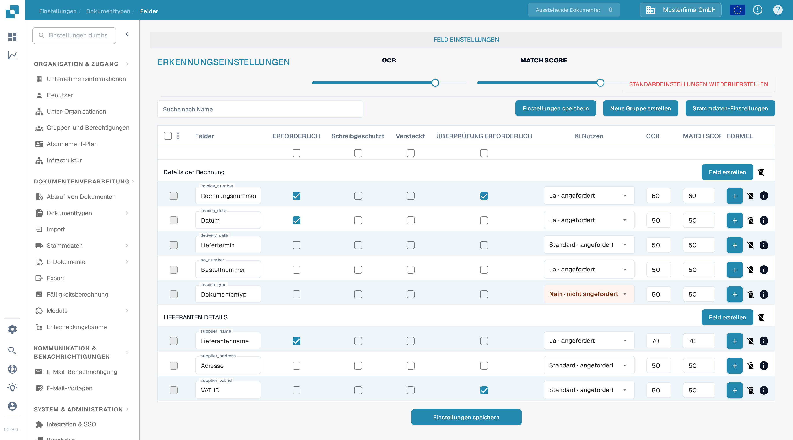
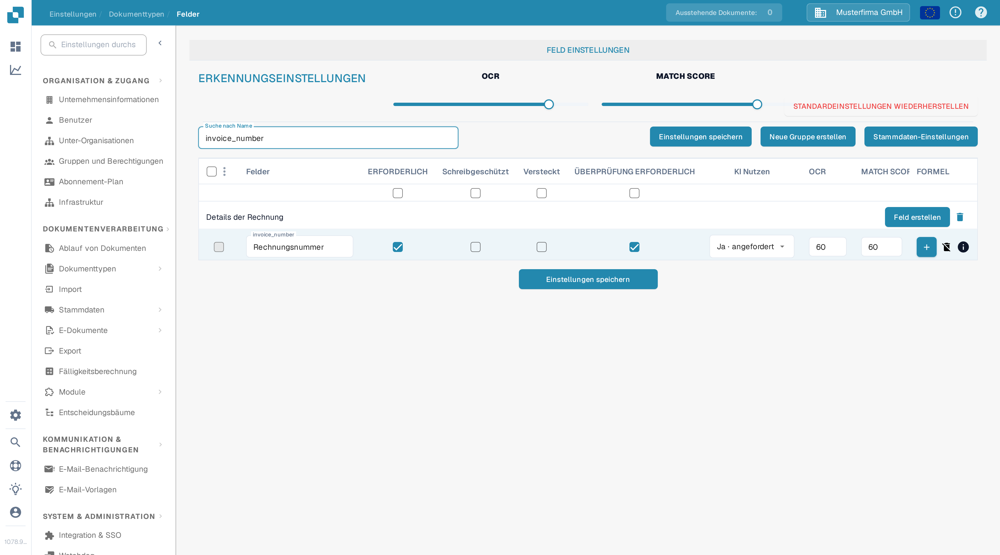

# Konfigurieren von Feldeigenschaften

Nutzen Sie **Einstellungen → Dokumenttypen → Felder**, um das Verhalten der Felder eines Dokumenttyps zu steuern. Wählen Sie zuerst den Dokumenttyp; die Beispiele unten zeigen **Rechnung** in der deutschen Oberfläche.

<figure><figcaption>Feldeinstellungen der Rechnung in einer DocBits-Sandbox-Organisation.</figcaption></figure>

## Ein Feld finden und seine Eigenschaften ändern

1. Geben Sie unter **Suche nach Name** den Feldnamen oder Titel ein. Das filtert nur die Liste; das Feld selbst wird dabei nicht geändert.
2. Suchen Sie die Zeile des Feldes. Das Feld **Rechnungsnummer** hat zum Beispiel den technischen Namen `invoice_number`.
3. Stellen Sie die Regler und Kontrollkästchen in dieser Zeile ein und wählen Sie anschließend **Einstellungen speichern**. Dieselbe Schaltfläche gibt es oberhalb und unterhalb der Tabelle.

<figure><figcaption>Die Zeile des Feldes Rechnungsnummer nach der Suche nach `invoice_number`.</figcaption></figure>

| Steuerung | Wofür Sie sie verwenden |
| --- | --- |
| **ERFORDERLICH** | Markiert Informationen, die vorhanden sein müssen damit die Prüfung des Belegs bestehen kann. Prüfen Sie nach der Änderung das Prüfergebnis eines Belegs. |
| **Schreibgeschützt** | Zeigt das Feld an, ohne dass Benutzer den Wert bearbeiten können. |
| **Versteckt** | Hält das Feld aus der normalen Belegansicht heraus. |
| **ÜBERPRÜFUNG ERFORDERLICH** | Verlangt, dass das Feld die Prüfung besteht. Die detaillierten Regeln stellen Sie getrennt ein; dieses Kontrollkästchen ist kein Regel-Editor. |
| **KI Nutzen** | Fordert die KI-Extraktion für dieses Feld an oder beendet sie. Die Zeile zeigt an, ob die Extraktion angefordert ist. |
| **OCR** | Tragen Sie hier den Schwellenwert für die OCR-Güte des Feldes ein. Das ist eine Zahl, kein An-/Aus-Schalter und keine Sprach- oder Schriftarteinstellung. |
| **MATCH SCORE** | Tragen Sie hier den Schwellenwert für den Abgleich des Feldes ein. Das ist eine Zahl, kein An-/Aus-Schalter. |

Die Schieberegler **OCR** und **MATCH SCORE** im Bereich **ERKENNUNGSEINSTELLUNGEN** setzen Werte für die gesamte Feldliste. Die Kontrollkästchen direkt unter den Spaltentiteln setzen **ERFORDERLICH**, **Schreibgeschützt**, **Versteckt** oder **ÜBERPRÜFUNG ERFORDERLICH** über die ganze Liste. Prüfen Sie die betroffenen Zeilen, bevor Sie **Einstellungen speichern** wählen. **STANDARDEINSTELLUNGEN WIEDERHERSTELLEN** setzt die Feldkonfiguration zurück; nutzen Sie das nur, wenn Sie Ihre Änderungen bewusst ersetzen wollen.

## Andere Steuerelemente in dieser Ansicht

- **Neue Gruppe erstellen** und **Feld erstellen** fügen eine Gruppe oder ein Feld hinzu. Siehe [Hinzufügen und Bearbeiten von Feldern](adding-and-editing-fields.md).
- **Stammdaten-Einstellungen** öffnet die [Stammdaten-Konfiguration](master-data-settings.md).
- Die äußersten linken Kontrollkästchen markieren Felder. Das danebenliegende Menü bietet **Feldgruppe neu zuordnen** für die markierten Felder.
- Die Plus-Schaltfläche **FORMEL** öffnet den Formeleditor für dieses Feld. Das **Info**-Symbol zeigt Feldinformationen. Das Löschen-Symbol ist für Standardfelder nicht verfügbar.

Mehr zu Prüfung und Abgleich finden Sie unter [Setting Validation and Match Score](setting-validation-and-match-score.md).
