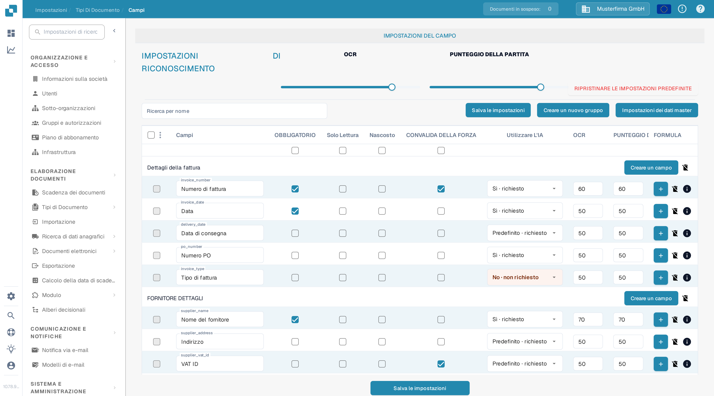
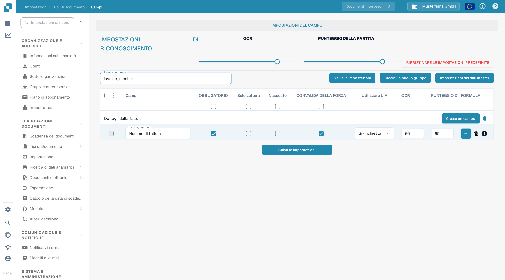

# Configurazione delle Proprietà Campo

Usate **Impostazioni → Tipi Di Documento → Campi** per controllare il comportamento dei campi di un tipo di documento. Selezionate prima il tipo di documento; l'esempio seguente mostra **Fattura** nell'interfaccia italiana.

<figure><figcaption>Impostazioni dei campi della fattura in una organizzazione DocBits Sandbox.</figcaption></figure>

## Trovare un campo e modificarne le proprietà

1. In **Ricerca per nome** inserite il nome o l'etichetta del campo. Questo filtra l'elenco; non modifica il campo.
2. Trovate la riga del campo. La riga **Numero fattura** risponde per esempio al nome tecnico `invoice_number`.
3. Regolate i controlli di quella riga e poi scegliete **Salva le impostazioni**. Lo stesso pulsante di salvataggio è disponibile sopra e sotto la tabella.

<figure><figcaption>La riga del campo numero fattura dopo la ricerca di `invoice_number`.</figcaption></figure>

| Controllo | A cosa serve |
| --- | --- |
| **OBBLIGATORIO** | Contrassegna le informazioni che devono essere presenti per la convalida. Controllate il risultato di convalida del documento dopo aver modificato questa impostazione. |
| **Solo Lettura** | Mostra un campo senza permettere agli utenti di modificarne il valore. |
| **Nascosto** | Tiene il campo fuori dalla normale vista del documento. |
| **CONVALIDA DELLA FORZA** | Richiede che il campo superi la convalida. Le regole dettagliate si configurano separatamente; questa casella di controllo non è un editor di regole. |
| **Utilizzare L'IA** | Richiede o interrompe l'estrazione con l'IA per questo campo. La riga mostra se l'estrazione è richiesta. |
| **OCR** | Inserite la soglia di affidabilità OCR del campo. È un numero, non un interruttore acceso/spento e non un'impostazione di lingua. |
| **PUNTEGGIO DELLA PARTITA** | Inserite la soglia di abbinamento del campo. È un numero, non un interruttore acceso/spento. |

I cursori **OCR** e **PUNTEGGIO DELLA PARTITA** sotto **IMPOSTAZIONI DI RICONOSCIMENTO** applicano i valori all'intero elenco di campi. Le caselle di controllo direttamente sotto i titoli delle colonne applicano **OBBLIGATORIO**, **Solo Lettura**, **Nascosto** o **CONVALIDA DELLA FORZA** all'intero elenco. Controllate le righe interessate prima di scegliere **Salva le impostazioni**. **RIPRISTINARE LE IMPOSTAZIONI PREDEFINITE** reimposta la configurazione dei campi; usatelo solo se volete davvero sostituire le vostre modifiche.

## Altri controlli in questa vista

- **Creare un nuovo gruppo** e **Creare un campo** aggiungono un gruppo o un campo. Vedere [Aggiungere e modificare i campi](adding-and-editing-fields.md).
- **Impostazioni dei dati master** apre la [configurazione dei dati master](master-data-settings.md).
- Le caselle di controllo più a sinistra selezionano i campi. Il menu accanto offre **Riassegnare il gruppo di campo** per i campi selezionati.
- Il pulsante più **FORMULA** apre l'editor di formule per quel campo. L'icona **info** mostra le informazioni del campo. L'icona di eliminazione non è disponibile per i campi standard.

Per maggiori informazioni su convalida e abbinamento vedete [Impostazione della Convalida e del Match Score](setting-validation-and-match-score.md).
