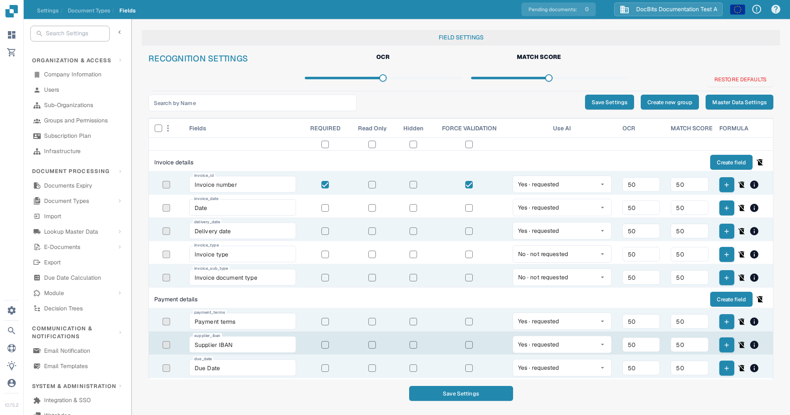
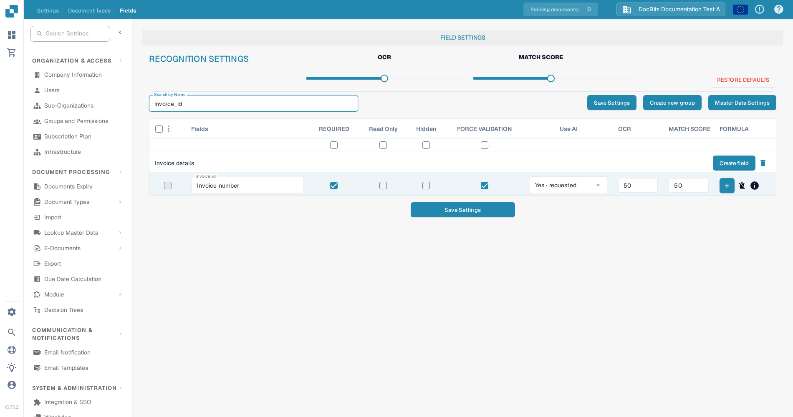

# Configuring Field Properties

Use **Settings → Document Types → Fields** to control how fields behave for a document type. Select the document type first; the example below shows **Invoice** in the English interface.

<figure><figcaption>Invoice field settings in a DocBits sandbox organization.</figcaption></figure>

## Find a field and change its properties

1. In **Search by Name**, enter the field name or label. This filters the list; it does not change the field.
2. Find the field row. For example, **Invoice number** has the technical name `invoice_id`.
3. Adjust the controls in that row, then select **Save Settings**. The same save button is available above and below the table.

<figure><figcaption>The Invoice number row after searching for `invoice_id`.</figcaption></figure>

| Control | What to use it for |
| --- | --- |
| **Required** | Mark information that must be present for validation. Check the document's validation result after changing this setting. |
| **Read Only** | Show a field without allowing users to edit its value. |
| **Hidden** | Keep the field out of the normal document view. |
| **Force Validation** | Require the field to pass validation. Configure detailed rules separately; this checkbox is not a rule editor. |
| **Use AI** | Request or stop AI extraction for this field. The row displays whether extraction is requested. |
| **OCR** | Enter the field's OCR confidence threshold. This is a number, not an on/off switch or a language setting. |
| **Match Score** | Enter the field's matching threshold. This is a number, not an on/off switch. |

The **OCR** and **Match Score** sliders under **Recognition Settings** apply values across the field list. The checkboxes directly below the column titles apply **Required**, **Read Only**, **Hidden**, or **Force Validation** across the list. Review the affected rows before selecting **Save Settings**. **Restore Defaults** resets the field configuration; use it only when you intend to replace your changes.

## Other controls in this view

- **Create new group** and **Create field** add a group or a field. See [Adding and Editing Fields](adding-and-editing-fields.md).
- **Master Data Settings** opens the [master data configuration](master-data-settings.md).
- The leftmost checkboxes select fields. The adjacent menu offers **Reassign Field Group** for selected fields.
- The **Formula** plus button opens the formula editor for that field. The **info** icon shows field information. The delete icon is unavailable for standard fields.

For more on validation and matching, see [Setting Validation and Match Score](setting-validation-and-match-score.md).
