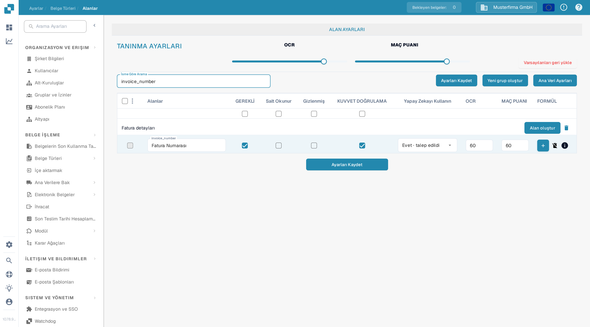

# Alan Özelliklerini Yapılandırma

Bir belge türü için alanların nasıl davranacağını denetlemek üzere **Ayarlar → Belge Türleri → Alanlar** bölümünü kullanın. Önce belge türünü seçin; aşağıdaki örnekte Türkçe arayüzde bir faturanın alan ayarları gösterilmektedir.

<figure><figcaption>Bir DocBits sandbox organizasyonunda fatura alan ayarları.</figcaption></figure>

## Bir alan bulmak ve özelliklerini değiştirmek

1. **İsme Göre Arama** alanına alan adını veya etiketini girin. Bu yalnızca listeyi filtreler; alanı değiştirmez.
2. Alanın satırını bulun. Alanlar teknik adlarıyla listelenir; örneğin fatura numarası alanının teknik adı `invoice_number`dır.
3. O satırdaki denetimleri ayarlayın ve ardından **Ayarları Kaydet** seçeneğini seçin. Aynı kaydet düğmesi tablonun üstünde ve altında bulunur.

<figure><figcaption>`invoice_number` aramasından sonra fatura numarası satırı.</figcaption></figure>

| Denetim | Ne için kullanılır |
| --- | --- |
| **GEREKLİ** | Doğrulama için zorunlu olan bilgileri işaretler. Bu ayarı değiştirdikten sonra belgenin doğrulama sonucunu kontrol edin. |
| **Salt Okunur** | Alanı, kullanıcıların değerini düzenlemesine izin vermeden gösterir. |
| **Gizlenmiş** | Alanı normal belge görünümünün dışında tutar. |
| **KUVVET DOĞRULAMA** | Alanın doğrulamayı geçmesini zorunlu kılar. Ayrıntılı kuralları ayrı yapılandırırsınız; bu onay kutusu bir kural düzenleyicisi değildir. |
| **Yapay Zekayı Kullanın** | Bu alan için yapay zeka çıkarmayı ister veya durdurur. Satır, çıkarmanın istenip istenmediğini gösterir. |
| **OCR** | Alanın OCR güven eşiğini girin. Bu bir sayıdır; açma/kapama düğmesi veya dil ayarı değildir. |
| **MAÇ PUANI** | Alanın eşleştirme eşiğini girin. Bu bir sayıdır; açma/kapama düğmesi değildir. |

**TANINMA AYARLARI** bölümündeki **OCR** ve **MAÇ PUANI** kaydırıcıları değerleri alan listesinin tamamına uygular. Sütun başlıklarının hemen altındaki onay kutuları **GEREKLİ**, **Salt Okunur**, **Gizlenmiş** veya **KUVVET DOĞRULAMA** ayarlarını listenin tamamına uygular. **Ayarları Kaydet** seçeneğini seçmeden önce etkilenen satırları gözden geçirin. **Varsayılanları geri yükle**, alan yapılandırmasını sıfırlar; bunu yalnızca değişikliklerinizi bilerek değiştirmek istediğinizde kullanın.

## Bu görünümdeki diğer denetimler

- **Yeni grup oluştur** ve **Alan oluştur** bir grup ya da alan ekler. Ayrıntılı adımlar için yayımlanmış [Alan Ekleme ve Düzenleme](https://docs.docbits.com/administration-and-setup/settings/global-settings/document-types/fields/adding-and-editing-fields) sayfasına bakın.
- **Ana Veri Ayarları**, [ana veri yapılandırmasını](https://docs.docbits.com/administration-and-setup/settings/global-settings/document-types/fields/master-data-settings) açar.
- En soldaki onay kutuları alanları seçer. Yanındaki menü, seçili alanlar için **Alan Grubunu Yeniden Ata** olanağını sunar.
- **FORMÜL** artı düğmesi, o alanın formül düzenleyicisini açar. **info** simgesi alan bilgilerini gösterir. Silme simgesi standart alanlar için kullanılamaz.

Doğrulama ve eşleştirme hakkında daha fazla bilgi için yayımlanmış [Doğrulama ve Eşleşme Puanını Ayarlama](https://docs.docbits.com/administration-and-setup/settings/global-settings/document-types/fields/setting-validation-and-match-score) sayfasına bakın.
