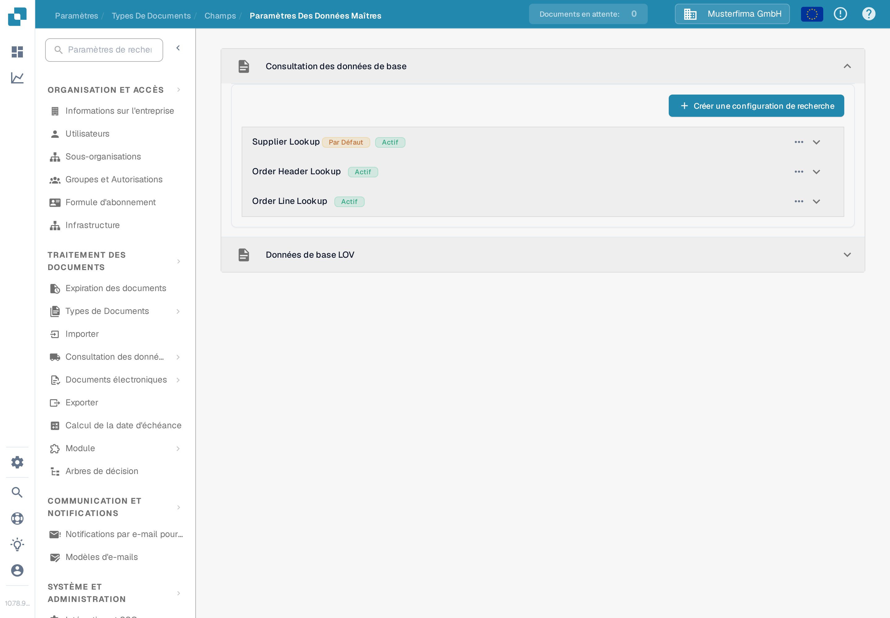
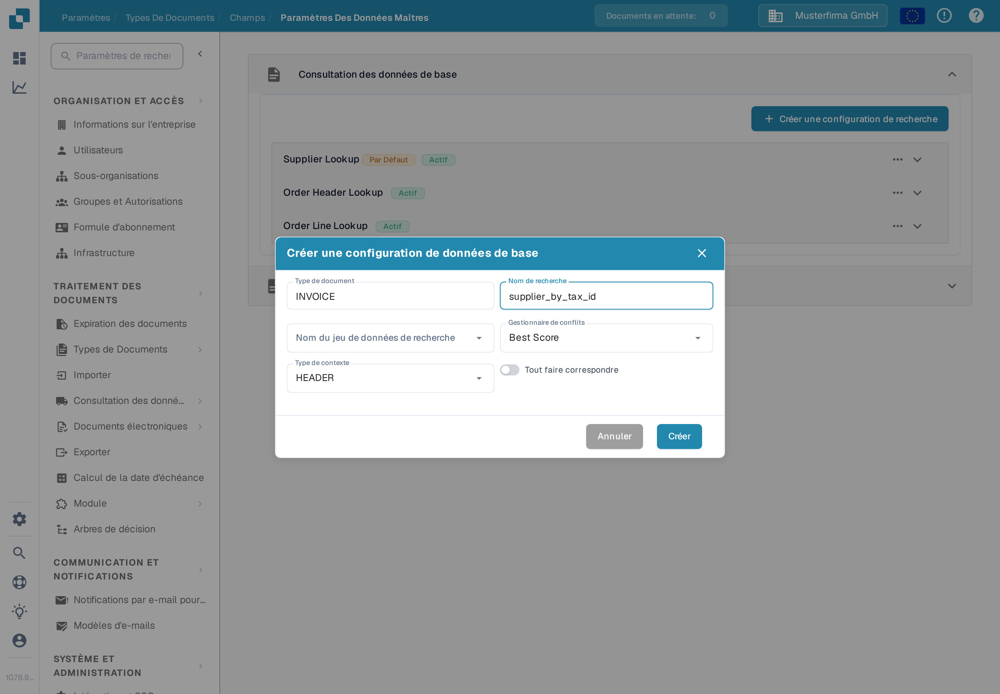
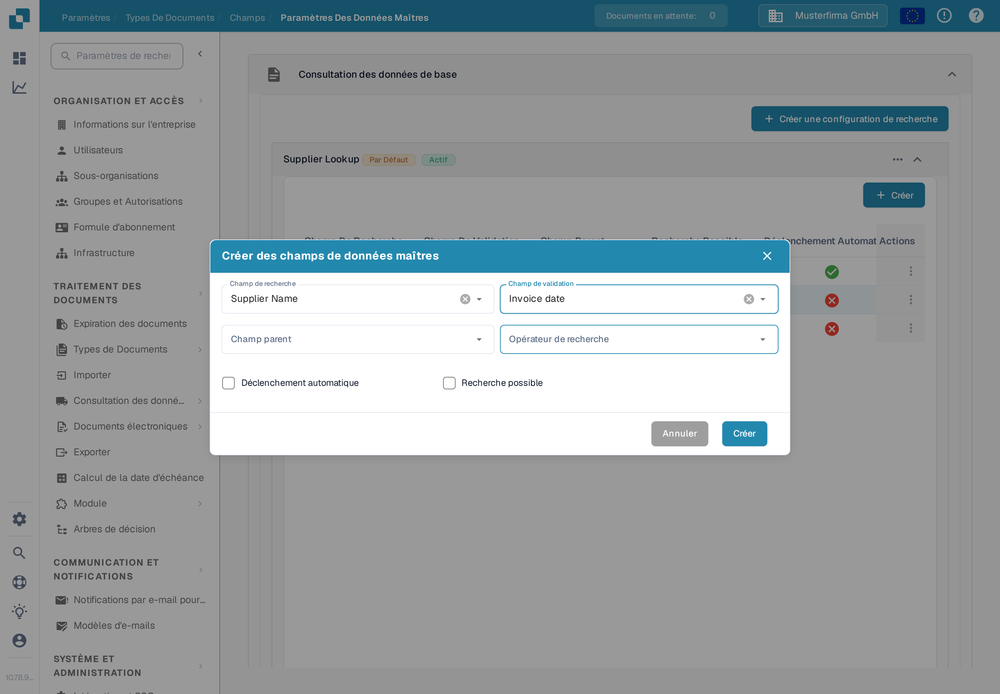
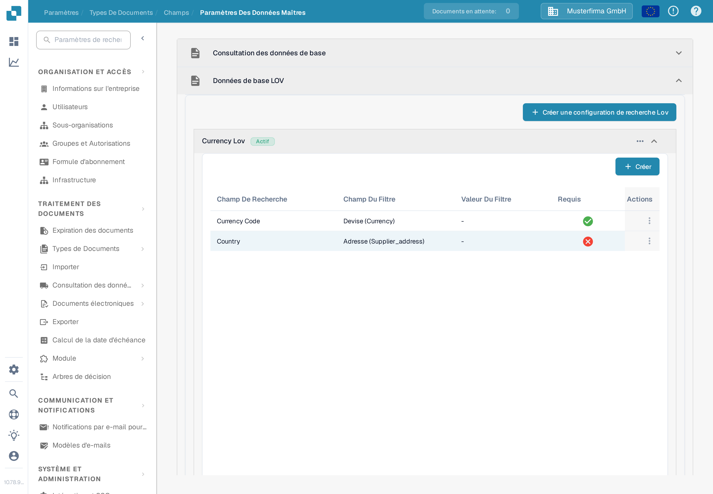
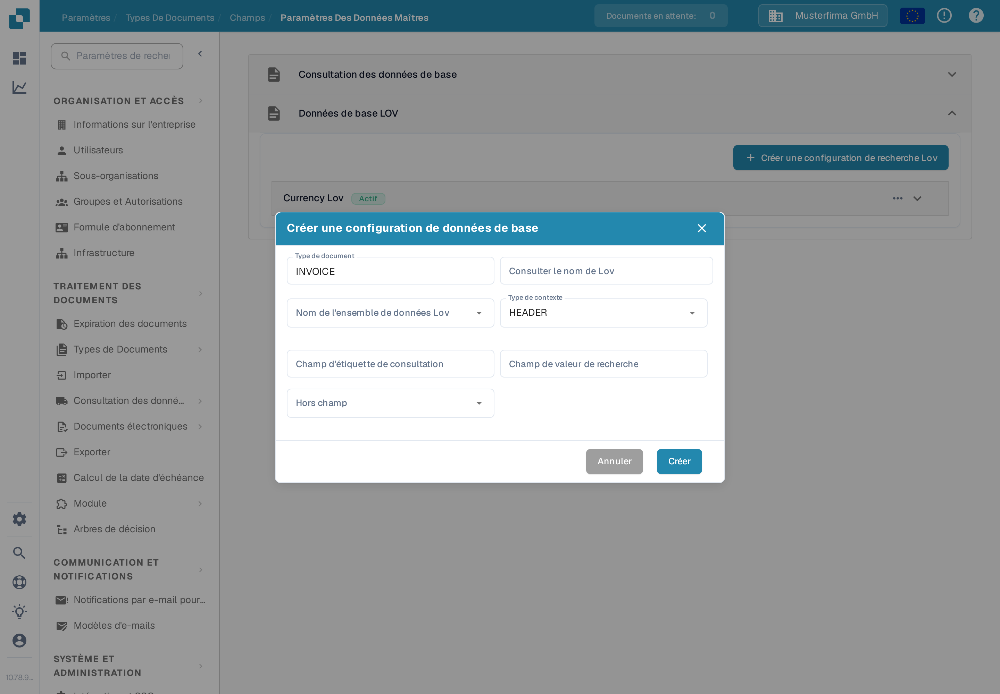

# Paramètres des données de référence

Les **Paramètres des données de référence** relient les champs de validation d'un document aux données stockées sous [Recherche de données de référence](../../../document-processing/master-data-lookup.md). Utilisez **Consultation des données de base** pour trouver un enregistrement correspondant et le reprendre. Utilisez **Données de base LOV** pour proposer une liste de valeurs issue d'un jeu de données.

## Ouvrir les paramètres

1. Dans **Paramètres**, ouvrez **Traitement des documents → Types de documents**.
2. Ouvrez le type de document que vous souhaitez configurer, par exemple **Facture**, puis sélectionnez **Champs**.
3. Sélectionnez **Paramètres des données de référence**. La page contient les deux sections **Consultation des données de base** et **Données de base LOV**. Sélectionnez le titre d'une section pour la déplier.

<figure><figcaption>
Choisissez la section qui correspond au type de champ que vous souhaitez configurer.
</figcaption></figure>

## Associer un enregistrement avec la consultation des données de base

Les configurations de la section **Consultation des données de base** parcourent un jeu de données et associent un enregistrement correspondant aux champs du document. La liste affiche le nom de chaque configuration et indique si elle est active. Un badge **Par défaut** identifie une configuration fournie par DocBits ; vous pouvez la désactiver, mais pas la modifier ni la supprimer.

### Créer une configuration de recherche

1. Sélectionnez **Créer une configuration de recherche**.
2. Saisissez un **Nom de recherche** et choisissez le **Nom du jeu de données de recherche** qui contient les enregistrements à parcourir.
3. Choisissez un **Gestionnaire de conflits** pour le cas où plusieurs enregistrements correspondent :
   * **Best Score** choisit la correspondance la plus forte.
   * **Return None** laisse le résultat vide, à une personne de décider.
   * **Return First** utilise le premier résultat.
4. Choisissez **HEADER** pour les champs du document ou **LINE** pour les champs d'un tableau du document. Pour **LINE**, choisissez également le **Détail du contexte**, c'est-à-dire le tableau auquel la recherche s'applique.
5. Activez **Tout faire correspondre** si chaque champ de recherche configuré doit correspondre à un enregistrement. Laissez-le désactivé si un seul champ correspondant suffit. Sélectionnez **Créer**.

<figure><figcaption>
Le formulaire d'une configuration de recherche pour l'en-tête d'une facture.
</figcaption></figure>

**Tout faire correspondre** et le **Gestionnaire de conflits** agissent ensemble et décident si un fournisseur est reconnu automatiquement. Vous trouverez des exemples dans [Configuration des données floues avec les données maîtres](../../../../setup/document-types/fuzzy-data-configuration-with-master-data.md).

### Mapper les champs d'une configuration

Dépliez une configuration pour voir les champs qui lui sont associés. Dans l'exemple ci-dessous, **Supplier Name** est recherchable, tandis que **Supplier Number** déclenche la recherche automatiquement. Les associations de votre organisation peuvent différer.

<figure><figcaption>
Dépliez une recherche pour examiner les champs qui participent à la correspondance.
</figcaption></figure>

Sélectionnez **Créer** dans la configuration dépliée pour ajouter une association :

* **Champ de recherche** est la colonne du jeu de données à parcourir.
* **Champ de validation** est le champ du document qui reçoit le résultat.
* **Champ parent** vérifie éventuellement le résultat par rapport à un champ associé.
* **Opérateur de recherche** détermine la manière dont le texte est comparé. **Smart** ignore les espaces et la ponctuation ; les autres choix incluent Contient, Commence par, Se termine par et Exact.
* **Déclenchement automatique** lance une recherche dès que ce champ est renseigné. **Recherche possible** laisse le champ participer aux recherches et permet une recherche manuelle pendant la validation.

Sélectionnez **Créer** pour ajouter l'association. Utilisez le menu à trois points **Actions** d'une ligne pour modifier ou supprimer une association modifiable. Les associations par défaut peuvent uniquement être consultées.

<figure><figcaption>
Choisissez la manière dont une colonne du jeu de données est associée à un champ du document.
</figcaption></figure>

Utilisez le menu à trois points d'une configuration pour l'activer ou la désactiver, la dupliquer ou la modifier. Une configuration par défaut propose **Vue** à la place de **Modifier** et ne peut pas être supprimée. Supprimer une configuration ou un champ personnalisé supprime son association ; vérifiez d'abord quels champs du document en dépendent.

## Proposer une liste avec les données de base LOV

**Données de base LOV** crée des listes déroulantes à partir d'un jeu de données de référence. Vous pouvez également ajouter des champs de filtre pour qu'une sélection précédente restreigne les choix affichés ensuite.

Dépliez **Données de base LOV**, puis sélectionnez **Créer une configuration de recherche Lov**. Si aucune configuration n'existe, la section n'affiche que ce bouton.

<figure><figcaption>
Ouvrez cette section lorsqu'un champ du document doit proposer les valeurs d'un jeu de données comme choix.
</figcaption></figure>

Dans le formulaire, saisissez **Consulter le nom de Lov**, choisissez **Nom de l'ensemble de données Lov** et réglez **Type de contexte** sur **HEADER** ou **LINE**. Pour **LINE**, sélectionnez **Détail du contexte** afin d'identifier le tableau du document. Choisissez ensuite :

* **Champ d'étiquette de consultation** : la valeur que les personnes voient dans la liste déroulante.
* **Champ de valeur de recherche** : la valeur stockée pour la sélection et utilisée pour le filtrage.
* **Hors champ** : le champ du document renseigné par l'étiquette sélectionnée.

Sélectionnez **Créer** pour enregistrer la configuration. Dépliez-la pour examiner ses champs, ou utilisez son menu à trois points pour l'activer, la dupliquer, la modifier ou la supprimer.

<figure><figcaption>
Reliez la valeur d'un jeu de données et son étiquette visible à un champ du document.
</figcaption></figure>

Pour créer des listes déroulantes dépendantes, sélectionnez **Créer** dans une configuration LOV dépliée et choisissez un **Champ de recherche** et un **Champ du filtre**. La valeur du champ de filtre restreint les choix renvoyés par la recherche. Vous pouvez également définir une **Valeur du filtre** fixe et marquer un champ comme **Requis**. Utilisez le menu à trois points de la ligne pour modifier ou supprimer un champ de filtre personnalisé.
