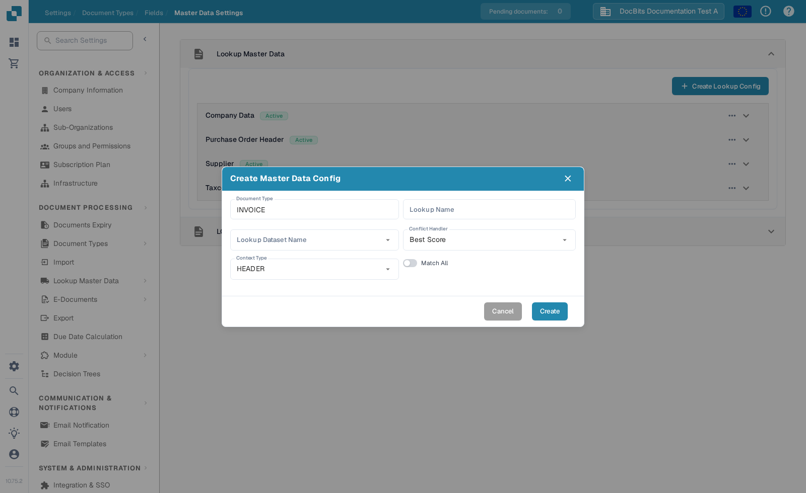
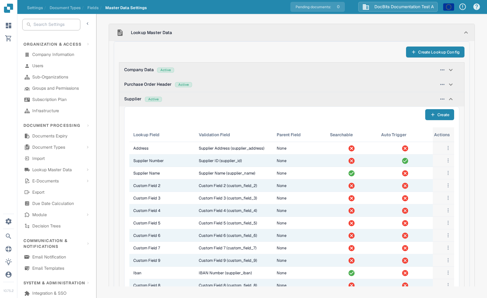
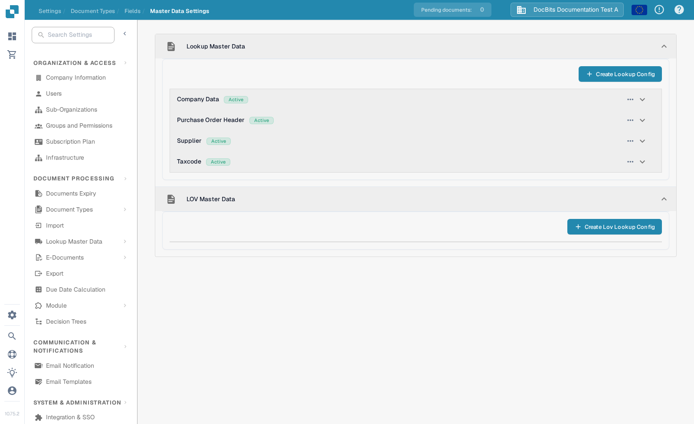
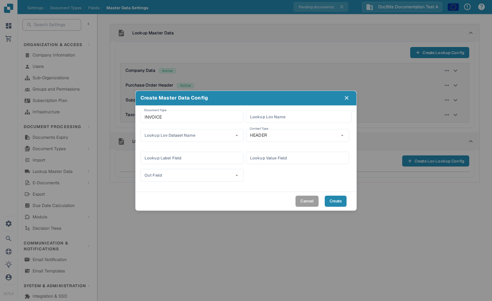

# Master Data Settings

Master Data Settings connect a document's validation fields to data stored under [Lookup Master Data](../../../document-processing/master-data-lookup.md). Use **Lookup Master Data** to find and fill matching records. Use **LOV Master Data** to offer a list of values from a dataset.

## Open the settings

1. In **Settings**, open **Document Processing → Document Types**.
2. Open the document type you want to configure, such as **Invoice**, and select **Fields**.
3. Select **Master Data Settings**. The page contains separate **Lookup Master Data** and **LOV Master Data** sections. Select a section heading to expand it.

<figure><figcaption>Choose the section that matches the type of field you want to configure.</figcaption></figure>

## Match a record with Lookup Master Data

**Lookup Master Data** configurations search a dataset and map a matching record to document fields. The list shows each configuration's name and whether it is active. A **Default** badge identifies a DocBits configuration; you can deactivate it, but you cannot edit or delete it.

### Create a lookup configuration

1. Select **Create Lookup Config**.
2. Enter a **Lookup Name** and choose the **Lookup Dataset Name** that contains the records to search.
3. Choose a **Conflict Handler** for cases where several records match:
   * **Best Score** chooses the strongest match.
   * **Return None** leaves the result empty for a user to decide.
   * **Return First** uses the first result.
4. Choose **HEADER** for document fields or **LINE** for fields in a document table. For **LINE**, also choose **Context Detail**, the table where the lookup applies.
5. Turn on **Match All** if every configured search field must match a record. Leave it off if one matching field is enough. Select **Create**.

<figure><figcaption>The lookup configuration form for an Invoice header.</figcaption></figure>

**Match All** and **Conflict Handler** affect automatic supplier recognition. See [Fuzzy data configuration with master data](../../../../setup/document-types/fuzzy-data-configuration-with-master-data.md) for worked examples.

### Map fields in a configuration

Expand a configuration to see its mapped fields. In the example below, **Supplier Name** is searchable, while **Supplier Number** is set to trigger the lookup automatically. Your organisation's mappings may differ.

<figure><figcaption>Expand a lookup to inspect the fields that participate in matching.</figcaption></figure>

Select **Create** inside the expanded configuration to add a mapping:

* **Lookup Field** is the dataset column to search.
* **Validation Field** is the document field that receives the result.
* **Parent Field** optionally checks the result against a related field.
* **Search Operator** controls how text is compared. **Smart** ignores spaces and punctuation; the other choices include Contains, Starts With, Ends With and Exact.
* **Auto Trigger** starts a lookup when this field is filled. **Searchable** lets the field participate in searches and supports manual lookup during validation.

Select **Create** to add the mapping. Use the three-dot **Actions** menu on a row to edit or delete an editable mapping. Default mappings can only be viewed.

<figure><figcaption>Choose how a dataset column maps to a document field.</figcaption></figure>

Use the three-dot menu on a configuration to activate or deactivate it, duplicate it, or edit it. A default configuration offers **View** in place of **Edit** and cannot be deleted. Deleting a custom configuration or field removes its mapping; check which document fields depend on it first.

## Offer a list with LOV Master Data

**LOV Master Data** creates dropdown choices from a master data dataset. You can also add filter fields so an earlier selection narrows the choices shown next.

Expand **LOV Master Data**, then select **Create Lov Lookup Config**. If no configuration exists, the section shows only this button.

<figure><figcaption>Open this section when a document field should offer dataset values as choices.</figcaption></figure>

In the form, enter **Lookup Lov Name**, choose **Lookup Lov Dataset Name**, and set **Context Type** to **HEADER** or **LINE**. For **LINE**, select **Context Detail** to identify the document table. Then choose:

* **Lookup Label Field**: the value users see in the dropdown.
* **Lookup Value Field**: the value stored for the selection and used for filtering.
* **Out Field**: the document field filled by the selected label.

Select **Create** to save the configuration. Expand it to inspect its fields, or use its three-dot menu to activate, duplicate, edit or delete it.

<figure><figcaption>Connect a dataset value and its visible label to a document field.</figcaption></figure>

To make dependent dropdowns, select **Create** inside an expanded LOV configuration and choose a **Lookup Field** and **Filter Field**. The filter field's value narrows the choices returned by the lookup. You can also set a static **Filter Value** and mark a field **Required**. Use the row's three-dot menu to edit or delete a custom filter field.
