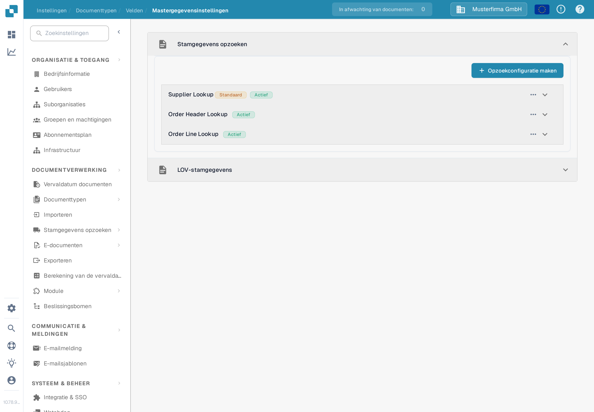
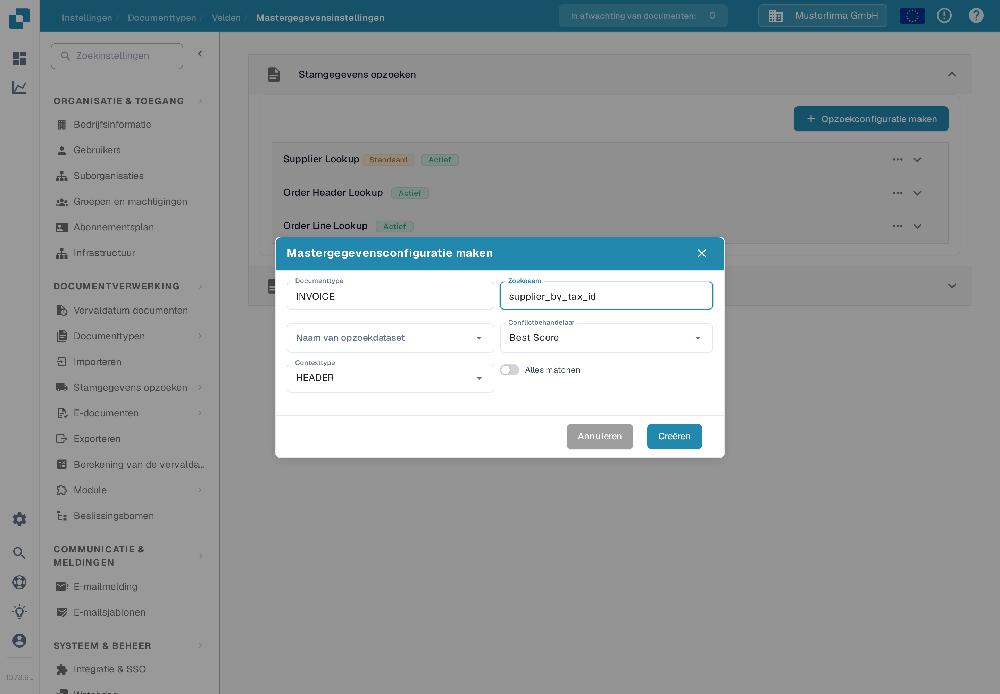
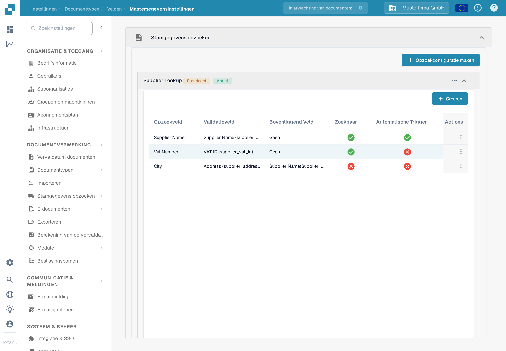
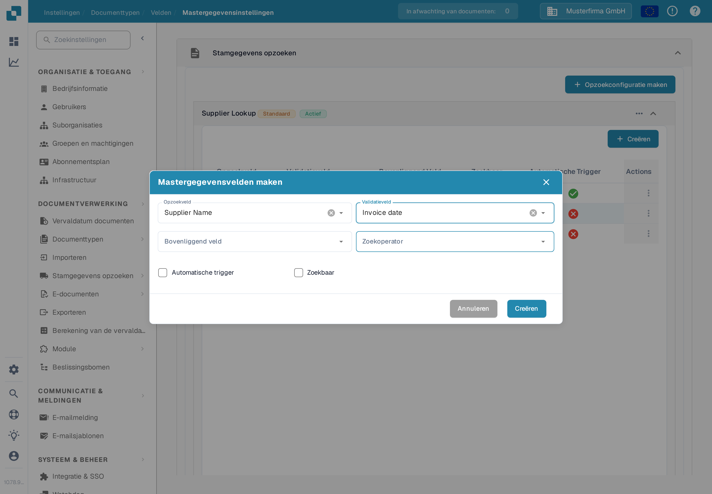
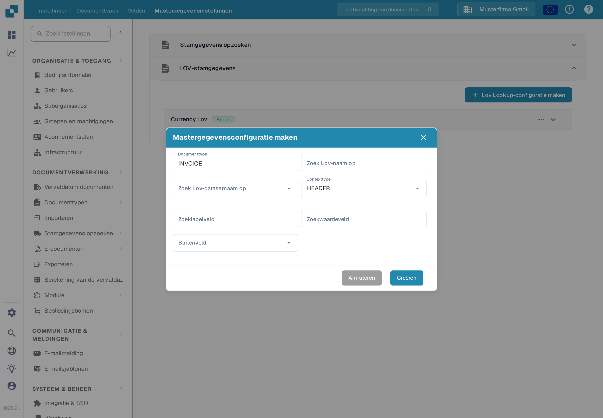

# Mastergegevensinstellingen

Met **Mastergegevensinstellingen** koppelt u de validatievelden van een document aan gegevens uit [Stamgegevens opzoeken](../../../document-processing/master-data-lookup.md). Gebruik **Stamgegevens opzoeken** om een overeenkomend record te vinden en in te vullen. Gebruik **LOV-stamgegevens** om een lijst met waarden uit een dataset aan te bieden.

## De instellingen openen

1. Open in **Instellingen** achtereenvolgens **Documentverwerking → Documenttypen**.
2. Open het documenttype dat u wilt configureren, bijvoorbeeld **Factuur**, en selecteer **Velden**.
3. Selecteer **Mastergegevensinstellingen**. De pagina bevat de twee aparte secties **Stamgegevens opzoeken** en **LOV-stamgegevens**. Selecteer de titel van een sectie om die uit te klappen.

<figure><figcaption>Kies de sectie die past bij het soort veld dat u wilt configureren.</figcaption></figure>

## Een record koppelen met Stamgegevens opzoeken

Configuraties onder **Stamgegevens opzoeken** doorzoeken een dataset en koppelen een overeenkomend record aan documentvelden. De lijst toont de naam van elke configuratie en of die actief is. Een badge **Standaard** markeert een configuratie van DocBits; u kunt die deactiveren, maar niet bewerken of verwijderen.

### Een opzoekconfiguratie maken

1. Selecteer **Opzoekconfiguratie maken**.
2. Voer een **Zoeknaam** in en kies de **Naam van opzoekdataset** met de records die u wilt doorzoeken.
3. Kies een **Conflictbehandelaar** voor het geval meerdere records overeenkomen:
   * **Best Score** kiest de sterkste overeenkomst.
   * **Return None** laat het resultaat leeg, zodat een gebruiker beslist.
   * **Return First** gebruikt het eerste resultaat.
4. Kies **HEADER** voor documentvelden of **LINE** voor velden in een documenttabel. Kies bij **LINE** ook **Contextdetail**, de tabel waarop de opzoeking van toepassing is.
5. Schakel **Alles matchen** in als elk geconfigureerd zoekveld met een record moet overeenkomen. Laat het uit als één overeenkomend veld genoeg is. Selecteer **Creëren**.

<figure><figcaption>Het formulier van een opzoekconfiguratie voor de kop van een Factuur.</figcaption></figure>

**Alles matchen** en de **Conflictbehandelaar** beïnvloeden de automatische herkenning van leveranciers. Zie [Fuzzy Data-configuratie met Mastergegevens](../../../../setup/document-types/fuzzy-data-configuration-with-master-data.md) voor uitgewerkte voorbeelden.

### Velden in een configuratie koppelen

Klap een configuratie uit om de gekoppelde velden te zien. In het voorbeeld hieronder is **Supplier Name** doorzoekbaar, terwijl **Supplier Number** de opzoeking automatisch activeert. De koppelingen van uw organisatie kunnen anders zijn.

<figure><figcaption>Klap een opzoeking uit om de velden te bekijken die aan de overeenkomst deelnemen.</figcaption></figure>

Selecteer **Creëren** in de uitgeklapte configuratie om een koppeling toe te voegen:

* **Opzoekveld** is de datasetkolom die wordt doorzocht.
* **Validatieveld** is het documentveld dat het resultaat ontvangt.
* **Bovenliggend veld** controleert het resultaat eventueel tegen een gerelateerd veld.
* **Zoekoperator** bepaalt hoe tekst wordt vergeleken. **Smart** negeert spaties en leestekens; de andere keuzes zijn Bevat, Begint met, Eindigt met en Exact.
* **Automatische trigger** start een opzoeking wanneer dit veld wordt ingevuld. **Zoekbaar** laat het veld aanzoekopdrachten deelnemen en ondersteunt handmatig opzoeken tijdens de validatie.

Selecteer **Creëren** om de koppeling toe te voegen. Gebruik het driepuntsmenu **Actions** op een rij om een bewerkbare koppeling te wijzigen of te verwijderen. Standaardkoppelingen kunnen alleen worden bekeken.

<figure><figcaption>Kies hoe een datasetkolom aan een documentveld wordt gekoppeld.</figcaption></figure>

Gebruik het driepuntsmenu van een configuratie om die te activeren of deactiveren, te dupliceren of te bewerken. Een standaardconfiguratie biedt **Weergave** in plaats van **Bewerking** en kan niet worden verwijderd. Het verwijderen van een aangepaste configuratie of een veld verwijdert de koppeling; controleer eerst welke documentvelden daarvan afhangen.

## Een lijst aanbieden met LOV-stamgegevens

**LOV-stamgegevens** maken keuzelijsten van een stamgegevensdataset. U kunt ook filtervelden toevoegen, zodat een eerdere keuze de keuzes die daarna worden getoond beperkt.

Klap **LOV-stamgegevens** uit en selecteer **Lov Lookup-configuratie maken**. Als er nog geen configuratie bestaat, toont de sectie alleen deze knop.

<figure><figcaption>Open deze sectie wanneer een documentveld de waarden van een dataset als keuzes moet aanbieden.</figcaption></figure>

Voer in het formulier **Zoek Lov-naam op** in, kies **Zoek Lov-datasetnaam op** en stel **Contexttype** in op **HEADER** of **LINE**. Kies bij **LINE** ook **Contextdetail** om de documenttabel aan te wijzen. Kies daarna:

* **Zoeklabelveld**: de waarde die gebruikers in de keuzelijst zien.
* **Zoekwaardeveld**: de waarde die voor de keuze wordt opgeslagen en voor filtering wordt gebruikt.
* **Buitenveld**: het documentveld dat met het gekozen label wordt gevuld.

Selecteer **Creëren** om de configuratie op te slaan. Klap die uit om de velden te bekijken, of gebruik het driepuntsmenu om de configuratie te activeren, dupliceren, bewerken of verwijderen.

<figure><figcaption>Koppel de waarde van een dataset en het zichtbare label daarvan aan een documentveld.</figcaption></figure>

Selecteer **Creëren** in een uitgeklapte LOV-configuratie en kies een **Opzoekveld** en een **Filterveld** om afhankelijke keuzelijsten te maken. De waarde van het filterveld beperkt de keuzes die de opzoeking teruggeeft. U kunt ook een vaste **Filterwaarde** instellen en een veld als **Vereist** markeren. Gebruik het driepuntsmenu van de rij om een aangepast filterveld te bewerken of te verwijderen.
