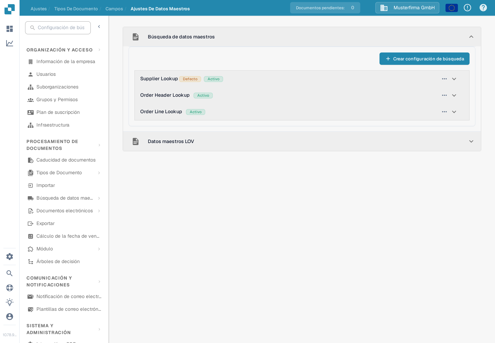
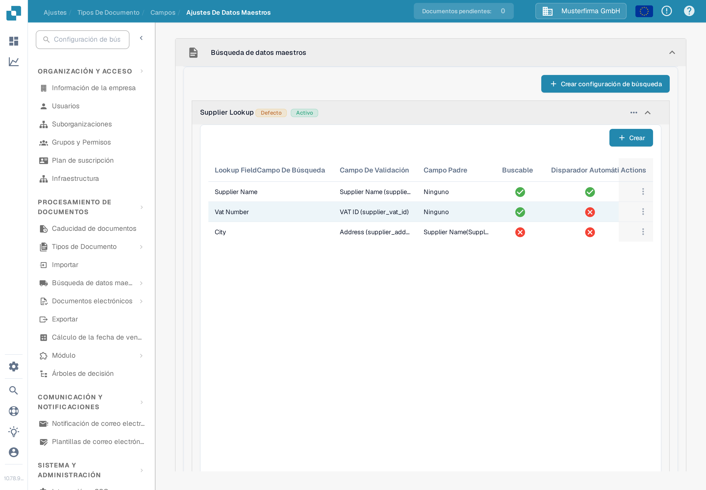
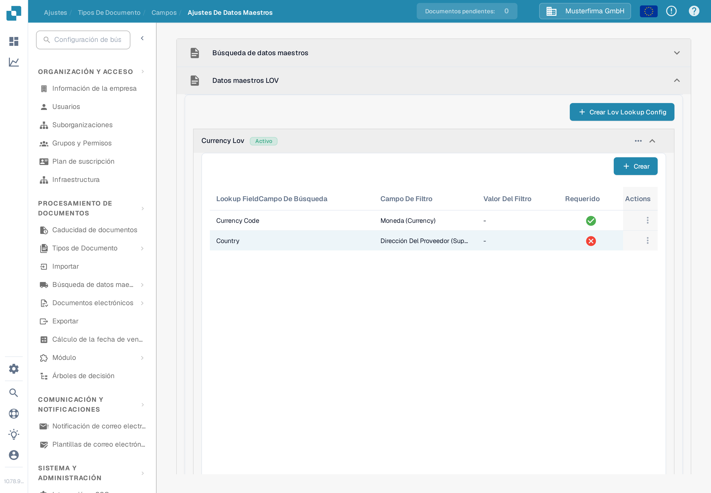
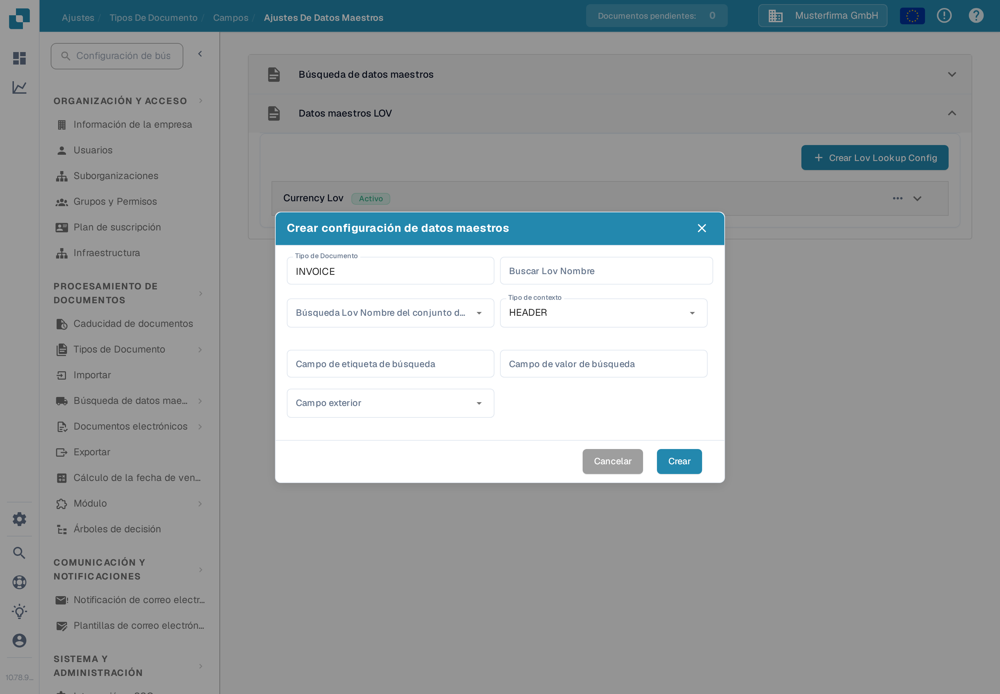

# Ajustes de datos maestros

Los **Ajustes de datos maestros** conectan los campos de validación de un documento con los datos almacenados en [Búsqueda de datos maestros](../../../document-processing/master-data-lookup.md). Use **Búsqueda de datos maestros** para encontrar y rellenar registros coincidentes. Use **Datos maestros LOV** para ofrecer una lista de valores de un conjunto de datos.

## Abrir los ajustes

1. En **Ajustes**, abra **Procesamiento de documentos → Tipos de documento**.
2. Abra el tipo de documento que desea configurar, por ejemplo **Factura**, y seleccione **Campos**.
3. Seleccione **Ajustes de datos maestros**. La página contiene las secciones **Búsqueda de datos maestros** y **Datos maestros LOV**. Seleccione el título de una sección para expandirla.

<figure><figcaption>
Elija la sección que corresponda al tipo de campo que desea configurar.
</figcaption></figure>

## Coincidir un registro con Búsqueda de datos maestros

Las configuraciones de **Búsqueda de datos maestros** buscan en un conjunto de datos y asignan un registro coincidente a los campos del documento. La lista muestra el nombre de cada configuración y si está activa. Una etiqueta **Defecto** identifica una configuración de DocBits; puede desactivarla, pero no editarla ni eliminarla.

### Crear una configuración de búsqueda

1. Seleccione **Crear configuración de búsqueda**.
2. Introduzca un **Nombre de búsqueda** y elija el **Nombre del conjunto de datos** que contiene los registros que se van a buscar.
3. Elija un **Gestor de conflictos** para los casos en que coincidan varios registros:
   * **Best Score** elige la coincidencia más fuerte.
   * **Return None** deja el resultado vacío para que lo decida una persona.
   * **Return First** usa el primer resultado.
4. Elija **HEADER** para los campos del documento o **LINE** para los campos de una tabla del documento. Para **LINE**, elija también el **Contexto**, es decir, la tabla en la que se aplica la búsqueda.
5. Active **Coincidir con todo** si cada campo de búsqueda configurado debe coincidir con un registro. Déjelo desactivado si basta con un campo coincidente. Seleccione **Crear**.

<figure><figcaption>
El formulario de configuración de búsqueda para el encabezado de una factura.
</figcaption></figure>

**Coincidir con todo** y **Gestor de conflictos** afectan al reconocimiento automático de proveedores. Consulte [Configuración de datos difusos con datos maestros](../../../../setup/document-types/fuzzy-data-configuration-with-master-data.md) para ver ejemplos prácticos.

### Asignar campos en una configuración

Expanda una configuración para ver sus campos asignados. En el ejemplo siguiente, **Supplier Name** es buscable, mientras que **Supplier Number** está configurado para activar la búsqueda automáticamente. Las asignaciones de su organización pueden ser distintas.

<figure><figcaption>
Expanda una búsqueda para inspeccionar los campos que participan en la coincidencia.
</figcaption></figure>

Seleccione **Crear** dentro de la configuración expandida para añadir una asignación:

* **Lookup Field** es la columna del conjunto de datos que se busca.
* **Campo De Validación** es el campo del documento que recibe el resultado.
* **Campo Padre** comprueba opcionalmente el resultado con un campo relacionado.
* **Operador de búsqueda** controla cómo se compara el texto. **Smart** omite espacios y signos de puntuación; las demás opciones incluyen Contains, Starts With, Ends With y Exact.
* **Disparador Automático** inicia una búsqueda cuando este campo se rellena. **Buscable** permite que el campo participe en las búsquedas y admite la búsqueda manual durante la validación.

Seleccione **Crear** para añadir la asignación. Use el menú de tres puntos **Actions** de una fila para editar o eliminar una asignación editable. Las asignaciones predeterminadas solo se pueden ver.

<figure><figcaption>
Elija cómo se asigna una columna del conjunto de datos a un campo del documento.
</figcaption></figure>

Use el menú de tres puntos de una configuración para activarla o desactivarla, duplicarla o editarla. Una configuración predeterminada ofrece **View** en lugar de **Edit** y no se puede eliminar. Si elimina una configuración o un campo personalizados, se elimina su asignación; compruebe antes de qué campos del documento depende.

## Ofrecer una lista con Datos maestros LOV

**Datos maestros LOV** crea listas desplegables a partir de un conjunto de datos maestros. También puede añadir campos de filtro para que una selección anterior limite las opciones que se muestran después.

Expanda **Datos maestros LOV** y seleccione **Crear Lov Lookup Config**. Si no existe ninguna configuración, la sección solo muestra este botón.

<figure><figcaption>
Abra esta sección cuando un campo del documento deba ofrecer valores de un conjunto de datos como opciones.
</figcaption></figure>

En el formulario, introduzca **Buscar Lov Nombre**, elija **Búsqueda Lov Nombre del conjunto de datos** y ajuste el **Tipo de contexto** en **HEADER** o **LINE**. Para **LINE**, seleccione el **Contexto** para identificar la tabla del documento. A continuación, elija:

* **Campo de etiqueta de búsqueda**: el valor que las personas ven en la lista desplegable.
* **Campo de valor de búsqueda**: el valor que se guarda para la selección y se usa para filtrar.
* **Campo exterior**: el campo del documento que se rellena con la etiqueta seleccionada.

Seleccione **Crear** para guardar la configuración. Expándala para inspeccionar sus campos, o use su menú de tres puntos para activarla, duplicarla, editarla o eliminarla.

<figure><figcaption>
Conecte un valor del conjunto de datos y su etiqueta visible con un campo del documento.
</figcaption></figure>

Para crear listas desplegables dependientes, seleccione **Crear** dentro de una configuración LOV expandida y elija un **Lookup Field** y un **Campo De Filtro**. El valor del campo de filtro limita las opciones que devuelve la búsqueda. También puede definir un **Valor Del Filtro** estático y marcar un campo como **Requerido**. Use el menú de tres puntos de la fila para editar o eliminar un campo de filtro personalizado.
