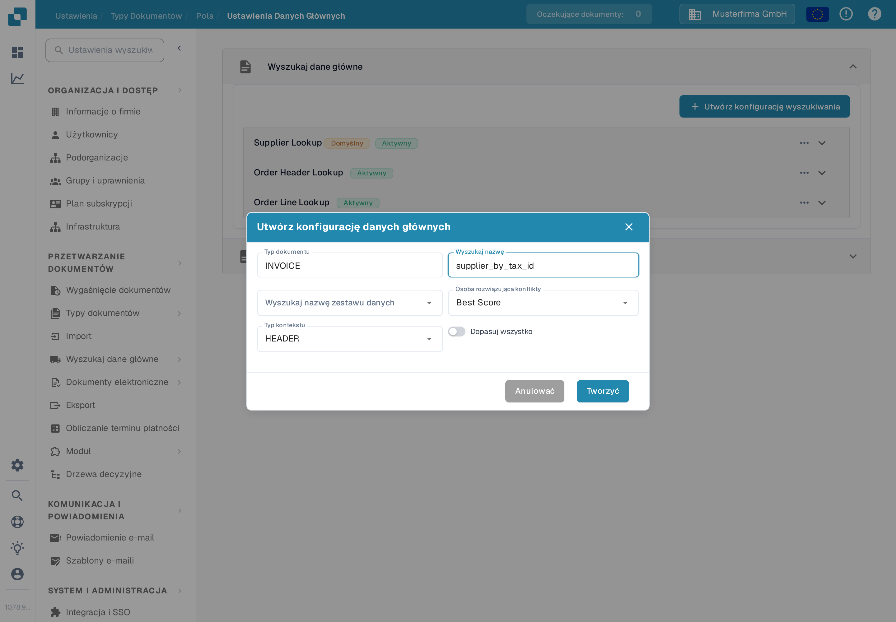
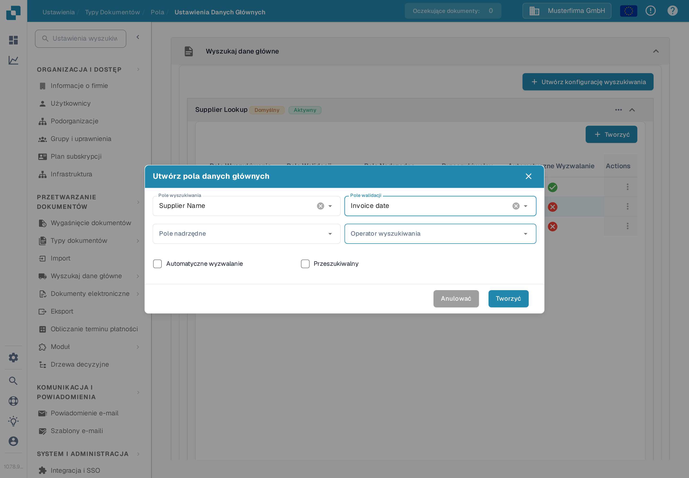
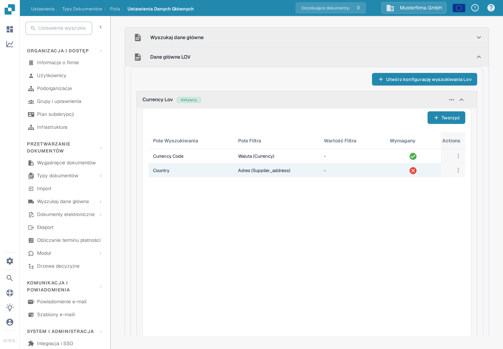
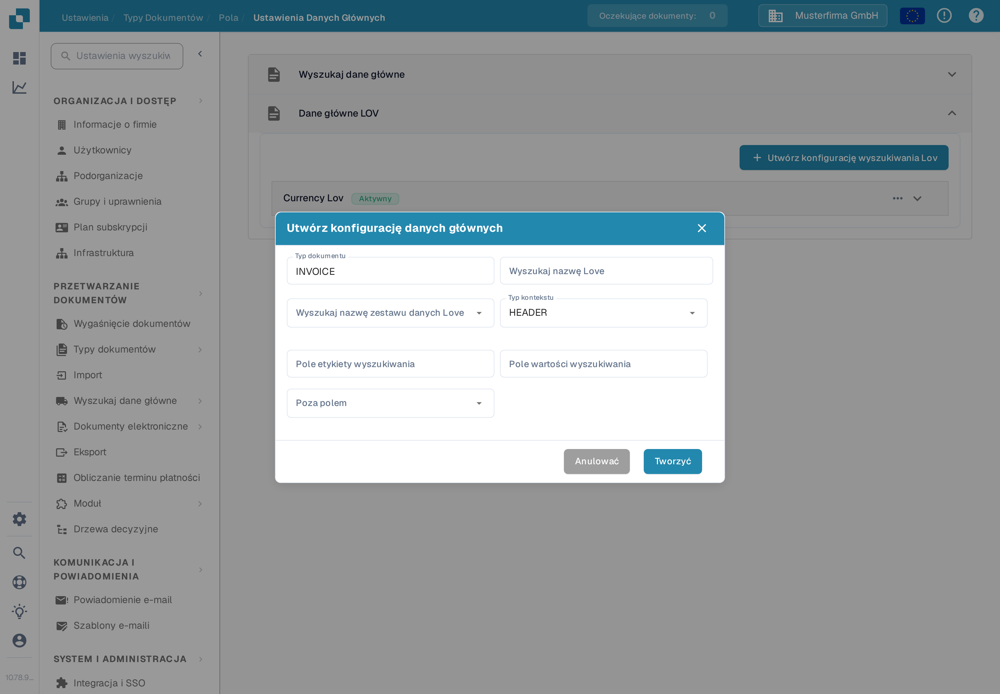

# Ustawienia danych głównych

Ustawienia danych głównych łączą pola walidacji dokumentu z danymi przechowywanymi na stronie [Wyszukiwanie danych podstawowych](../../../document-processing/master-data-lookup.md). Użyj **Wyszukaj dane główne**, aby znaleźć i wypełnić pasujące rekordy. Użyj **Dane główne LOV**, aby zaproponować listę wartości z zestawu danych.

## Otwórz ustawienia

1. W **Ustawienia** otwórz **Przetwarzanie dokumentów → Typy dokumentów**.
2. Otwórz typ dokumentu, który chcesz skonfigurować, na przykład **Faktura**, i wybierz **Pola**.
3. Wybierz **Ustawienia danych głównych**. Strona zawiera oddzielne sekcje **Wyszukaj dane główne** i **Dane główne LOV**. Wybierz nagłówek sekcji, aby ją rozwinąć.

<figure><figcaption>Wybierz sekcję odpowiadającą typowi pola, który chcesz skonfigurować.</figcaption></figure>

## Dopasuj rekord za pomocą Wyszukiwania danych głównych

Konfiguracje **Wyszukaj dane główne** przeszukują zestaw danych i przypisują pasujący rekord do pól dokumentu. Lista pokazuje nazwę każdej konfiguracji oraz informację, czy jest aktywna. Etykieta **Domyślny** oznacza konfigurację DocBits; możesz ją dezaktywować, ale nie możesz jej edytować ani usunąć.

### Utwórz konfigurację wyszukiwania

1. Wybierz **Utwórz konfigurację wyszukiwania**.
2. Wprowadź **Wyszukaj nazwę** i wybierz **Wyszukaj nazwę zestawu danych**, który zawiera rekordy do przeszukania.
3. Wybierz **Osobę rozwiązującą konflikty** na wypadek, gdy pasuje kilka rekordów:
   * **Best Score** wybiera najsilniejsze dopasowanie.
   * **Return None** pozostawia wynik pusty, aby użytkownik sam zdecydował.
   * **Return First** używa pierwszego wyniku.
4. Wybierz **HEADER** dla pól dokumentu lub **LINE** dla pól w tabeli dokumentu. W przypadku **LINE** wybierz także **Szczegóły kontekstu**, czyli tabelę, której dotyczy wyszukiwanie.
5. Włącz **Dopasuj wszystko**, jeśli każde skonfigurowane pole wyszukiwania musi pasować do rekordu. Pozostaw wyłączone, jeśli wystarczy jedno pasujące pole. Wybierz **Tworzyć**.

<figure><figcaption>Formularz konfiguracji wyszukiwania dla nagłówka faktury.</figcaption></figure>

**Dopasuj wszystko** i **Osoba rozwiązująca konflikty** wpływają na automatyczne rozpoznawanie dostawców. Przykłady znajdziesz w sekcji [Konfiguracja danych rozmytych z danymi głównymi](../../../../setup/document-types/fuzzy-data-configuration-with-master-data.md).

### Mapuj pola w konfiguracji

Rozwiń konfigurację, aby zobaczyć jej zmapowane pola. W poniższym przykładzie **Supplier Name** można przeszukiwać, natomiast **Supplier Number** jest ustawione tak, aby automatycznie uruchamiać wyszukiwanie. Mapowania w Twojej organizacji mogą się różnić.

<figure><figcaption>Rozwiń wyszukiwanie, aby sprawdzić pola biorące udział w dopasowaniu.</figcaption></figure>

Wybierz **Tworzyć** wewnątrz rozwiniętej konfiguracji, aby dodać mapowanie:

* **Pole wyszukiwania** to kolumna zestawu danych, która jest przeszukiwana.
* **Pole walidacji** to pole dokumentu, które otrzymuje wynik.
* **Pole nadrzędne** opcjonalnie sprawdza wynik względem powiązanego pola.
* **Operator wyszukiwania** określa sposób porównywania tekstu. **Smart** ignoruje spacje i znaki interpunkcyjne; pozostałe opcje to Zawiera, Zaczyna się od, Kończy się na i Dokładny.
* **Automatyczne wyzwalanie** uruchamia wyszukiwanie, gdy to pole zostanie wypełnione. **Przeszukiwalny** pozwala polu brać udział w wyszukiwaniach i umożliwia ręczne wyszukiwanie podczas walidacji.

Wybierz **Tworzyć**, aby dodać mapowanie. Użyj menu **Actions** z trzema kropkami w wierszu, aby edytować lub usunąć edytowalne mapowanie. Domyślne mapowania można tylko wyświetlać.

<figure><figcaption>Wybierz, w jaki sposób kolumna zestawu danych mapuje się na pole dokumentu.</figcaption></figure>

Użyj menu z trzema kropkami w konfiguracji, aby ją aktywować lub dezaktywować, zduplikować albo edytować. Domyślna konfiguracja oferuje **Pogląd** zamiast **Redagować** i nie można jej usunąć. Usunięcie własnej konfiguracji lub pola usuwa jego mapowanie; najpierw sprawdź, które pola dokumentu od niego zależą.

## Zaproponuj listę za pomocą Danych głównych LOV

**Dane główne LOV** tworzą opcje listy rozwijanej z zestawu danych danych głównych. Możesz także dodać pola filtrujące, aby wcześniejszy wybór zawężał kolejno wyświetlane opcje.

Rozwiń **Dane główne LOV**, a następnie wybierz **Utwórz konfigurację wyszukiwania Lov**. Jeśli nie istnieje żadna konfiguracja, sekcja pokazuje tylko ten przycisk.

<figure><figcaption>Otwórz tę sekcję, gdy pole dokumentu ma oferować wartości zestawu danych jako opcje.</figcaption></figure>

W formularzu wprowadź **Wyszukaj nazwę Love**, wybierz **Wyszukaj nazwę zestawu danych Love** i ustaw **Typ kontekstu** na **HEADER** lub **LINE**. W przypadku **LINE** wybierz **Szczegóły kontekstu**, aby wskazać tabelę dokumentu. Następnie wybierz:

* **Pole etykiety wyszukiwania**: wartość, którą użytkownicy widzą na liście rozwijanej.
* **Pole wartości wyszukiwania**: wartość przechowywana dla wyboru i używana do filtrowania.
* **Poza polem**: pole dokumentu wypełniane wybraną etykietą.

Wybierz **Tworzyć**, aby zapisać konfigurację. Rozwiń ją, aby sprawdzić jej pola, albo użyj menu z trzema kropkami, aby ją aktywować, zduplikować, edytować lub usunąć.

<figure><figcaption>Połącz wartość zestawu danych i jej widoczną etykietę z polem dokumentu.</figcaption></figure>

Aby utworzyć zależne listy rozwijane, wybierz **Tworzyć** wewnątrz rozwiniętej konfiguracji LOV i wybierz **Pole wyszukiwania** oraz **Pole filtra**. Wartość pola filtra zawęża opcje zwracane przez wyszukiwanie. Możesz także ustawić statyczną **Wartość filtra** i oznaczyć pole jako **Wymagany**. Użyj menu z trzema kropkami w wierszu, aby edytować lub usunąć własne pole filtra.
