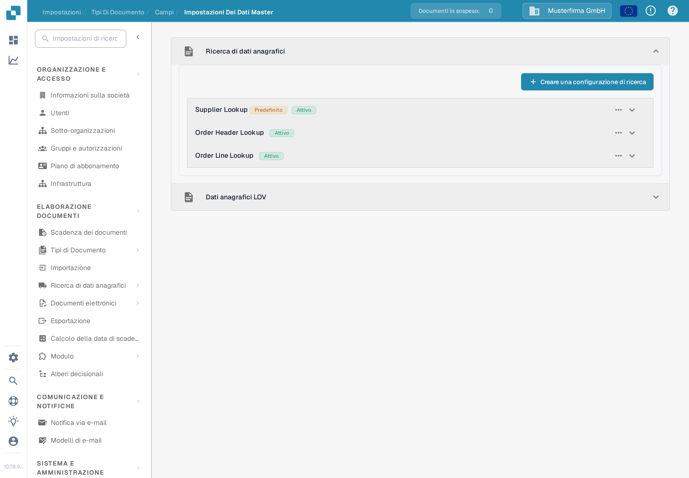
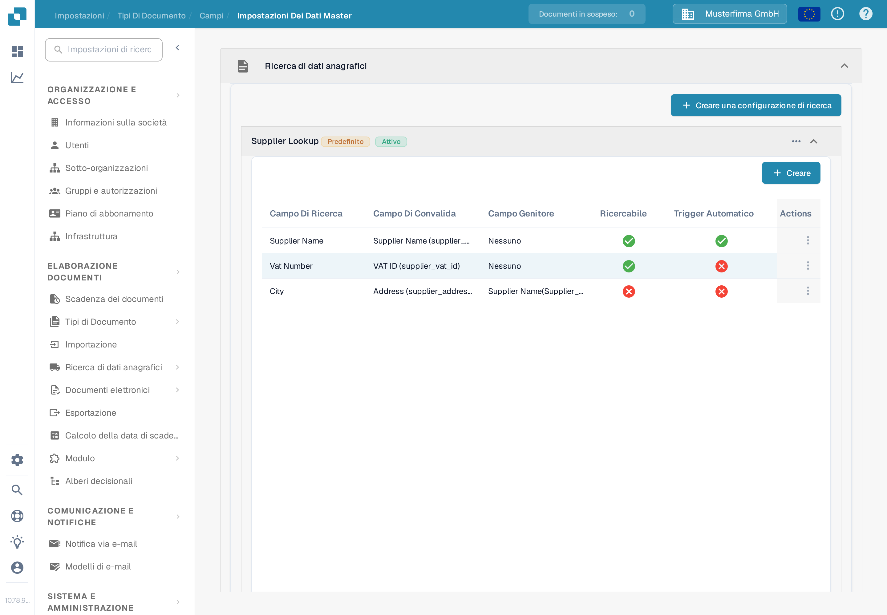
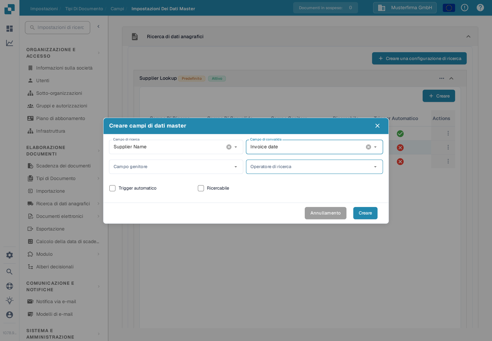
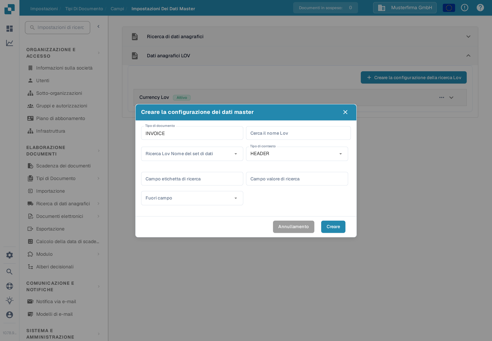

# Impostazioni dei dati master

Le **Impostazioni dei dati master** collegano i campi di convalida di un documento ai dati archiviati in [Ricerca dei dati master](../../../document-processing/master-data-lookup.md). Usa **Ricerca di dati anagrafici** per trovare e riprendere un record corrispondente. Usa **Dati anagrafici LOV** per proporre un elenco di valori tratti da un set di dati.

## Aprire le impostazioni

1. In **Impostazioni**, apri **Elaborazione documenti → Tipi di Documento**.
2. Apri il tipo di documento che vuoi configurare, ad esempio **Invoice**, e seleziona **Campi**.
3. Seleziona **Impostazioni Dei Dati Master**. La pagina contiene le due sezioni separate **Ricerca di dati anagrafici** e **Dati anagrafici LOV**. Seleziona il titolo di una sezione per espanderla.

<figure><figcaption>
Scegli la sezione che corrisponde al tipo di campo che vuoi configurare.
</figcaption></figure>

## Associare un record con la ricerca di dati anagrafici

Le configurazioni della sezione **Ricerca di dati anagrafici** interrogano un set di dati e collegano un record corrispondente ai campi del documento. L'elenco mostra il nome di ogni configurazione e se è attiva. Un badge **Predefinito** identifica una configurazione fornita da DocBits; puoi disattivarla, ma non modificarla né eliminarla.

### Creare una configurazione di ricerca

1. Seleziona **Creare una configurazione di ricerca**.
2. Inserisci un **Cerca nome** e scegli il **Nome del set di dati di ricerca** che contiene i record da interrogare.
3. Scegli un **Gestore dei conflitti** per il caso in cui più record corrispondano:
   * **Best Score** sceglie la corrispondenza più forte.
   * **Return None** lascia il risultato vuoto, così decide un utente.
   * **Return First** usa il primo risultato.
4. Scegli **HEADER** per i campi del documento o **LINE** per i campi di una tabella del documento. Per **LINE**, scegli anche **Dettaglio del contesto**, cioè la tabella a cui la ricerca si applica.
5. Attiva **Abbina tutti** se ogni campo di ricerca configurato deve corrispondere a un record. Lascialo disattivato se basta un solo campo corrispondente. Seleziona **Creare**.

<figure><figcaption>
Il modulo di una configurazione di ricerca per l'intestazione di un documento Invoice.
</figcaption></figure>

**Abbina tutti** e il **Gestore dei conflitti** agiscono insieme e decidono se un fornitore viene riconosciuto automaticamente. Trovi esempi pratici in [Configurazione fuzzy dei dati con i dati master](../../../../setup/document-types/fuzzy-data-configuration-with-master-data.md).

### Mappare i campi di una configurazione

Espandi una configurazione per vedere i campi collegati. Nell'esempio qui sotto, **Supplier Name** è ricercabile, mentre **Supplier Number** attiva la ricerca automaticamente. Le mappature della tua organizzazione possono essere diverse.

<figure><figcaption>
Espandi una ricerca per esaminare i campi che partecipano alla corrispondenza.
</figcaption></figure>

Seleziona **Creare** dentro la configurazione espansa per aggiungere una mappatura:

* **Campo Di Ricerca** è la colonna del set di dati da interrogare.
* **Campo Di Convalida** è il campo del documento che riceve il risultato.
* **Campo Genitore** verifica eventualmente il risultato rispetto a un campo correlato.
* **Operatore di ricerca** stabilisce come viene confrontato il testo. **Smart** ignora spazi e punteggiatura; le altre scelte includono Contiene, Inizia con, Finisce con ed Esatto.
* **Trigger automatico** avvia una ricerca quando questo campo viene compilato. **Ricercabile** consente al campo di partecipare alle ricerche e supporta la ricerca manuale durante la convalida.

Seleziona **Creare** per aggiungere la mappatura. Usa il menu **Actions** a tre punti di una riga per modificare o eliminare una mappatura modificabile. Le mappature predefinite possono solo essere visualizzate.

<figure><figcaption>
Scegli come una colonna del set di dati viene collegata a un campo del documento.
</figcaption></figure>

Usa il menu a tre punti di una configurazione per attivarla o disattivarla, duplicarla o modificarla. Una configurazione predefinita propone **Vista** al posto di **Modifica** e non può essere eliminata. Eliminare una configurazione o un campo personalizzato rimuove la sua mappatura; verifica prima quali campi del documento ne dipendono.

## Proporre un elenco con i dati anagrafici LOV

**Dati anagrafici LOV** crea menu a tendina a partire da un set di dati master. Puoi aggiungere anche campi filtro, in modo che una selezione precedente restringa le scelte mostrate successivamente.

Espandi **Dati anagrafici LOV**, poi seleziona **Creare la configurazione della ricerca Lov**. Se non esiste alcuna configurazione, la sezione mostra solo questo pulsante.

<figure><figcaption>
Apri questa sezione quando un campo del documento deve proporre i valori di un set di dati come scelte.
</figcaption></figure>

Nel modulo inserisci **Cerca il nome Lov**, scegli **Ricerca Lov Nome del set di dati** e imposta **Tipo di contesto** su **HEADER** o **LINE**. Per **LINE**, seleziona **Dettaglio del contesto** per identificare la tabella del documento. Scegli poi:

* **Campo etichetta di ricerca**: il valore che gli utenti vedono nel menu a tendina.
* **Campo valore di ricerca**: il valore memorizzato per la selezione e usato per il filtraggio.
* **Fuori campo**: il campo del documento compilato dall'etichetta selezionata.

Seleziona **Creare** per salvare la configurazione. Espandila per esaminarne i campi, oppure usa il suo menu a tre punti per attivarla, duplicarla, modificarla o eliminarla.

<figure><figcaption>
Collega il valore di un set di dati e la sua etichetta visibile a un campo del documento.
</figcaption></figure>

Per creare menu a tendina concatenati, seleziona **Creare** dentro una configurazione LOV espansa e scegli un **Campo Di Ricerca** e un **Campo Filtro**. Il valore del campo filtro restringe le scelte restituite dalla ricerca. Puoi anche impostare un **Valore Del Filtro** fisso e contrassegnare un campo come **Richiesto**. Usa il menu a tre punti della riga per modificare o eliminare un campo filtro personalizzato.
