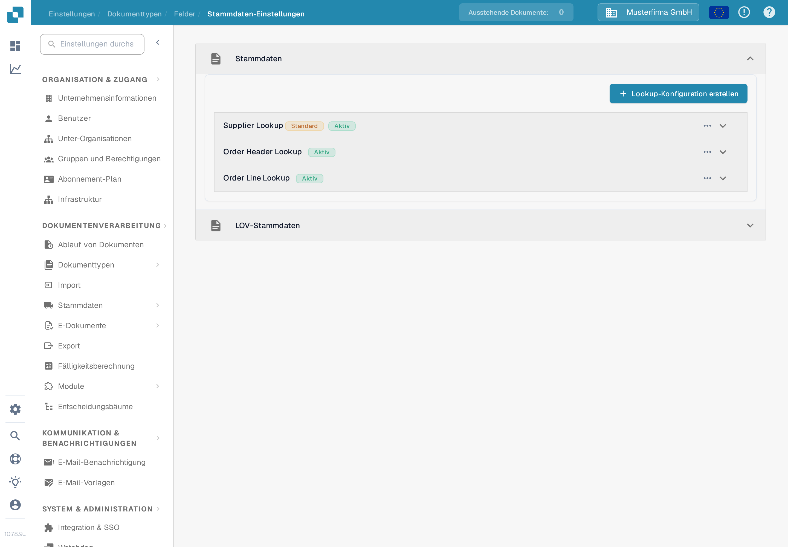
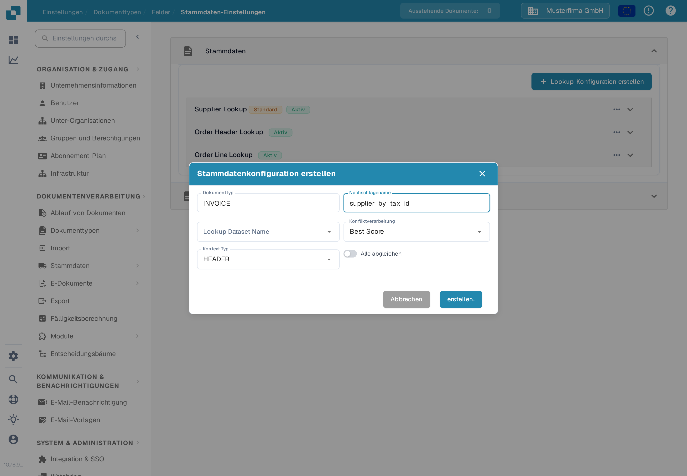
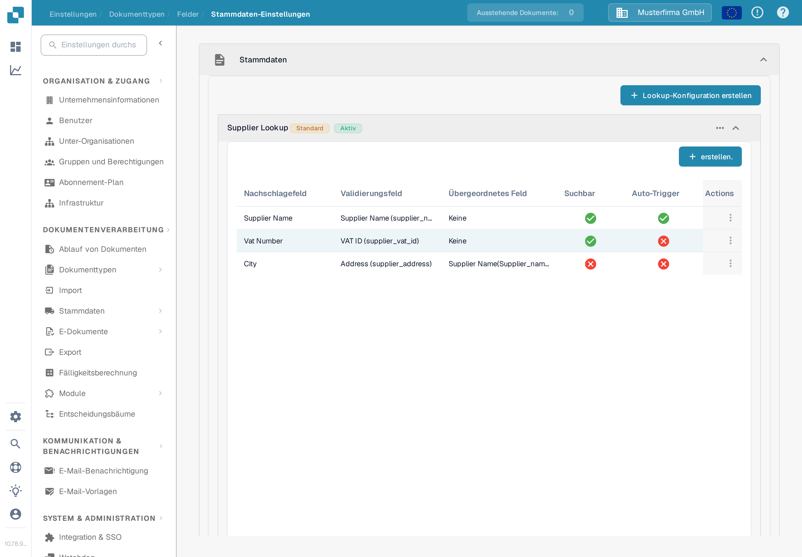
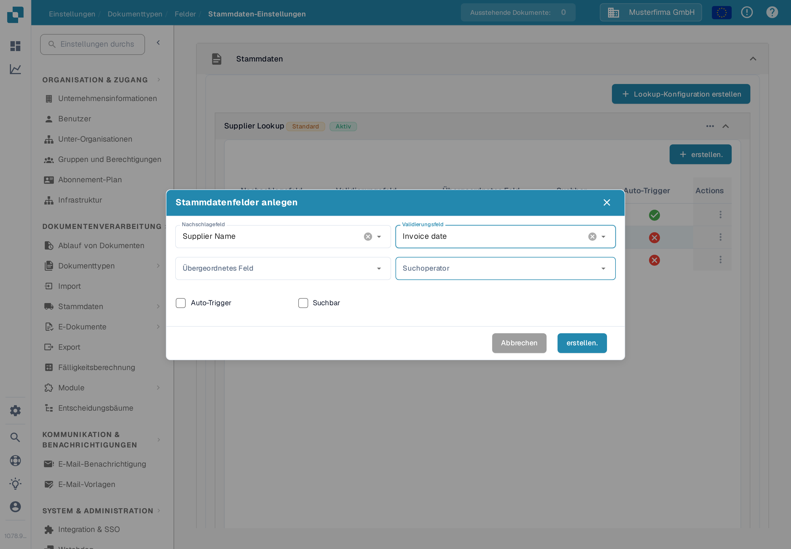
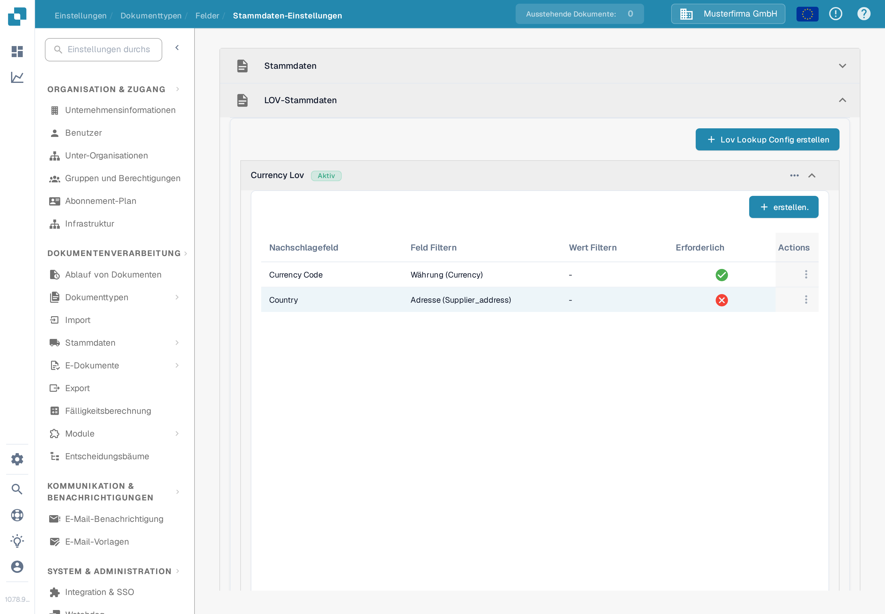
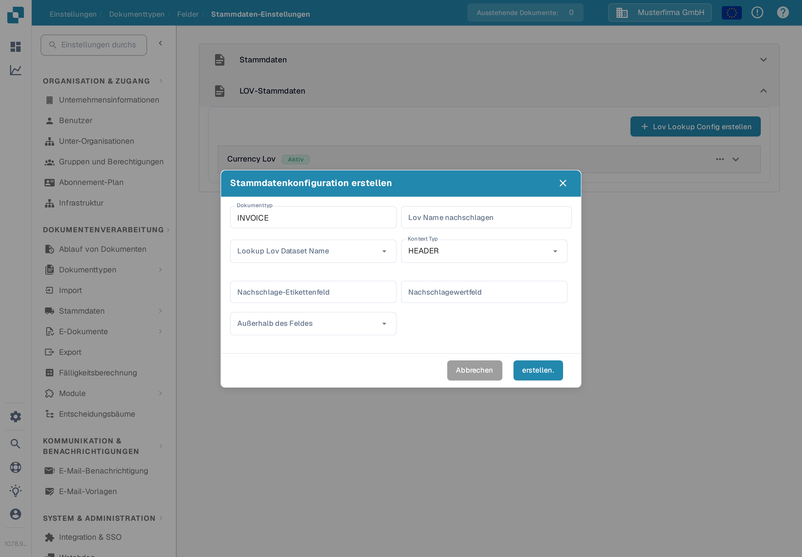

# Stammdaten-Einstellungen

Die **Stammdaten-Einstellungen** verbinden die Validierungsfelder eines Dokuments mit Daten aus [Stammdaten-Lookup](../../../document-processing/master-data-lookup.md). Nutzen Sie **Stammdaten** (Lookup Master Data), um passende Datensätze zu finden und zu übernehmen. Nutzen Sie **LOV-Stammdaten**, um eine Werteliste aus einem Dataset als Auswahl anzubieten.

## Einstellungen öffnen

1. Öffnen Sie in **Einstellungen** den Punkt **Dokumentenverarbeitung → Dokumenttypen**.
2. Öffnen Sie den Dokumenttyp, den Sie konfigurieren möchten, zum Beispiel **Rechnung**, und wählen Sie **Felder**.
3. Wählen Sie **Stammdaten-Einstellungen**. Die Seite enthält die beiden Bereiche **Stammdaten** und **LOV-Stammdaten**. Wählen Sie eine Bereichsüberschrift, um sie aufzuklappen.

<figure><figcaption>
Wählen Sie den Bereich, der zur Art des Feldes passt, das Sie konfigurieren möchten.
</figcaption></figure>

## Einen Datensatz mit Stammdaten (Lookup Master Data) abgleichen

Konfigurationen unter **Stammdaten** durchsuchen ein Dataset und ordnen einen passenden Datensatz den Dokumentfeldern zu. Die Liste zeigt den Namen jeder Konfiguration und ob sie aktiv ist. Ein Badge **Standard** kennzeichnet eine DocBits-Konfiguration; Sie können sie deaktivieren, aber nicht bearbeiten oder löschen.

### Eine Lookup-Konfiguration erstellen

1. Wählen Sie **Lookup-Konfiguration erstellen**.
2. Geben Sie einen **Nachschlagename** ein und wählen Sie den **Lookup Dataset Name**, der die zu durchsuchenden Datensätze enthält.
3. Wählen Sie eine **Konfliktverarbeitung** für den Fall, dass mehrere Datensätze passen:
   * **Best Score** wählt die stärkste Übereinstimmung.
   * **Return None** lässt das Ergebnis leer, damit eine Person entscheidet.
   * **Return First** verwendet das erste Ergebnis.
4. Wählen Sie **HEADER** für Dokumentfelder oder **LINE** für Felder in einer Dokumenttabelle. Wählen Sie bei **LINE** zusätzlich **Kontextdetails**, also die Tabelle, auf die der Lookup angewendet wird.
5. Schalten Sie **Alle abgleichen** ein, wenn jedes konfigurierte Suchfeld mit einem Datensatz übereinstimmen muss. Lassen Sie es aus, wenn ein passendes Feld genügt. Wählen Sie **erstellen.**

<figure><figcaption>
Das Formular für eine Lookup-Konfiguration einer Rechnung im Kopfbereich.
</figcaption></figure>

**Alle abgleichen** und **Konfliktverarbeitung** wirken zusammen und entscheiden, ob ein Lieferant automatisch erkannt wird. Beispiele dafür finden Sie unter [Fuzzy Data Konfiguration mit Masterdaten](../../../../setup/document-types/fuzzy-data-configuration-with-master-data.md).

### Felder in einer Konfiguration zuordnen

Klappen Sie eine Konfiguration auf, um ihre zugeordneten Felder zu sehen. Im Beispiel unten ist **Supplier Name** durchsuchbar, während **Supplier Number** den Lookup automatisch auslöst. Die Zuordnungen Ihrer Organisation können abweichen.

<figure><figcaption>
Klappen Sie einen Lookup auf, um die Felder zu prüfen, die beim Abgleich mitwirken.
</figcaption></figure>

Wählen Sie **erstellen.** innerhalb der aufgeklappten Konfiguration, um eine Zuordnung hinzuzufügen:

* **Nachschlagefeld** ist die Dataset-Spalte, die durchsucht wird.
* **Validierungsfeld** ist das Dokumentfeld, das das Ergebnis erhält.
* **Übergeordnetes Feld** prüft das Ergebnis optional gegen ein verwandtes Feld.
* **Suchoperator** bestimmt, wie Text verglichen wird. **Smart** ignoriert Leerzeichen und Satzzeichen; die weiteren Auswahlmöglichkeiten sind unter anderem Contains, Starts With, Ends With und Exact.
* **Auto-Trigger** startet einen Lookup, sobald dieses Feld gefüllt ist. **Suchbar** lässt das Feld an Suchen teilnehmen und unterstützt den manuellen Lookup während der Validierung.

Wählen Sie **erstellen.**, um die Zuordnung hinzuzufügen. Über das Drei-Punkte-Menü **Actions** einer Zeile bearbeiten oder löschen Sie eine bearbeitbare Zuordnung. Standard-Zuordnungen können nur angezeigt werden.

<figure><figcaption>
Legen Sie fest, wie eine Dataset-Spalte einem Dokumentfeld zugeordnet wird.
</figcaption></figure>

Über das Drei-Punkte-Menü einer Konfiguration aktivieren oder deaktivieren, duplizieren oder bearbeiten Sie diese. Eine Standard-Konfiguration bietet statt **Bearbeiten** nur **Ansehen** an und kann nicht gelöscht werden. Löschen Sie eine eigene Konfiguration oder ein eigenes Feld, entfällt damit seine Zuordnung; prüfen Sie vorher, welche Dokumentfelder davon abhängen.

## Eine Liste mit LOV-Stammdaten anbieten

**LOV-Stammdaten** erzeugt Dropdown-Auswahlen aus einem Stammdaten-Dataset. Sie können zusätzlich Filterfelder hinzufügen, damit eine frühere Auswahl die nächsten angezeigten Werte eingrenzt.

Klappen Sie **LOV-Stammdaten** auf und wählen Sie **Lov Lookup Config erstellen**. Existiert noch keine Konfiguration, zeigt der Bereich nur diese Schaltfläche.

<figure><figcaption>
Öffnen Sie diesen Bereich, wenn ein Dokumentfeld Werte aus einem Dataset als Auswahl anbieten soll.
</figcaption></figure>

Geben Sie im Formular **Lov Name nachschlagen** ein, wählen Sie **Lookup Lov Dataset Name** und setzen Sie **Kontext Typ** auf **HEADER** oder **LINE**. Wählen Sie bei **LINE** **Kontextdetails**, um die Dokumenttabelle zu bestimmen. Wählen Sie danach:

* **Nachschlage-Etikettenfeld**: der Wert, den die Personen im Dropdown sehen.
* **Nachschlagewertfeld**: der Wert, der für die Auswahl gespeichert und zum Filtern verwendet wird.
* **Außerhalb des Feldes**: das Dokumentfeld, das durch das gewählte Etikett gefüllt wird.

Wählen Sie **erstellen.**, um die Konfiguration zu speichern. Klappen Sie sie auf, um ihre Felder zu prüfen, oder nutzen Sie ihr Drei-Punkte-Menü zum Aktivieren, Duplizieren, Bearbeiten oder Löschen.

<figure><figcaption>
Verbinden Sie einen Dataset-Wert mit seinem sichtbaren Etikett und einem Dokumentfeld.
</figcaption></figure>

Für voneinander abhängige Dropdowns wählen Sie **erstellen.** innerhalb einer aufgeklappten LOV-Konfiguration und wählen Sie **Nachschlagefeld** und **Feld Filtern**. Der Wert des Filterfeldes grenzt die vom Lookup zurückgegebenen Auswahlmöglichkeiten ein. Sie können außerdem einen festen **Wert Filtern** setzen und ein Feld als **Erforderlich** markieren. Über das Drei-Punkte-Menü der Zeile bearbeiten oder löschen ein eigenes Filterfeld.
