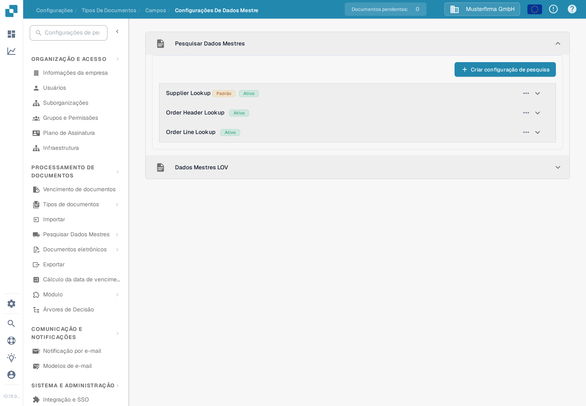
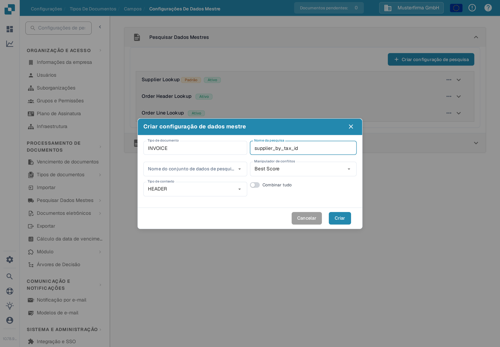
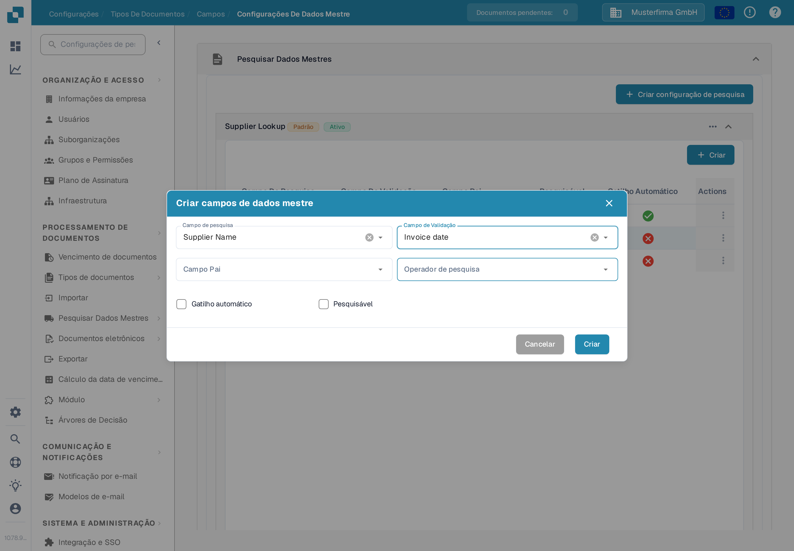
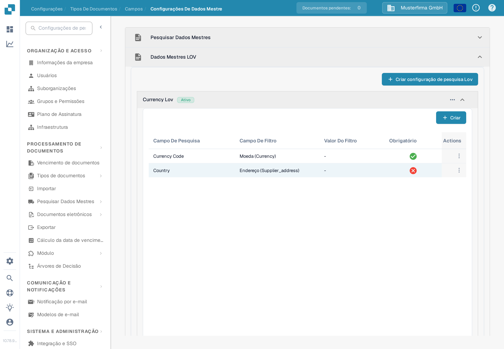
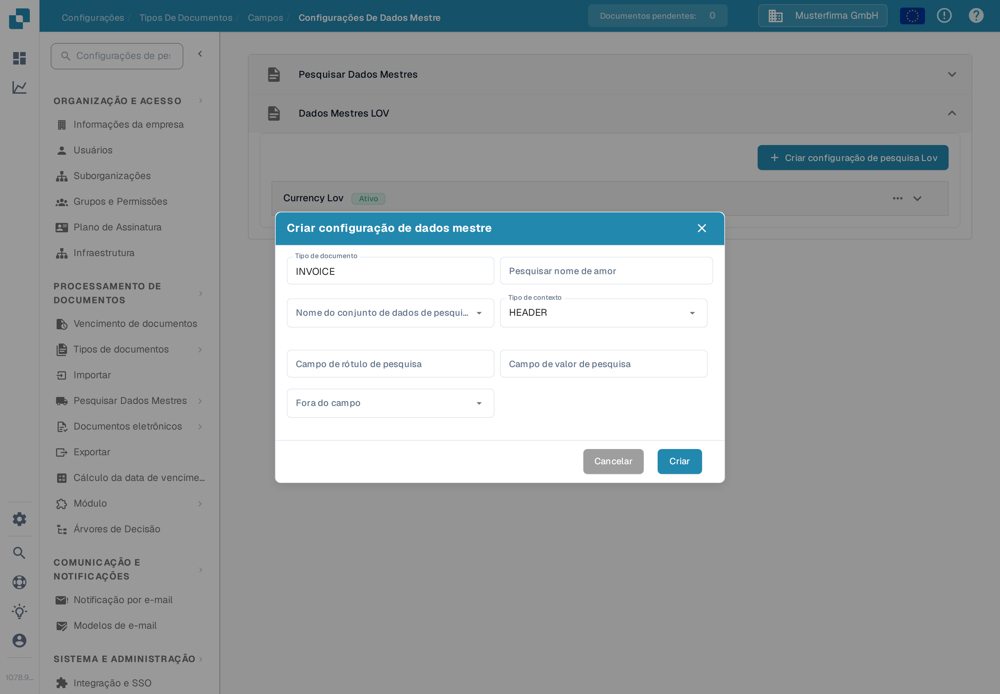

# Configurações de dados mestre

As **Configurações de dados mestre** ligam os campos de validação de um documento aos dados guardados em [Pesquisa de dados mestre](../../../document-processing/master-data-lookup.md). Use **Pesquisar Dados Mestres** para encontrar e preencher registos correspondentes. Use **Dados Mestres LOV** para oferecer uma lista de valores de um conjunto de dados.

## Abrir as configurações

1. Em **Configurações**, abra **Processamento de documentos → Tipos de documentos**.
2. Abra o tipo de documento que quer configurar, por exemplo **Fatura**, e selecione **Campos**.
3. Selecione **Configurações de dados mestre**. A página tem as secções separadas **Pesquisar Dados Mestres** e **Dados Mestres LOV**. Selecione o título de uma secção para a expandir.

<figure><figcaption>Escolha a secção que corresponde ao tipo de campo que quer configurar.</figcaption></figure>

## Corresponder um registo com Pesquisar Dados Mestres

As configurações em **Pesquisar Dados Mestres** procuram num conjunto de dados e associam um registo correspondente aos campos do documento. A lista mostra o nome de cada configuração e se está ativa. Uma etiqueta **Padrão** identifica uma configuração do DocBits; pode desativá-la, mas não a pode editar nem eliminar.

### Criar uma configuração de pesquisa

1. Selecione **Criar configuração de pesquisa**.
2. Introduza um **Nome da pesquisa** e escolha o **Nome do conjunto de dados de pesquisa** que contém os registos a procurar.
3. Escolha um **Manipulador de conflitos** para os casos em que vários registos correspondem:
   * **Best Score** escolhe a correspondência mais forte.
   * **Return None** deixa o resultado vazio, para um utilizador decidir.
   * **Return First** usa o primeiro resultado.
4. Escolha **HEADER** para campos do documento ou **LINE** para campos de uma tabela do documento. Em **LINE**, escolha também **Detalhe do contexto**, a tabela onde a pesquisa é aplicada.
5. Ative **Combinar tudo** se todos os campos de pesquisa configurados tiverem de corresponder a um registo. Deixe desativado se um campo correspondente for suficiente. Selecione **Criar**.

<figure><figcaption>O formulário de uma configuração de pesquisa para o cabeçalho de uma Fatura.</figcaption></figure>

**Combinar tudo** e o **Manipulador de conflitos** afetam o reconhecimento automático de fornecedores. Veja [Configuração de Dados Fuzzy com Dados Mestres](../../../../setup/document-types/fuzzy-data-configuration-with-master-data.md) para exemplos práticos.

### Mapear campos numa configuração

Expanda uma configuração para ver os campos associados. No exemplo abaixo, **Supplier Name** é pesquisável, enquanto **Supplier Number** está definido para acionar a pesquisa automaticamente. Os mapeamentos da sua organização podem ser diferentes.

<figure><figcaption>Expanda uma pesquisa para ver os campos que participam na correspondência.</figcaption></figure>

Selecione **Criar** dentro da configuração expandida para adicionar um mapeamento:

* **Campo de pesquisa** é a coluna do conjunto de dados a procurar.
* **Campo de validação** é o campo do documento que recebe o resultado.
* **Campo pai** verifica opcionalmente o resultado contra um campo relacionado.
* **Operador de pesquisa** controla a forma como o texto é comparado. **Smart** ignora espaços e pontuação; as outras opções incluem Contains, Starts With, Ends With e Exact.
* **Gatilho automático** inicia uma pesquisa quando este campo é preenchido. **Pesquisável** permite que o campo participe nas pesquisas e suporta a pesquisa manual durante a validação.

Selecione **Criar** para adicionar o mapeamento. Use o menu de três pontos **Actions** numa linha para editar ou eliminar um mapeamento editável. Os mapeamentos padrão só podem ser vistos.

<figure><figcaption>Escolha como uma coluna do conjunto de dados é associada a um campo do documento.</figcaption></figure>

Use o menu de três pontos de uma configuração para a ativar ou desativar, duplicar ou editar. Uma configuração padrão oferece **Ver** em vez de **Editar** e não pode ser eliminada. Eliminar uma configuração ou campo personalizado remove o respetivo mapeamento; verifique primeiro de que campos do documento depende.

## Oferecer uma lista com Dados Mestres LOV

**Dados Mestres LOV** cria listas de opções a partir de um conjunto de dados de dados mestre. Também pode adicionar campos de filtro para que uma seleção anterior limite as opções mostradas a seguir.

Expanda **Dados Mestres LOV** e selecione **Criar configuração de pesquisa Lov**. Se não existir nenhuma configuração, a secção mostra apenas este botão.

<figure><figcaption>Abra esta secção quando um campo do documento deve oferecer valores de um conjunto de dados como opções.</figcaption></figure>

No formulário, introduza **Pesquisar nome de amor**, escolha **Nome do conjunto de dados de pesquisa Lov** e defina o **Tipo de contexto** como **HEADER** ou **LINE**. Em **LINE**, selecione **Detalhe do contexto** para identificar a tabela do documento. Depois escolha:

* **Campo de rótulo de pesquisa**: o valor que os utilizadores veem na lista de opções.
* **Campo de valor de pesquisa**: o valor guardado para a seleção e usado para filtrar.
* **Fora do campo**: o campo do documento preenchido com o rótulo selecionado.

Selecione **Criar** para guardar a configuração. Expanda-a para ver os respetivos campos, ou use o menu de três pontos para a ativar, duplicar, editar ou eliminar.

<figure><figcaption>Ligue o valor de um conjunto de dados e o respetivo rótulo visível a um campo do documento.</figcaption></figure>

Para criar listas dependentes, selecione **Criar** dentro de uma configuração LOV expandida e escolha um **Campo de pesquisa** e um **Campo de filtro**. O valor do campo de filtro limita as opções devolvidas pela pesquisa. Também pode definir um **Valor do filtro** fixo e marcar um campo como **Obrigatório**. Use o menu de três pontos da linha para editar ou eliminar um campo de filtro personalizado.
