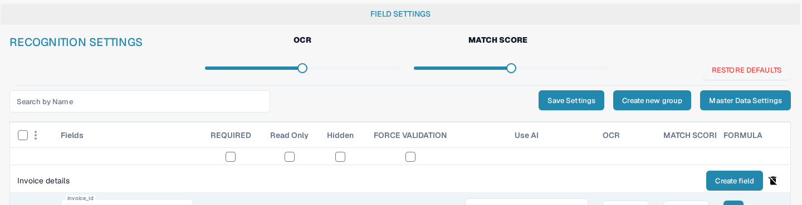
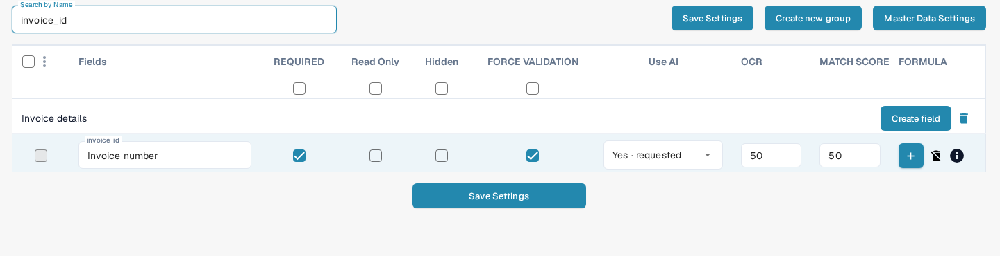

# Setting Validation and Match Score

In **Fields**, you can set validation and recognition thresholds for a document type. This page uses **Invoice** in a documentation test organization. It explains the current **Force Validation** checkbox and **Match Score** controls.

## Open the field settings

1. Go to **Settings → Document Types → Invoice → Fields**.
2. Use **Search by Name** to find a field, for example `invoice_id` (shown as **Invoice number**).
3. Check the field row before changing a setting. **Required**, **Read Only**, **Hidden** and **Force Validation** are separate checkboxes.

<figure><figcaption>Recognition controls appear above the field list.</figcaption></figure>

## Force Validation

Select **Force Validation** in the field row to apply stricter validation to that field. The checkbox is separate from **Required**: marking a field as required does not select Force Validation automatically. The checkbox can be unavailable when a field is hidden or read only. Click **Save Settings** after changing the field configuration.

The old instructions suggested entering numeric limits or regular expressions here. The current Fields table does not show a rule editor in the Force Validation cell. For field-specific rules, see [Configuring Field Properties](configuring-field-properties-1.md).

## Match Score

**Match Score** is a numeric threshold, not a fixed reference value. The **MATCH SCORE** slider in **Recognition Settings** applies its value to the document type's field rows; use a field row's **MATCH SCORE** input for an individual value. In the test organization, the slider and `invoice_id` both show **50**. Review the affected fields, then click **Save Settings**.

<figure><figcaption>Search for a field to review its Force Validation checkbox and Match Score value.</figcaption></figure>

**OCR** is a separate recognition threshold beside Match Score. **Restore Defaults** resets settings; use it only when you intend to discard your custom thresholds. For other field options, see the [Fields overview](README.md).
