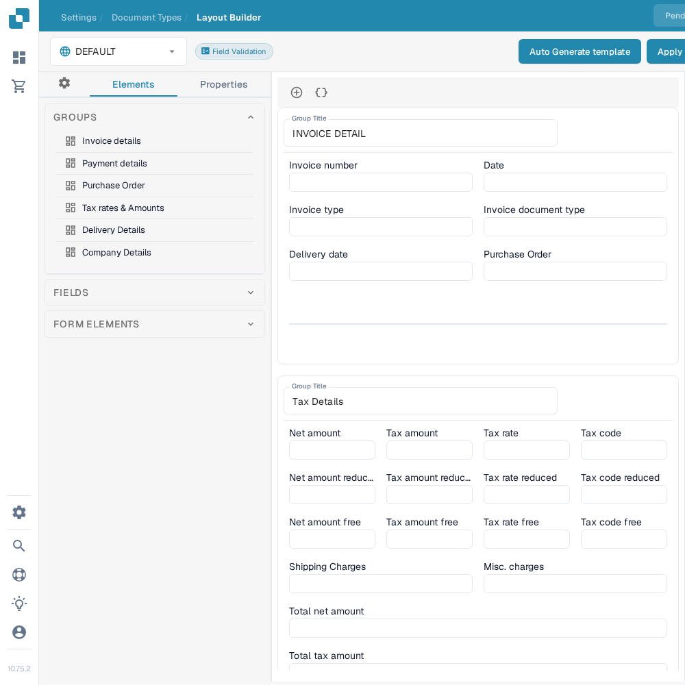
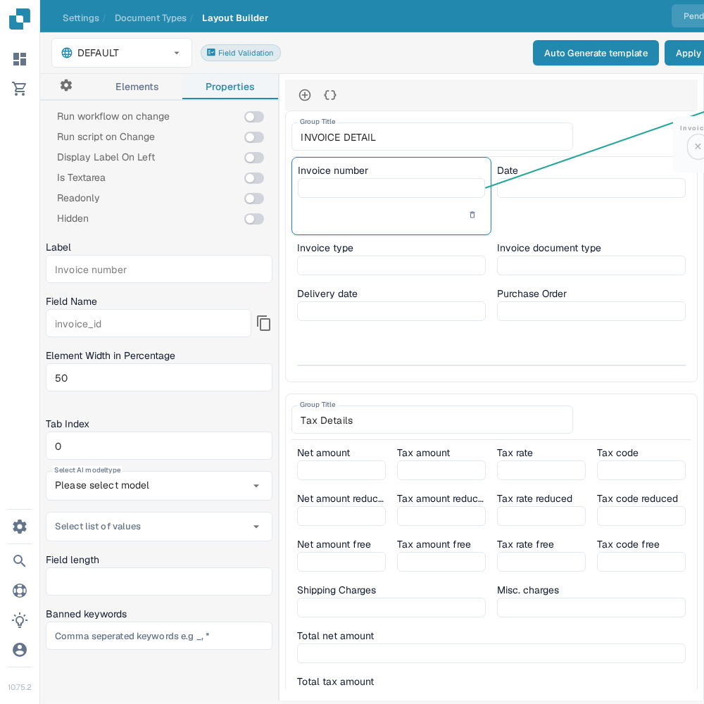

# Configuring Field Properties in the Layout Builder

The **Layout Builder** controls how fields appear in a document layout. It is separate from the document type's [Fields settings](../fields/configuring-field-properties-1.md), where you configure required values, validation, OCR and matching.

Open **Settings → Document Types**, choose a document type, and open its **Layout Builder**. The example below uses the English **Invoice** layout in a sandbox organization. Select the layout at the top left; **Elements** lists groups and fields, and the center shows their placement.

<figure><figcaption>Find the field in the Invoice layout.</figcaption></figure>

## Change a field in the layout

1. Select a field in the center of the layout. For example, select **Invoice number**.
2. Open **Properties** in the left panel. Check the selected field name in the layout before changing anything.
3. Change only the options you need, then select **Save** in the top bar. See [Save and Apply Changes](save-and-apply-changes.md) for the remaining layout steps.

<figure><figcaption>Properties of the selected Invoice number field.</figcaption></figure>

| Property | What it changes |
| --- | --- |
| **Run workflow on change** / **Run script on Change** | Request the configured workflow or script when this field changes. Configure those actions separately before enabling them. |
| **Display Label On Left** | Place the field label beside the input instead of above it. |
| **Is Textarea** | Show a multi-line text input. |
| **Readonly** / **Hidden** | Prevent editing or hide the field in this layout. |
| **Label** | Text shown to users for this field. |
| **Field Name** | Technical field name; the adjacent copy icon copies it. Check this when two fields have similar labels. |
| **Element Width in Percentage** | Width the field takes within its row. |
| **Tab Index** | Position in the keyboard tab order. |
| **Select AI modeltype** / **Select list of values** | Choose a configured model or list for the field, if available. |
| **Field length** / **Banned keywords** | Limit the input length or enter comma-separated disallowed words. |

The **Elements** panel also offers **Groups**, **Fields** and **Form Elements** for arranging the layout. For a broader tour, see [Navigating the Layout Manager](navigating-the-layout-manager.md). Use the document type's [Fields settings](../fields/configuring-field-properties-1.md) for validation and matching; this Properties panel does not offer field-type selection, permission management or field history.
