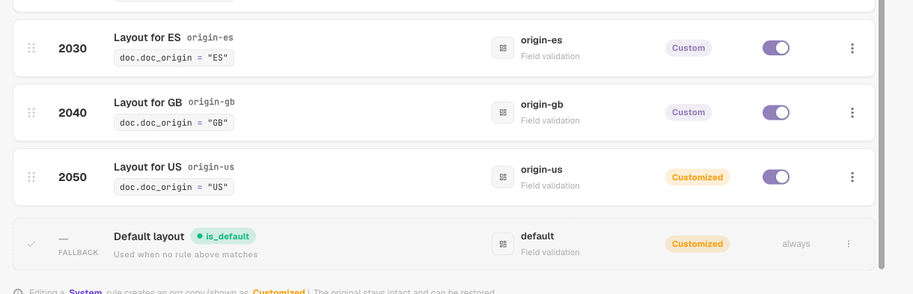
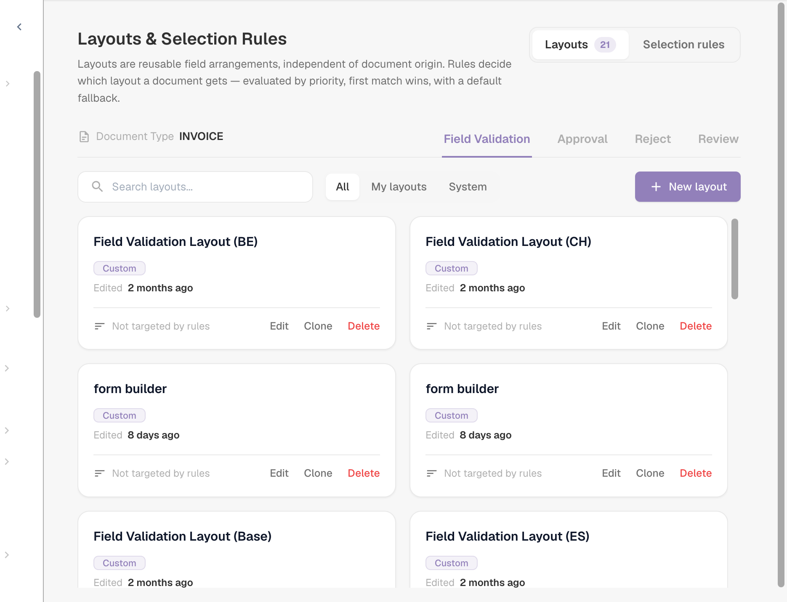
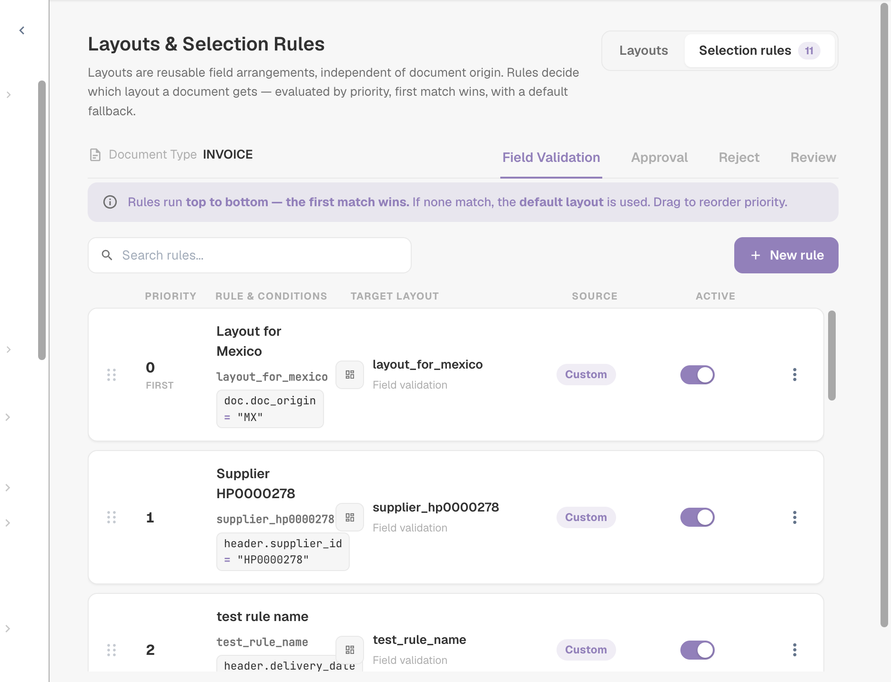
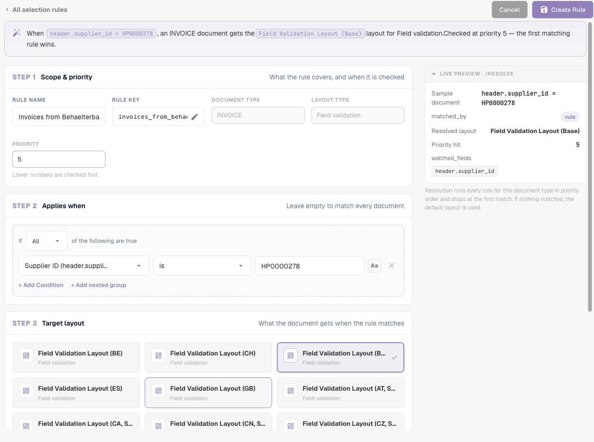
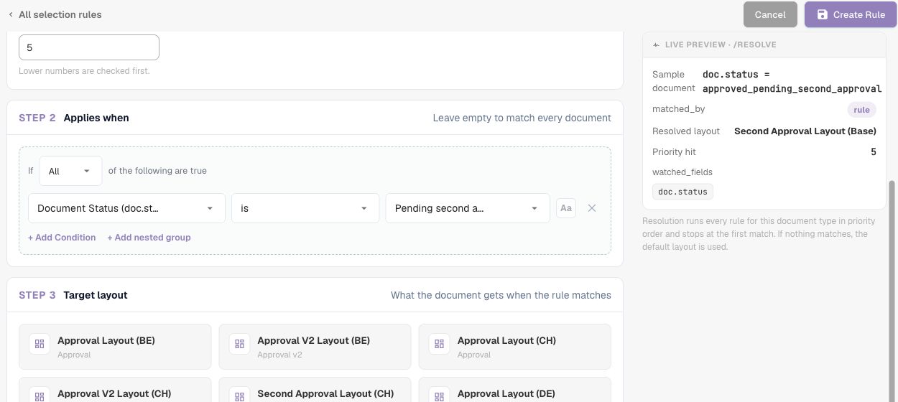

# Layout Selection Rules

## Overview

A **layout** decides which fields and groups a user sees — and in which order — on the **validation**, **approval**, **reject** and **review** screens of a document. You design layouts in the [Layout Manager](README.md).

Classically, DocBits chose the layout by the document's **origin**: the country or region taken from the document's language settings, such as `DE` or `US`. Every origin had its own copy of the layout, and nothing else could influence the choice.

With **layout selection rules**, layouts become reusable building blocks that are independent of the origin, and **rules** decide which layout a document gets:

> *When* the document meets a condition, *then* it gets this layout. Rules are checked from top to bottom; **the first matching rule wins**. If no rule matches, the **default layout** is used.

The origin is still available — as one condition among many. A rule can just as well look at the supplier, the amount, the document status, the extraction method or any header field.

### Problems they solve

| Requirement | Classic origin-based layouts | With selection rules |
| --- | --- | --- |
| One supplier's invoices need extra fields (project, customs number) | impossible without a new origin | rule *Supplier ID is 20723* → layout "Invoice with project fields" |
| DE, AT and CH documents should look the same | three copies of the same layout to maintain | one layout, one rule per origin (or an ANY group) pointing to it |
| E-invoices need a simpler screen than scanned PDFs | not possible | rule *Extraction Method is ELECTRONIC_DOCUMENT* → layout "E-invoice" |
| High-value invoices need more fields on the approval screen | not possible | Approval rule *Total Amount greater than 10000* → layout "High value approval" |
| The second approver should see a different screen than the first | separate "second approval" layout type | Approval rule *Document Status is Pending second approval* → layout "Second approval" |


While the feature is in beta, the settings described below only appear when the **Document Types** settings page is opened with `?beta=true` appended to the address.


## Enable rule-based layouts

Rule-based layouts are switched on **per document type** by an **organisation administrator**.

1. Go to **Settings → Global Settings → Document Types**.
2. Click the **settings** (gear) icon on the document type card.
3. Open **Manage Layouts** and turn the toggle on.

<figure><figcaption>
The Manage Layouts toggle in the additional settings of a document type
</figcaption></figure>

The **Layouts** link on the document type card now opens **Layouts & Selection Rules**.

### What happens when you switch it on

DocBits converts your existing origin-based layouts into rules — once, for this document type and for each screen:

* The layout of the origin **DEFAULT** becomes the **default layout** (the fallback).
* Every layout of a specific origin becomes a rule **"Layout for XX"** with the condition *Document Origin is XX*, pointing to that layout. These rules get priorities in steps of 10 (for example 2000, 2010, 2020 …), so you can place your own rules before, between or after them.

<figure><figcaption>
The origin rules created on activation, followed by the default layout (FALLBACK)
</figcaption></figure>

Nothing is deleted or changed in the layouts themselves. Right after activation every document therefore gets exactly the layout it got before. Only when you add or change rules does the behaviour change.

**Switching it off** returns the document type to origin-based selection immediately. The rules are kept but not used, and they take effect again when you switch the toggle back on.

## The Layouts & Selection Rules screen

<figure><figcaption>
The Layouts tab: every layout of the document type as a card
</figcaption></figure>

* **Layouts / Selection rules** (top right) switch between the list of layouts and the list of rules. The numbers show how many there are.
* **Field Validation / Approval / Reject / Review** switch the **screen**. Every screen has its own layouts, its own rules and its own default layout — an Approval rule never changes the validation screen.
* On the **Layouts** tab you can create, edit, clone and delete layouts. Each card shows whether a rule uses the layout ("Not targeted by rules" when none does). Filter with **All / My layouts / System**; system layouts are shipped with DocBits and can be viewed and cloned, but not changed.


First and second approval share the **Approval** layouts and rules. To give the second approval stage its own screen, add an Approval rule with the condition *Document Status is Pending second approval* — see the [example](#different-screens-for-first-and-second-approval).


## How a layout is chosen

Each time a document is opened, and again after it is saved, DocBits decides its layout for the current screen:

1. The **active rules** of the screen are checked in order of **priority** (lowest number first). **The first rule whose condition is true wins**, and its layout is used.
2. If no rule matches, the **default layout** is used.
3. If there is no default either, DocBits falls back to the classic origin-based choice.

Rules whose layout has been deleted or is empty are skipped.

### A worked example

Rules of the **Field Validation** screen:

| Priority | Rule | Condition | Layout |
| --- | --- | --- | --- |
| 5 | Behaelterbau invoices | *Supplier ID is HP0000278* | Invoice with project fields |
| 10 | E-invoices | *Extraction Method is ELECTRONIC_DOCUMENT* | E-invoice |
| 2020 | Layout for DE | *Document Origin is DE* | Field Validation Layout (DE) |
| — | Default layout | — | Field Validation Layout (Base) |

Which layout each document gets:

| Document | Supplier | Extraction | Origin | Layout | Because |
| --- | --- | --- | --- | --- | --- |
| 1 | HP0000278 | e-invoice | DE | Invoice with project fields | priority 5 matches first; later rules are not checked |
| 2 | 10040 | e-invoice | DE | E-invoice | priority 5 does not match, 10 does |
| 3 | 10040 | scanned PDF | DE | Field Validation Layout (DE) | only the origin rule matches |
| 4 | 10040 | scanned PDF | US | Field Validation Layout (Base) | no rule matches → default |

**Order matters**: put specific rules (one supplier) above general rules (one country).

### When a user changes a field the rules look at

The layout is always chosen from the **current** values of the document. If a user corrects, for example, the supplier on the validation screen, DocBits chooses the layout again after the save, and the screen may switch to another layout. No data is lost: a field that is not part of the new layout keeps its value; it is just not shown until a layout that contains it applies again.

## Manage selection rules

<figure><figcaption>
The Selection rules tab of the Field Validation screen
</figcaption></figure>

Each row shows the **priority** (the first row is marked **FIRST**), the **rule name and key** with its **conditions**, the **target layout**, the **source** badge and an **Active** switch.

| Task | How |
| --- | --- |
| Create a rule | **New rule** |
| Edit a rule | Click the row |
| Change the order | Drag the grip on the left of a row up or down. The new order is saved immediately. |
| Switch a rule off | **Active** switch. Inactive rules are ignored. |
| Duplicate or delete | **⋮** menu of the row |
| Find a rule | **Search rules…** |

The **source** badge tells you where a rule comes from: **System** rules are shipped with DocBits. Editing one creates a copy for your organisation, shown as **Customized**; the original stays intact and can be restored. Rules you create are **Custom**.

### The default layout

The last row, marked **FALLBACK** and **is_default**, is the default layout: it is used whenever no rule above matches and has no condition. It is created when you switch the feature on (from the layout of origin DEFAULT).


To use another fallback layout, create a rule **without any condition** and give it the highest priority number, so that it is checked last. It matches every document that no earlier rule matched, before the default is reached.


## Create a rule

Click **New rule** on the Selection rules tab of the screen you want to change.

<figure><figcaption>
The rule editor: summary sentence at the top, three steps on the left, live preview on the right
</figcaption></figure>

The sentence at the top summarises the rule as you build it — "When header.supplier_id = HP0000278, an INVOICE document gets the Field Validation Layout (Base) layout for Field validation. Checked at priority 5 — the first matching rule wins."

### Step 1 — Scope & priority

| Setting | What it does |
| --- | --- |
| **Rule Name** | Shown in the rule list. Describe the business case: "Behaelterbau invoices", "E-invoices", "High value approval". |
| **Rule key** | Generated from the name; stays the same when you rename the rule. |
| **Document Type** / **Layout type** | The document type and the screen the rule is for. Taken from where you clicked **New rule**. |
| **Priority** | Lower numbers are checked first. Leave gaps (5, 10, 20 …) so you can insert rules later. |

### Step 2 — Applies when

The condition a document must meet. You can use:

* **document attributes**: Document Origin, Extraction Method, Document Status, Sub Document Type,
* **header fields**: Supplier ID, Total Amount, Currency, Purchase Order and every other field of the document type,
* a **custom JSON path** (Advanced).

Table columns are not available: the layout is chosen once for the whole document.

Leave the step empty to match every document at this priority. How conditions work — ALL / ANY, nested groups, all operators, empty values, upper/lower case — is explained on [Rule Conditions (Applies when)](../rule-conditions-applies-when.md).

### Step 3 — Target layout

Click the layout the document should get. The list shows your own layouts and the system layouts of the selected screen. A layout cannot be deleted while a rule still points to it.

### Live preview · /resolve

The panel on the right shows what the rule does for a sample document that has the values of your conditions:

| Line | Meaning |
| --- | --- |
| **Sample document** | The values used for the preview, taken from your conditions |
| **matched_by** | `rule` if a rule matched, otherwise the default |
| **Resolved layout** | The layout the sample document would get |
| **Priority hit** | The priority of the rule that matched |
| **watched_fields** | The fields the layout choice depends on. When a user changes one of them, the layout is chosen again. |

Click **Create Rule** (or **Save rule** when editing) to save. **Cancel** returns to the rule list.

## Examples

### Extra fields for one supplier

Screen **Field Validation** · priority **5** · *Supplier ID is HP0000278* · target *Invoice with project fields* (a clone of your standard layout with the additional project and cost center fields).

### One layout for several countries

Screen **Field Validation** · priority **100** · **ANY of**: *Document Origin is Deutsch*, *Document Origin is Austria*, *Document Origin is Switzerland* · target *DACH invoice*. Deactivate the migrated "Layout for AT" and "Layout for CH" rules if they point to older copies.

### A simpler screen for e-invoices

Screen **Field Validation** · priority **10** · *Extraction Method is ELECTRONIC_DOCUMENT* · target *E-invoice* (without OCR-related fields).

### A stricter approval screen for high amounts

Screen **Approval** · priority **10** · *Total Amount greater than 10000* · target *High value approval* (showing cost center, budget owner and contract number).

### Different screens for first and second approval

Screen **Approval** · priority **5** · *Document Status is Pending second approval* · target *Second Approval Layout*. Documents in the first approval step do not match and get the Approval default layout.

<figure><figcaption>
An Approval rule for the second approval stage; the preview resolves the Second Approval Layout
</figcaption></figure>

### A special reject screen for some suppliers

Screen **Reject** · priority **10** · *Supplier ID is one of* `10040, 10041` · target *Reject with reason codes*.

## Best practices

* **Specific before general.** Supplier rules above country rules, country rules above the default.
* **Leave priority gaps** (5, 10, 20 …) so that new rules fit in without renumbering.
* **Base conditions on reliable fields.** Supplier and origin are set early and rarely change. Conditions on fields that users edit often make the screen switch layouts while they work.
* **Clone, don't start from scratch.** Clone your standard layout and adjust it, so all layouts keep the same basic structure.
* **Check the live preview** and open a real document of each kind after changing rules.
* **Keep a meaningful default** for every screen, so that no document ends up without a layout.

## Troubleshooting

| Symptom | What to check |
| --- | --- |
| A document gets the wrong layout | An earlier rule matches first. Look at the rules above it, or at the **Priority hit** in the preview. |
| The default is used although a rule should match | Is the rule **Active**? Does the condition match the exact value (case, spaces)? Is the rule on the right **screen** tab? |
| The layout changes while a user works | A field in **watched_fields** was changed. Base the rule on a more stable field. |
| A layout cannot be deleted | A rule still points to it. Retarget or delete that rule first. |
| No layout at all is shown | No rule matched, there is no default and no origin-based layout exists for this screen. Add a rule without a condition as catch-all. |
| Nothing changed after activation | Expected: activation reproduces the previous origin-based choice. Add your own rules. |
| Second approval shows the first approval layout | Add an Approval rule on *Document Status is Pending second approval* above the other Approval rules. |

## Related

* [Rule Conditions (Applies when)](../rule-conditions-applies-when.md)
* [Custom Validation Rules](../custom-validation-rules.md)
* [Transformation Rules](../transformation-rules.md)
* [Navigating the Layout Manager](navigating-the-layout-manager.md)
