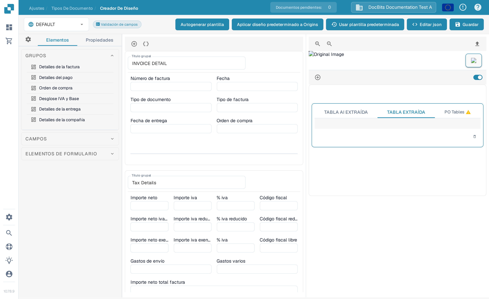
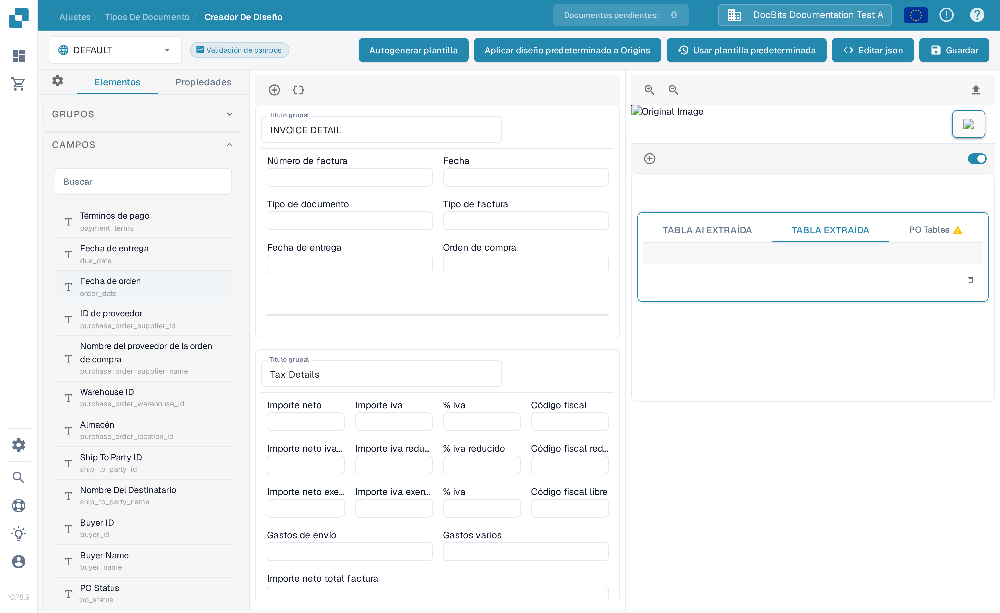
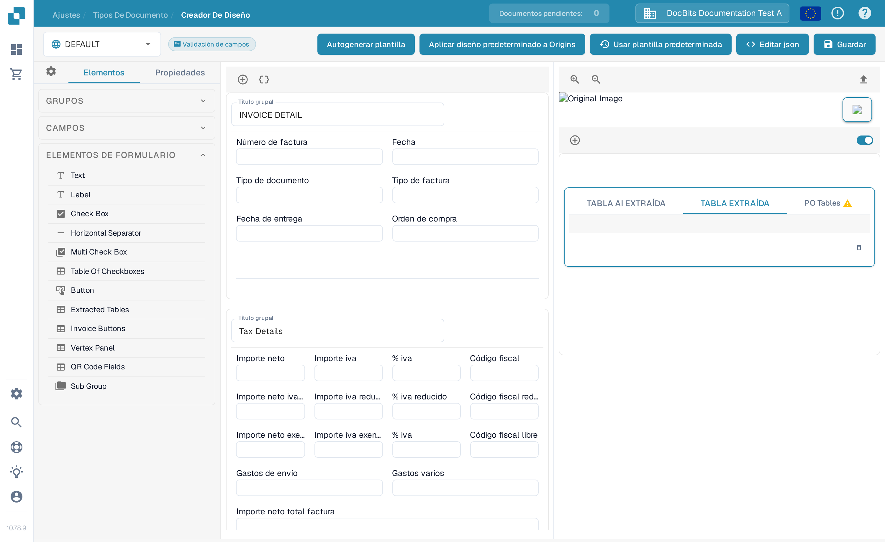

# Navegando el Creador de diseño

Use el **Creador de diseño** (Layout Builder) para organizar los grupos y campos que las personas ven en un documento. Esta guía usa el diseño de **Factura** en inglés de una organización de pruebas (sandbox).

## Abrir el diseño de Factura

1. Vaya a **Ajustes → Tipos de Documento**.
2. Busque **Factura** y seleccione **Diseños** en su tarjeta. El Creador de diseño se abre para ese tipo de documento.
3. Compruebe el selector de diseños en la parte superior izquierda. El ejemplo siguiente muestra **DEFAULT**.

<figure><figcaption>Abra **Diseños** desde la tarjeta de Factura.</figcaption></figure>

## Encontrar grupos y campos

El panel izquierdo **Elementos** tiene tres secciones. **Grupos** enumera las secciones del documento; el lienzo central muestra su disposición actual. Seleccione un campo en el lienzo y abra **Propiedades** para cambiar su configuración de visualización. Consulte [Configuración de propiedades de campo](configuring-field-properties.md) para ver las opciones disponibles.

<figure><figcaption>La lista de Grupos y el lienzo del diseño de Factura.</figcaption></figure>

Abra **Campos** para buscar los campos disponibles del documento. Use su cuadro de búsqueda cuando la lista sea larga y arrastre el campo al grupo deseado del lienzo. Los campos ya colocados en el diseño pueden aparecer como no disponibles en la lista.

<figure><figcaption>Busque entre los campos disponibles antes de colocar uno.</figcaption></figure>

Abra **Elementos de formulario** para controles visuales como Text, Label, Check Box, Horizontal Separator, Button y Sub Group. Arrastre el elemento que necesite al lienzo y revise sus **Propiedades**.

<figure><figcaption>La paleta actual de Elementos de formulario.</figcaption></figure>

## Organizar y guardar

- Seleccione el título de un grupo en el lienzo para cambiarlo. El botón **+** sobre el lienzo añade un grupo; el icono de llaves adyacente abre el formulario JSON avanzado de grupos.
- Pase el cursor sobre un grupo para ver las acciones de copiar JSON, subir, bajar, eliminar y el asa de arrastre. Para reordenar campos, arrástrelos dentro o entre grupos.
- Seleccione un campo en el lienzo para abrir **Propiedades**. Su icono de eliminación lo quita de este diseño. Para configurar validación, OCR o coincidencia, use la [Configuración de campos](../fields/configuring-field-properties-1.md) aparte.
- Seleccione **Guardar** en la barra superior tras editar. Consulte [Guardar y aplicar cambios](save-and-apply-changes.md) antes de usar las demás acciones de la barra superior, incluida la generación de plantillas, las plantillas predeterminadas y la aplicación de un diseño a los orígenes.
