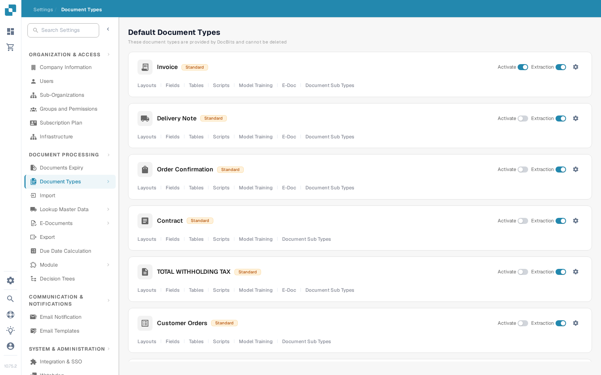
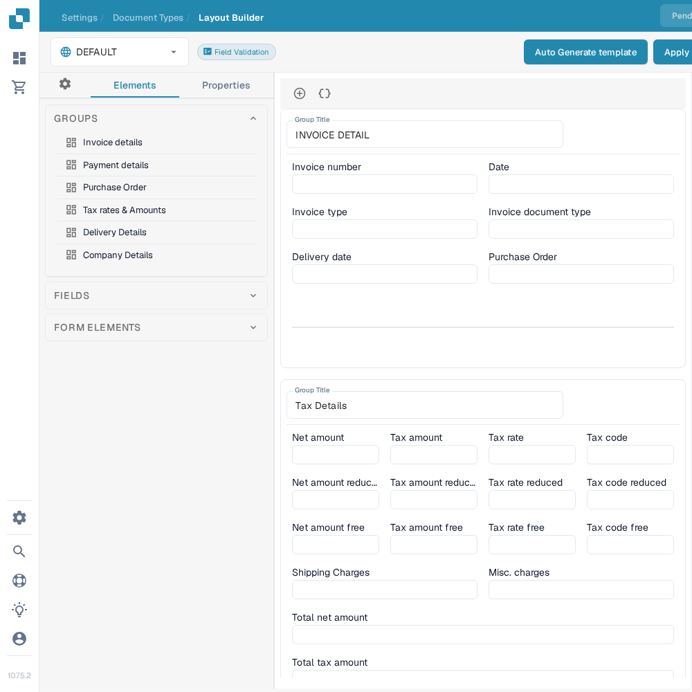
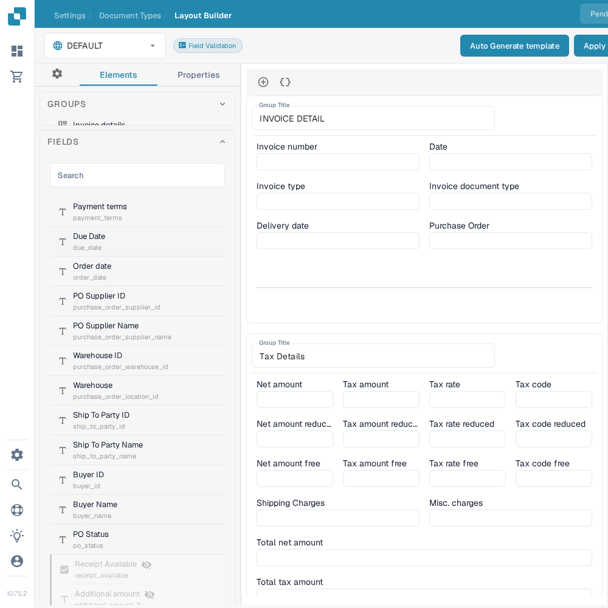
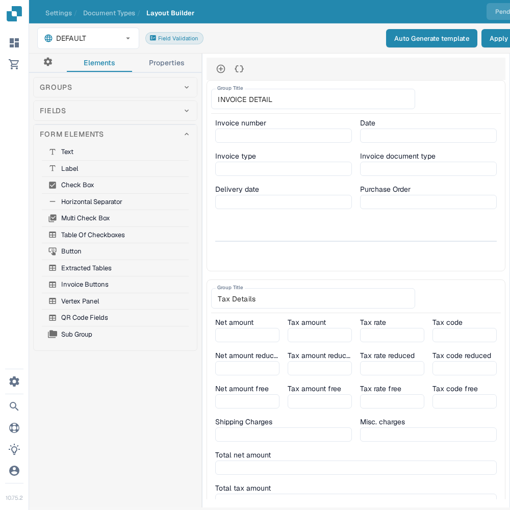

# Navigating the Layout Builder

Use the **Layout Builder** to arrange the fields and groups that people see on a document. This guide uses the English **Invoice** layout in a sandbox organization.

## Open the Invoice layout

1. Go to **Settings → Document Types**.
2. Find **Invoice** and select **Layouts** on its card. The Layout Builder opens for that document type.
3. Check the layout selector at the top left. The example below shows **DEFAULT**.

<figure><figcaption>Open **Layouts** from the Invoice card.</figcaption></figure>

## Find groups and fields

The left **Elements** panel has three sections. **Groups** lists the document sections; the middle canvas shows their current arrangement. Select a field in the canvas and open **Properties** to change its display settings. See [Configuring Field Properties](configuring-field-properties.md) for the available options.

<figure><figcaption>The Groups list and Invoice layout canvas.</figcaption></figure>

Open **Fields** to find available document fields. Use its search box when the list is long, then drag the field into the desired group in the canvas. Fields already placed in the layout may appear unavailable in the list.

<figure><figcaption>Search the available fields before placing one.</figcaption></figure>

Open **Form Elements** for visual controls such as Text, Label, Check Box, separator, Button and Sub Group. Drag the element you need into the canvas, then check its **Properties**.

<figure><figcaption>The current Form Elements palette.</figcaption></figure>

## Arrange and save

- Select a group title in the canvas to change its title. The **+** above the canvas adds a group; the adjacent braces icon opens the advanced JSON group form.
- Hover over a group for the copy-JSON, move-up, move-down, delete and drag-handle actions. To reorder fields, drag them within or between groups.
- Select a field in the canvas to open **Properties**. Its delete icon removes it from this layout. To configure validation, OCR or matching, use the separate [Fields settings](../fields/configuring-field-properties-1.md).
- Select **Save** in the top bar after editing. See [Save and Apply Changes](save-and-apply-changes.md) before using the other top-bar actions, including template generation, default templates and applying a layout to origins.
