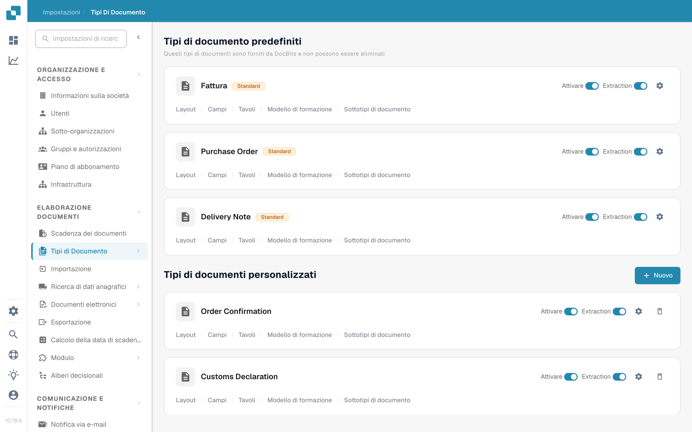
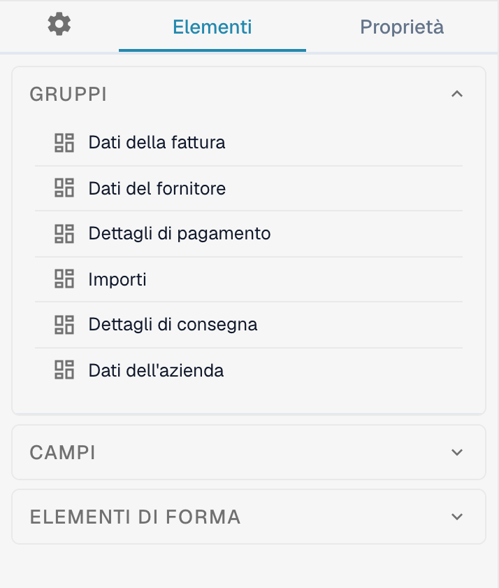
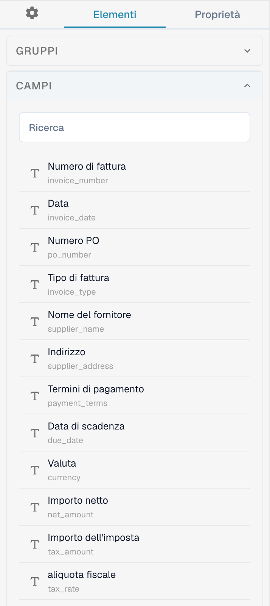

# Navigare nel Layout Builder

Usa il **Layout Builder** (Costruttore di layout) per disporre i campi e i gruppi che le persone vedono su un documento. Questa guida usa il layout **Fattura** in inglese in un'organizzazione sandbox.

## Aprire il layout Fattura

1. Vai in **Impostazioni → Tipi di Documento**.
2. Trova la scheda **Fattura** e seleziona **Layout** su di essa. Il Layout Builder si apre per quel tipo di documento.
3. Controlla in alto a sinistra il selettore del layout. L'esempio qui sotto mostra **DEFAULT**.

<figure><figcaption>Apri **Layout** dalla scheda Fattura.</figcaption></figure>

## Trovare gruppi e campi

Il pannello **Elementi** a sinistra ha tre sezioni. **Gruppi** elenca le sezioni del documento; la tela centrale mostra la loro disposizione attuale. Seleziona un campo nella tela e apri **Proprietà** per modificarne le impostazioni di visualizzazione. Vedi [Configurare le proprietà dei campi](configuring-field-properties.md) per le opzioni disponibili.

<figure><figcaption>L'elenco Gruppi e la tela del layout Fattura.</figcaption></figure>

Apri **Campi** per trovare i campi disponibili del documento. Usa la casella **Ricerca** quando l'elenco è lungo, poi trascina il campo nel gruppo desiderato nella tela. I campi già inseriti nel layout possono risultare non disponibili nell'elenco.

<figure><figcaption>Cerca tra i campi disponibili prima di inserirne uno.</figcaption></figure>

Apri **Elementi di forma** per controlli visivi come Text, Label, Check Box, Horizontal Separator, Button e Sub Group. Trascina l'elemento necessario nella tela, poi controllane le **Proprietà**.

<figure><figcaption>La palette attuale degli Elementi di forma.</figcaption></figure>

## Disporre e salvare

- Seleziona il titolo di un gruppo nella tela (**Titolo del gruppo**) per cambiarne il nome. Il **+** sopra la tela aggiunge un gruppo; l'icona delle parentesi graffe accanto apre il modulo JSON avanzato del gruppo.
- Passa il mouse su un gruppo per le azioni copia-JSON, sposta in alto, sposta in basso, elimina e maniglia di trascinamento. Per riordinare i campi, trascinali dentro o tra i gruppi.
- Seleziona un campo nella tela per aprire **Proprietà**. La sua icona di eliminazione lo rimuove da questo layout. Per configurare convalida, OCR o matching, usa le separate [Impostazioni dei campi](../fields/configuring-field-properties-1.md).
- Seleziona **Salva** nella barra in alto dopo le modifiche. Vedi [Salvare e applicare le modifiche](save-and-apply-changes.md) prima di usare le altre azioni della barra in alto, tra cui la generazione automatica del modello, l'uso del modello predefinito e l'applicazione del layout predefinito alle origini.
