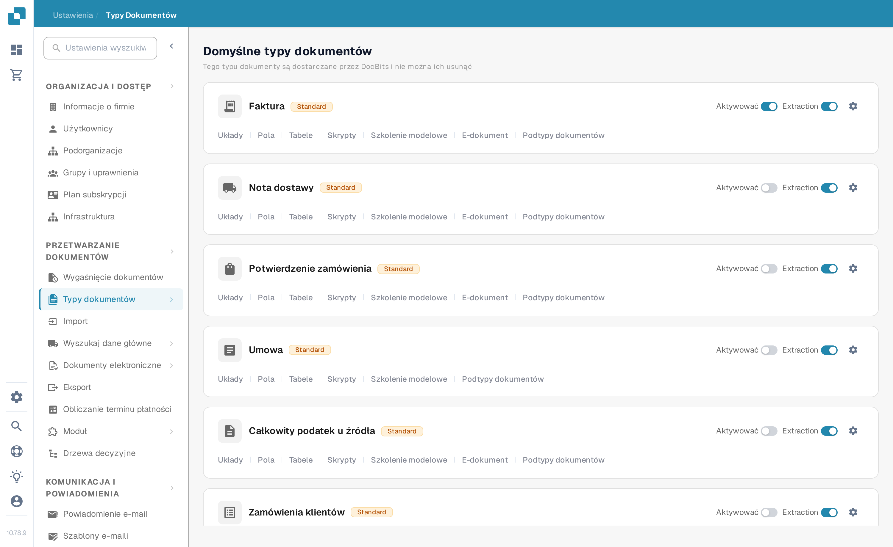
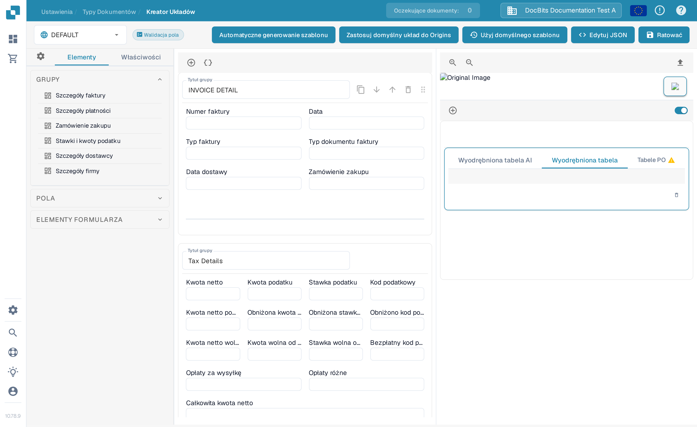
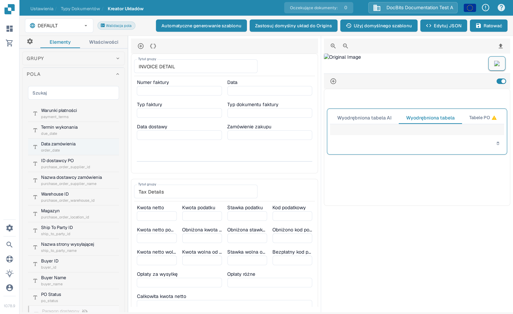
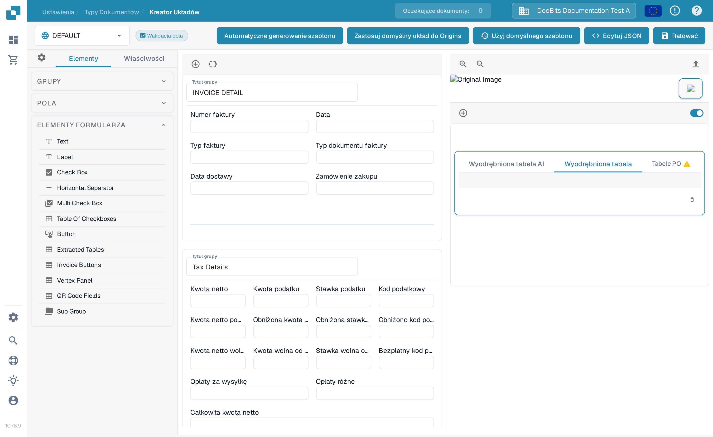

# Nawigacja w Kreatorze Układów

Użyj **Kreatora Układów** (Layout Builder), aby ułożyć grupy i pola widoczne na dokumencie. Ten przewodnik korzysta z układu dokumentu **Faktura** w organizacji testowej (sandbox).

## Otwieranie układu faktury

1. Przejdź do **Ustawienia → Typy dokumentów**.
2. Znajdź kartę **Faktura** i wybierz na niej **Układy**. Kreator Układów otworzy się dla tego typu dokumentu.
3. Sprawdź w lewym górnym rogu selector układu. W poniższym przykładzie wyświetlony jest układ **DEFAULT**.

<figure><figcaption>Otwórz **Układy** z karty Faktura.</figcaption></figure>

## Znajdowanie grup i pól

Lewy panel **Elementy** ma trzy sekcje. Sekcja **Grupy** zawiera sekcje dokumentu; centralny obszar roboczy pokazuje ich aktualne rozmieszczenie. Zaznacz pole w obszarze roboczym i otwórz **Właściwości**, aby zmienić jego ustawienia wyświetlania. Dostępne opcje opisano w artykule [Konfigurowanie Właściwości Pola](configuring-field-properties.md).

<figure><figcaption>Lista grup i obszar roboczy układu faktury.</figcaption></figure>

Otwórz sekcję **Pola**, aby znaleźć dostępne pola dokumentu. Gdy lista jest długa, użyj jej pola wyszukiwania, a następnie przeciągnij pole do wybranej grupy w obszarze roboczym. Pola już umieszczone w układzie mogą być na tej liście niedostępne.

<figure><figcaption>Przeszukaj dostępne pola, zanim jedno z nich umieścisz.</figcaption></figure>

Otwórz sekcję **Elementy formularza**, aby znaleźć elementy wizualne, takie jak Text, Label, Check Box, separator poziomy, Button i Sub Group. Przeciągnij potrzebny element do obszaru roboczego, a następnie sprawdź jego **Właściwości**.

<figure><figcaption>Aktualna paleta elementów formularza.</figcaption></figure>

## Porządkowanie i zapisywanie

- Zaznacz tytuł grupy w obszarze roboczym, aby go zmienić. Znak **+** nad obszarem roboczym dodaje grupę; umieszczona obok ikona klamer otwiera zaawansowany formularz JSON grupy.
- Najedź kursorem na grupę, aby uzyskać dostęp do akcji: kopiowanie JSON, przeniesienie w górę, przeniesienie w dół, usunięcie oraz uchwyt przeciągania. Aby zmienić kolejność pól, przeciągnij je w obrębie grupy lub między grupami.
- Zaznacz pole w obszarze roboczym, aby otworzyć **Właściwości**. Ikona usunięcia usuwa pole z tego układu. Walidację, OCR i dopasowanie konfiguruje się osobno w [Ustawieniach pól](../fields/configuring-field-properties-1.md).
- Po zakończeniu edycji wybierz **Ratować** (Zapisz) na górnym pasku. Przed użyciem pozostałych akcji górnego paska — generowania szablonu, szablonów domyślnych i zastosowania układu do źródeł (Origins) — zobacz [Zapisywanie i stosowanie zmian](save-and-apply-changes.md).
