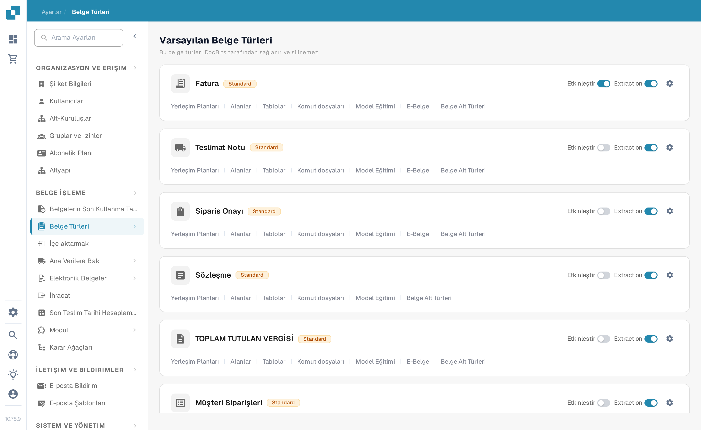
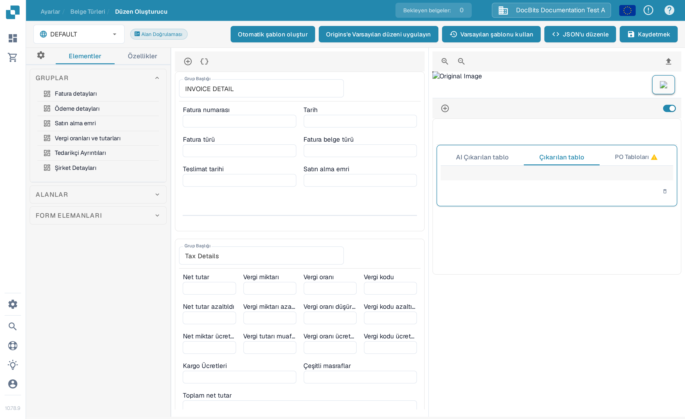
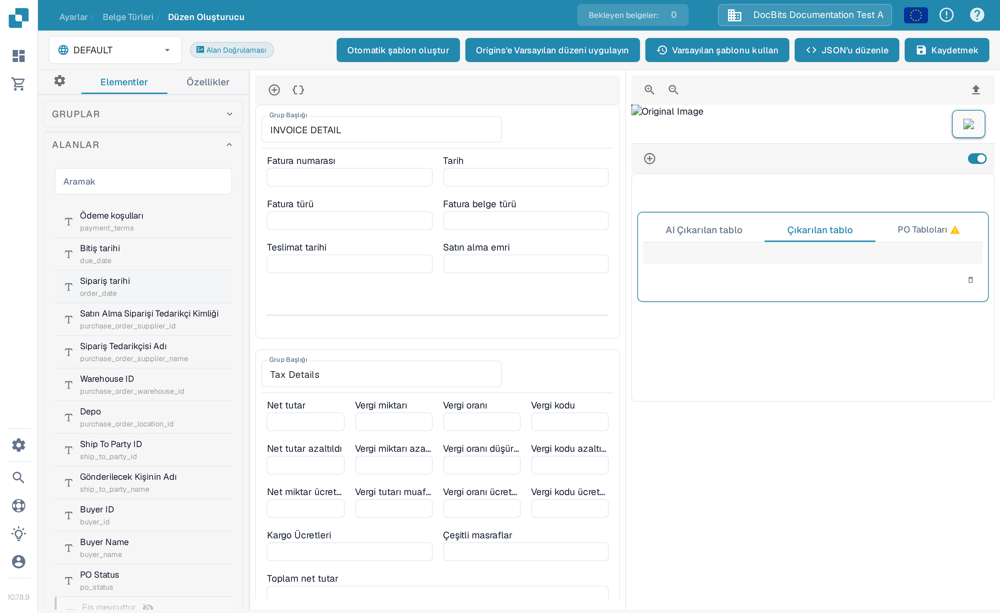

# Düzen Oluşturucu'da Yönelme

Belgede görünen grupları ve alanları düzenlemek için **Düzen Oluşturucu**'yu (Layout Builder) kullanın. Bu rehber, sandbox organizasyonundaki İngilizce **Invoice** (Fatura) düzenini kullanır.

## Fatura düzenini açma

1. **Ayarlar → Belge Türleri** yoluna gidin.
2. **Fatura** kartını bulun ve üzerindeki **Yerleşim Planları** bağlantısını seçin. Düzen Oluşturucu bu belge türü için açılır.
3. Sol üstteki düzen seçicisini kontrol edin. Aşağıdaki örnekte **DEFAULT** görünür.

<figure><figcaption>**Yerleşim Planları** bağlantısını Fatura kartından açın.</figcaption></figure>

## Grupları ve alanları bulma

Soldaki **Elementler** panelinde üç bölüm vardır. **Gruplar** belge bölümlerini listeler; ortadaki tuval bunların güncel yerleşimini gösterir. Tuvalde bir alan seçin ve görüntüleme ayarlarını değiştirmek için **Özellikler**'i açın. Kullanılabilir seçenekler ayrıntılı olarak Alan Özelliklerini Yapılandırma rehberinde anlatılır.

<figure><figcaption>Gruplar listesi ve Fatura düzeni tuvali.</figcaption></figure>

Kullanılabilir belge alanlarını bulmak için **Alanlar** bölümünü açın. Liste uzunsa arama kutusunu kullanın, ardından alanı tuvalde istediğiniz grubun içine sürükleyin. Düzene zaten yerleştirilmiş alanlar bu listede kullanılamaz görünebilir.

<figure><figcaption>Bir alanı yerleştirmeden önce kullanılabilir alanlarda arama yapın.</figcaption></figure>

Text, Label, Check Box, Horizontal Separator, Button ve Sub Group gibi görsel öğeler için **Form Elemanları** bölümünü açın. İhtiyacınız olan öğeyi tuvale sürükleyin, ardından **Özellikler**'ini kontrol edin.

<figure><figcaption>Güncel Form Elemanları paleti.</figcaption></figure>

## Düzenleme ve kaydetme

- Başlığını değiştirmek için tuvalde bir grup başlığı seçin. Tuvalin üzerindeki **+** yeni grup ekler; yanındaki süslü parantez simgesi gelişmiş JSON grup formunu açar.
- Bir grubun üzerine fareyle gelin: JSON'u kopyalama, yukarı taşıma, aşağı taşıma, silme ve sürükleme tutamacı eylemleri görünür. Alanların sırasını değiştirmek için onları grupların içinde veya gruplar arasında sürükleyin.
- **Özellikler**'i açmak için tuvalde bir alan seçin. Silme simgesi alanı bu düzenden kaldırır. Doğrulama, OCR veya eşleştirme ayarları ayrı bir sayfada, Alan ayarları bölümünde yapılandırılır.
- Düzenleme bittikten sonra üst çubukta **Kaydetmek** seçeneğini seçin. Şablon oluşturma, varsayılan şablonlar ve bir düzeni Origins'e uygulama dahil diğer üst çubuk eylemlerini kullanmadan önce Değişiklikleri Kaydetme ve Uygulama rehberine bakın.
