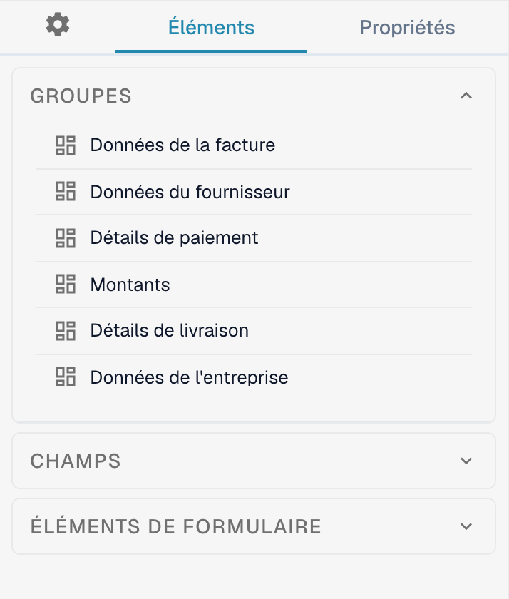
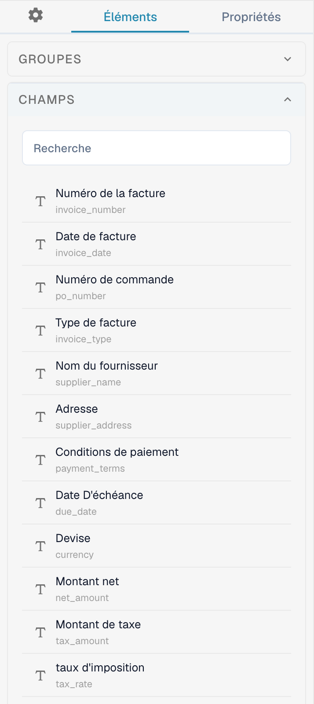
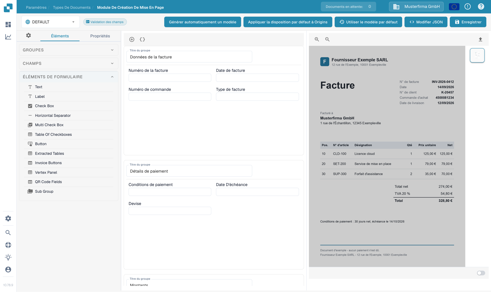

# Navigation dans le Layout Builder

Utilisez le **Layout Builder** pour organiser les champs et les groupes que les utilisateurs voient sur un document. Ce guide utilise la mise en page **Invoice** (Facture) en anglais dans une organisation de sandbox.

## Ouvrir la mise en page de la facture

1. Allez dans **Paramètres → Types de Documents**.
2. Repérez la carte **Facture** et ouvrez ses actions de mise en page. Le Layout Builder s'ouvre pour ce type de document.
3. Vérifiez le sélecteur de mise en page en haut à gauche. L'exemple ci-dessous affiche **DEFAULT**.

<figure><figcaption>Ouvrez les actions de mise en page depuis la carte **Facture**.</figcaption></figure>

## Retrouver les groupes et les champs

Le panneau **Éléments** à gauche contient trois sections. **Groupes** liste les sections du document ; le canvas central montre leur disposition actuelle. Sélectionnez un champ dans le canvas et ouvrez **Propriétés** pour modifier ses paramètres d'affichage. Consultez [Configuration des propriétés des champs](configuring-field-properties.md) pour connaître les options disponibles.

<figure><figcaption>La liste **Groupes** et le canvas de la mise en page Facture.</figcaption></figure>

Ouvrez **Champs** pour trouver les champs disponibles du document. Utilisez sa boîte de recherche **Recherche** quand la liste est longue, puis glissez le champ dans le groupe voulu du canvas. Les champs déjà placés dans la mise en page peuvent apparaître comme indisponibles dans la liste.

<figure><figcaption>Recherchez les champs disponibles avant d'en placer un.</figcaption></figure>

Ouvrez **Éléments de formulaire** pour les contrôles visuels tels que Text, Label, Check Box, Horizontal Separator, Multi Check Box, Table Of Checkboxes, Button, QR Code Fields et Sub Group. Glissez l'élément voulu dans le canvas, puis vérifiez ses **Propriétés**.

<figure><figcaption>La palette **Éléments de formulaire** actuelle.</figcaption></figure>

## Organiser et enregistrer

- Sélectionnez un titre de groupe dans le canvas pour modifier son titre. Le **+** au-dessus du canvas ajoute un groupe ; l'icône d'accolades voisine ouvre le formulaire JSON avancé du groupe.
- Survolez un groupe pour les actions copier le JSON, monter, descendre, supprimer et la poignée de glissement. Pour réordonner les champs, glissez-les dans un groupe ou entre les groupes.
- Sélectionnez un champ dans le canvas pour ouvrir **Propriétés**. Son icône de suppression le retire de cette mise en page. Pour configurer la validation, l'OCR ou la correspondance, utilisez les [paramètres des champs](../fields/configuring-field-properties-1.md) séparés.
- Sélectionnez **Enregistrer** dans la barre supérieure après vos modifications. Consultez [Enregistrer et appliquer les modifications](save-and-apply-changes.md) avant d'utiliser les autres actions de la barre supérieure, notamment **Générer automatiquement un modèle**, **Utiliser le modèle par défaut** et **Appliquer la disposition par défaut à Origins**.
