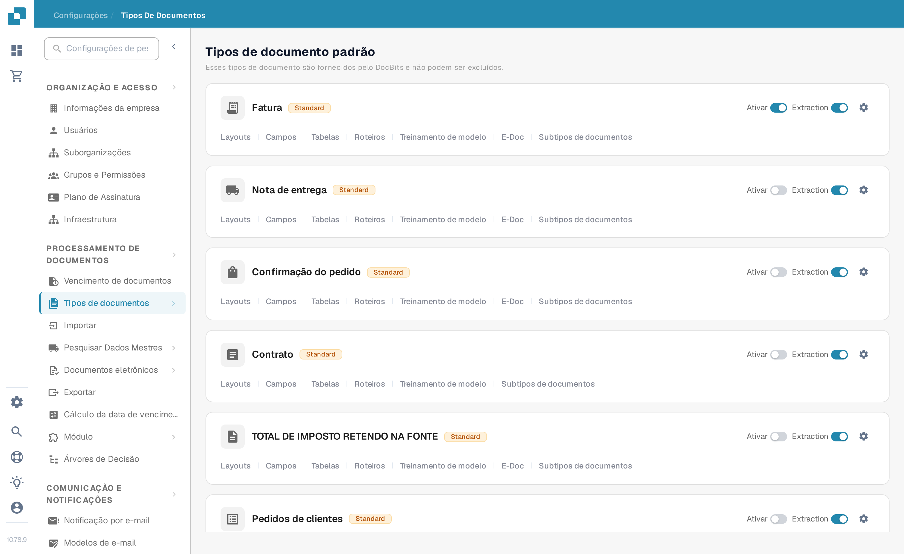
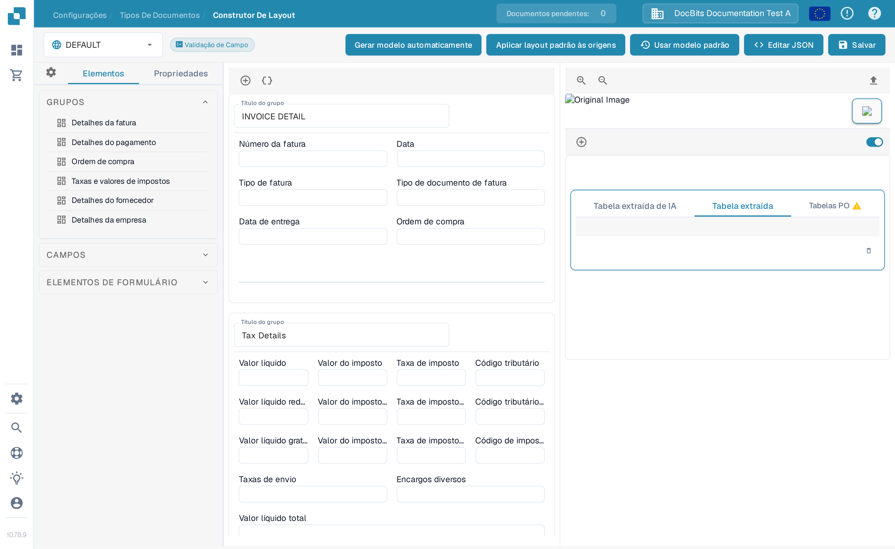
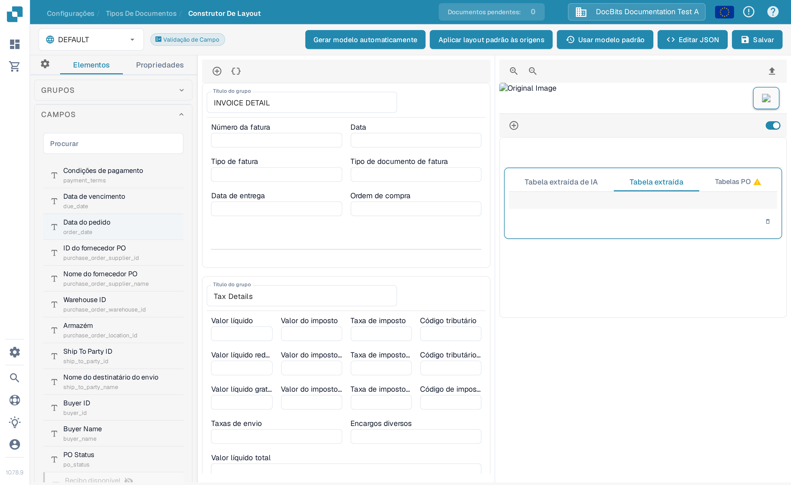
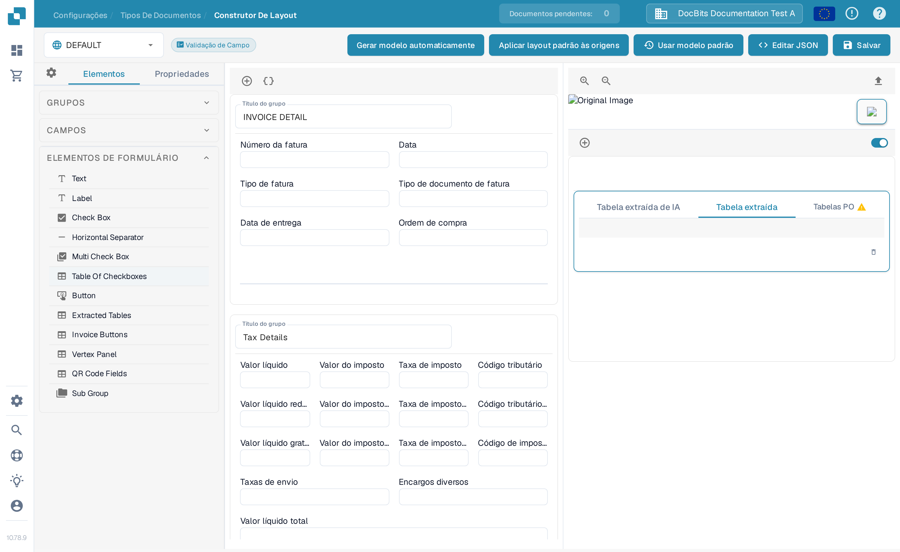

# Navegando no Construtor de Layout

Use o **Construtor de Layout** para organizar os grupos e campos que as pessoas veem em um documento. Este guia usa o layout de **Fatura** em português em uma organização de teste da Sandbox.

## Abrir o layout de Fatura

1. Acesse **Configurações → Tipos de documentos**.
2. Encontre **Fatura** e selecione **Layouts** no cartão dela. O Construtor de Layout abre para esse tipo de documento.
3. Confira o seletor de layout no canto superior esquerdo. O exemplo abaixo mostra **DEFAULT**.

<figure><figcaption>Abra **Layouts** no cartão de Fatura.</figcaption></figure>

## Encontrar grupos e campos

O painel esquerdo **Elementos** tem três seções. **Grupos** lista as seções do documento; o canvas central mostra a disposição atual. Selecione um campo no canvas e abra **Propriedades** para alterar as configurações de exibição. Veja [Configurando Propriedades de Campos](configuring-field-properties.md) para as opções disponíveis.

<figure><figcaption>A lista de Grupos e o canvas do layout de Fatura.</figcaption></figure>

Abra **Campos** para encontrar os campos disponíveis do documento. Use a caixa **Procurar** quando a lista for longa e arraste o campo para o grupo desejado no canvas. Campos já colocados no layout podem aparecer indisponíveis na lista.

<figure><figcaption>Pesquise os campos disponíveis antes de colocar um.</figcaption></figure>

Abra **Elementos de formulário** para controles visuais como Text, Label, Check Box, Horizontal Separator, Button e Sub Group. Os nomes desses controles aparecem em inglês na interface em português. Arraste o elemento necessário para o canvas e confira as **Propriedades** dele.

<figure><figcaption>A paleta atual de Elementos de formulário.</figcaption></figure>

## Organizar e salvar

- Selecione o título de um grupo no canvas para alterá-lo. O ícone **+** acima do canvas adiciona um grupo; o ícone de chaves ao lado abre o formulário avançado de grupo em JSON.
- Passe o mouse sobre um grupo para ver as ações de copiar JSON, mover para cima, mover para baixo, excluir e a alça de arrastar. Para reordenar campos, arraste-os dentro ou entre grupos.
- Selecione um campo no canvas para abrir **Propriedades**. O ícone de exclusão dele remove o campo deste layout. Para configurar validação, OCR ou correspondência, use as [Configurações de Campos](../fields/configuring-field-properties-1.md) separadas.
- Selecione **Salvar** na barra superior após editar. Veja [Salvar e Aplicar Alterações](save-and-apply-changes.md) antes de usar as outras ações da barra superior, incluindo gerar modelo, usar modelo padrão e aplicar um layout às origens.
