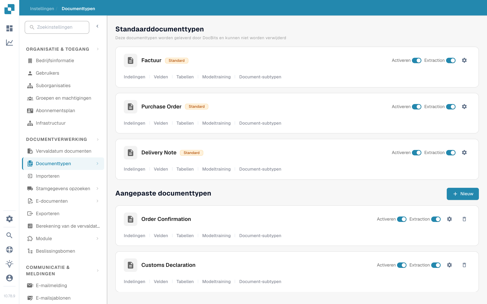
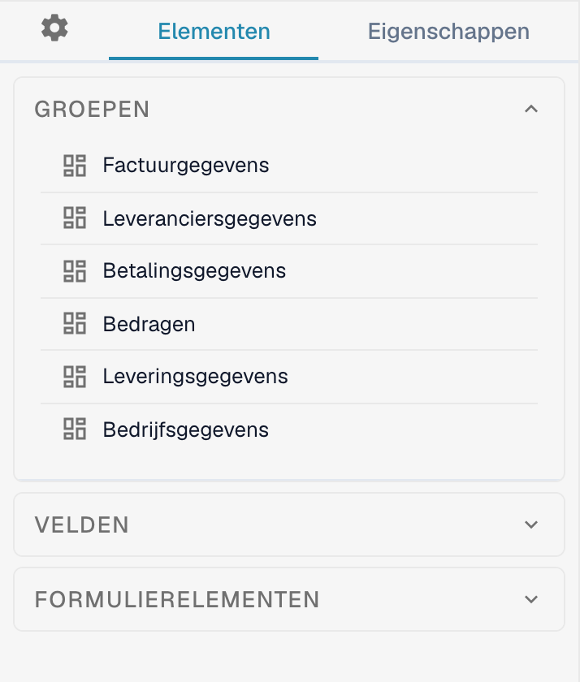
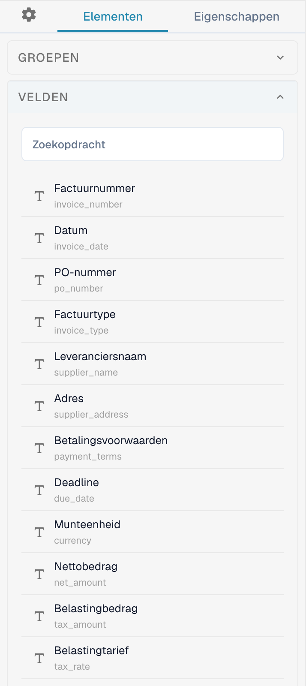

# Navigeren in de Lay-outbouwer

Gebruik de **Lay-outbouwer** om de velden en groepen te rangschikken die gebruikers op een document zien. Deze handleiding gebruikt de Nederlandse indeling **Factuur** in een sandbox-organisatie.

## De Factuur-indeling openen

1. Ga naar **Instellingen → Documenttypen**.
2. Zoek **Factuur** en selecteer **Indelingen** op de kaart. De Lay-outbouwer opent voor dat documenttype.
3. Controleer de indelingskeuze linksboven. Het voorbeeld hieronder toont **DEFAULT**.

<figure><figcaption>Open **Indelingen** via de kaart Factuur.</figcaption></figure>

## Groepen en velden vinden

Het linkerpaneel **Elementen** heeft drie secties. **Groepen** bevat de documentsecties; het middelste canvas toont de huidige indeling. Selecteer een veld in het canvas en open **Eigenschappen** om de weergave-instellingen te wijzigen. Zie [Configuring Field Properties](configuring-field-properties.md) voor de beschikbare opties.

<figure><figcaption>De lijst GROEPEN en het canvas van de Factuur-indeling.</figcaption></figure>

Open **Velden** om beschikbare documentvelden te vinden. Gebruik het zoekveld **Zoekopdracht** als de lijst lang is, sleep het veld vervolgens naar de gewenste groep in het canvas. Velden die al in de lay-out staan, kunnen in de lijst als niet-beschikbaar worden weergegeven.

<figure><figcaption>Zoek tussen de beschikbare velden voordat u er één plaatst.</figcaption></figure>

Open **Formulierelementen** voor visuele bedieningselementen zoals Text, Label, Check Box, Horizontal Separator, Button en Sub Group. Sleep het gewenste element naar het canvas en controleer daarna de **Eigenschappen**.

<figure><figcaption>Het huidige palet Formulierelementen.</figcaption></figure>

## Rangschikken en opslaan

- Selecteer een groepstitel in het canvas om de titel te wijzigen. De **+** boven het canvas voegt een groep toe; het icoon met accolades ernaast opent het geavanceerde JSON-groepsformulier.
- Beweeg over een groep voor de acties JSON kopiëren, omhoog, omlaag, verwijderen en sleepgreep. Sleep velden binnen of tussen groepen om de volgorde te wijzigen.
- Selecteer een veld in het canvas om **Eigenschappen** te openen. Het verwijdericoon haalt het veld uit deze lay-out. Gebruik voor validatie, OCR of matching de aparte [instellingen van Velden](../fields/configuring-field-properties-1.md).
- Selecteer **Opslaan** in de balk bovenaan na het bewerken. Zie [Save and apply changes](save-and-apply-changes.md) voordat u de andere acties in de balk gebruikt, zoals sjabloon genereren, standaardsjabloon en een indeling toepassen op oorsprongen.
